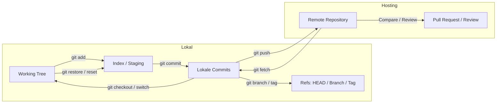
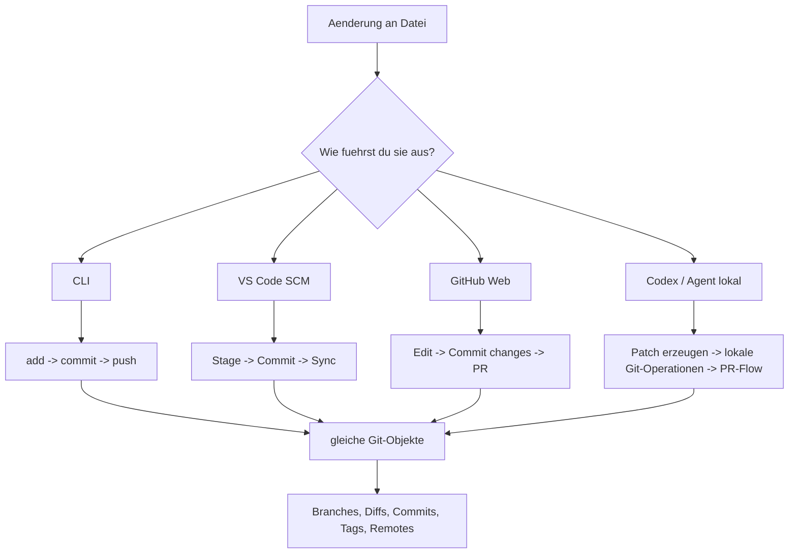

# Explanation: Git-Umgebung ueber Web/Cloud, VS Code und Codex hinweg verstehen

## Leitfrage

> **🟦 Ziel:** Du sollst Git nicht als Sammlung einzelner Buttons verstehen, sondern als **ein einziges Zustandsmodell** mit mehreren Oberflaechen.

Diese Doku trennt bewusst zwischen:

- **Explanation:** Warum dieselben Git-Objekte in Web, VS Code, CLI und Codex gleich bleiben.
- **How-to:** Wie du den Ablauf im Alltag sauber und PR-tauglich ausfuehrst.

## 1) Mentales Modell: immer dieselben Git-Objekte

Git kennt im Alltag nur wenige Kernobjekte:

- **Working Tree (Arbeitsbaum):** deine gerade bearbeiteten Dateien.
- **Index / Staging Area:** der geplante naechste Snapshot.
- **Commit-Historie:** unveraenderliche Snapshots mit Metadaten.
- **Refs:** Branches, Tags, `HEAD`.
- **Remote:** externer Speicherort wie GitHub.
- **Pull Request:** kein Git-Kernobjekt, sondern eine Hosting-Schicht auf Branch-Diffs.



## 2) Dieselbe Operation in vier Oberflaechen



## 3) Syntax-Regeln, die fast alle Missverstaendnisse vermeiden

### 3.1 Grundform

```text
git <subcommand> [optionen] [argumente]
```

### 3.2 Revisions zuerst, Pfade danach

Beispiel:

```text
git diff v1.0 v2.0 -- src/
```

- `v1.0` und `v2.0` sind **Revisionen**.
- `src/` ist ein **Pfad**.
- `--` trennt Revisionen von Pfaden, wenn Mehrdeutigkeit moeglich ist.

### 3.3 Die wichtigste Schutzregel: `--`

Wenn ein Name sowohl Datei als auch Revision sein koennte, nutze `--`.

Beispiel:

```text
git diff HEAD -- README.md
```

### 3.4 Kurzoptionen in Skripten nicht raten

- Optionen zuerst.
- Lange Optionen ausschreiben.
- Keine mehrdeutigen Abkuerzungen in Skripten.

## 4) Was Web/Cloud **ist** – und was nicht

GitHub/GitLab/Azure DevOps sind nicht Git selbst, sondern **Hosting- und Kollaborationsschichten**.

Darum gilt:

- **Branch, Commit, Tag, Remote-Ref** gehoeren zu Git.
- **Pull Request, Review, Required Checks, Merge Button** gehoeren zur Hosting-Schicht.
- Ein Web-Commit ist am Ende trotzdem nur ein Commit auf einem Branch.

## 5) UI-Mapping: gleiche Absicht, andere Oberflaeche

- **CLI:** direkteste, vollstaendigste Form.
- **VS Code:** GUI fuer haeufige Git-Operationen; gut fuer Stage, Commit, Diff, Merge-Conflicts, Fetch/Pull/Push.
- **GitHub Web:** stark fuer Compare, Review, PR, kleine Datei-Edits, Releases, Tags.
- **Codex/App lokal:** kein eigenes Versionsmodell; arbeitet auf demselben lokalen Repo-Zustand wie CLI und VS Code.

## 6) Befehlslandkarte – vollstaendige Abdeckung der offiziellen Git-Kommandogruppen

**Abdeckungsbasis:** Git-Referenz 2.53.0, gruppiert nach der offiziellen Befehlsstruktur. Enthalten sind **82 Befehle** aus Porcelain, Admin und Plumbing.

| Gruppe | Anzahl | Enthaltene Befehle |
| --- | ---: | --- |
| Setup und Konfiguration | 4 | `git git`, `git config`, `git help`, `git bugreport` |
| Projekte anlegen und holen | 2 | `git init`, `git clone` |
| Snapshots und Arbeitsstand | 9 | `git add`, `git status`, `git diff`, `git commit`, `git notes`, `git restore`, `git reset`, `git rm`, `git mv` |
| Branches und Zusammenfuehren | 9 | `git branch`, `git checkout`, `git switch`, `git merge`, `git mergetool`, `git log`, `git stash`, `git tag`, `git worktree` |
| Austausch mit Remotes | 5 | `git fetch`, `git pull`, `git push`, `git remote`, `git submodule` |
| Inspektion und Vergleich | 5 | `git show`, `git difftool`, `git range-diff`, `git shortlog`, `git describe` |
| Patches und Historienkorrektur | 4 | `git apply`, `git cherry-pick`, `git rebase`, `git revert` |
| Debugging | 3 | `git bisect`, `git blame`, `git grep` |
| E-Mail-Workflow | 5 | `git am`, `git format-patch`, `git send-email`, `git request-pull`, `git imap-send` |
| Externe Systeme | 2 | `git svn`, `git fast-import` |
| Administration | 8 | `git clean`, `git gc`, `git fsck`, `git reflog`, `git filter-branch`, `git instaweb`, `git archive`, `git bundle` |
| Server-Administration | 2 | `git daemon`, `git update-server-info` |
| Plumbing-Kommandos | 20 | `git cat-file`, `git check-ignore`, `git checkout-index`, `git commit-tree`, `git count-objects`, `git diff-index`, `git for-each-ref`, `git hash-object`, `git ls-files`, `git ls-tree`, `git merge-base`, `git read-tree`, `git rev-list`, `git rev-parse`, `git show-ref`, `git symbolic-ref`, `git update-index`, `git update-ref`, `git verify-pack`, `git write-tree` |

## 7) Vollstaendige Befehlsmatrix mit Bedeutung und UI-Zuordnung

### Setup und Konfiguration

| Befehl | Kanonische Syntax | Bedeutung | Typische UI-Entsprechung |
| --- | --- | --- | --- |
| `git git` | `git <subcommand> [optionen] [argumente]` | Dispatcher fuer alle Git-Befehle | meist Terminal-first; in UI nur teilweise vorhanden |
| `git config` | `git config [--global|--local] <key> <value>` | Liest oder schreibt Git-Konfiguration | meist Terminal-first; in UI nur teilweise vorhanden |
| `git help` | `git help <thema>` | Oeffnet Handbuchseiten und Referenzen | meist Terminal-first; in UI nur teilweise vorhanden |
| `git bugreport` | `git bugreport` | Erzeugt Diagnoseinformationen fuer Fehlermeldungen | meist Terminal-first; in UI nur teilweise vorhanden |

### Projekte anlegen und holen

| Befehl | Kanonische Syntax | Bedeutung | Typische UI-Entsprechung |
| --- | --- | --- | --- |
| `git init` | `git init [<pfad>]` | Initialisiert ein neues Repository | VS Code: Initialize Repository |
| `git clone` | `git clone <url> [<ordner>]` | Kopiert ein vorhandenes Repository lokal | VS Code: Git: Clone / GitHub Web: Repository-Seite -> Code -> Clone |

### Snapshots und Arbeitsstand

| Befehl | Kanonische Syntax | Bedeutung | Typische UI-Entsprechung |
| --- | --- | --- | --- |
| `git add` | `git add <pfad...>` | Uebernimmt Aenderungen in den Index (Staging Area) | VS Code: Stage Changes / Codex/App: lokaler Git-Flow, identische Objekte |
| `git status` | `git status` | Zeigt Arbeitsbaum, Index und Branch-Status | VS Code: Source Control View / GitHub Web: Dateiansicht + PR/Diff + lokale Clients / Codex/App: lokaler Git-Flow, identische Objekte |
| `git diff` | `git diff [<rev>] [--] [<pfad...>]` | Vergleicht Arbeitsbaum, Index oder Commits | VS Code: Diff Editor / GitHub Web: Files changed / Compare / Codex/App: lokaler Git-Flow, identische Objekte |
| `git commit` | `git commit -m "<nachricht>"` | Erzeugt einen Commit aus dem Index | VS Code: Commit Input + Commit / GitHub Web: Datei bearbeiten -> Commit changes / Codex/App: lokaler Git-Flow, identische Objekte |
| `git notes` | `git notes [add|show|list]` | Haengt Notizen an Commits | meist Terminal-first; in UI nur teilweise vorhanden |
| `git restore` | `git restore [--staged] <pfad...>` | Stellt Dateien aus Index oder Commit wieder her | VS Code: Discard Changes / Restore / Codex/App: lokaler Git-Flow, identische Objekte |
| `git reset` | `git reset [--soft|--mixed|--hard] [<rev>]` | Versetzt HEAD und optional Index/Arbeitsbaum zurueck | VS Code: Command Palette / Terminal / Codex/App: lokaler Git-Flow, identische Objekte |
| `git rm` | `git rm <pfad...>` | Entfernt Dateien aus Index und optional Arbeitsbaum | meist Terminal-first; in UI nur teilweise vorhanden |
| `git mv` | `git mv <alt> <neu>` | Verschiebt oder benennt verfolgte Dateien um | meist Terminal-first; in UI nur teilweise vorhanden |

### Branches und Zusammenfuehren

| Befehl | Kanonische Syntax | Bedeutung | Typische UI-Entsprechung |
| --- | --- | --- | --- |
| `git branch` | `git branch [<name>]` | Listet, erstellt oder loescht Branches | VS Code: Branch Picker / GitHub Web: Branch-Dropdown / Branch anlegen / Codex/App: lokaler Git-Flow, identische Objekte |
| `git checkout` | `git checkout <branch|rev|-- <pfad...>>` | Aelterer Mehrzweckbefehl fuer Wechsel und Restore | VS Code: Branch Picker / Datei-Revert / Codex/App: lokaler Git-Flow, identische Objekte |
| `git switch` | `git switch <branch>` | Wechselt Branches explizit | VS Code: Branch Picker / Codex/App: lokaler Git-Flow, identische Objekte |
| `git merge` | `git merge <branch>` | Fuehrt Historien zusammen | VS Code: Branch > Merge into Current / GitHub Web: Pull Request -> Merge / Codex/App: lokaler Git-Flow, identische Objekte |
| `git mergetool` | `git mergetool` | Oeffnet externes Konfliktloesungswerkzeug | VS Code: Merge Editor |
| `git log` | `git log [--oneline --graph --decorate]` | Zeigt Commit-Historie | VS Code: Graph / Timeline / Extensions / GitHub Web: Commits / History / Codex/App: lokaler Git-Flow, identische Objekte |
| `git stash` | `git stash [push|pop|apply|list]` | Lagert nicht committe Aenderungen temporaer aus | VS Code: Command Palette -> Git: Stash / GitHub Web: keine Web-Entsprechung / Codex/App: lokaler Git-Flow, identische Objekte |
| `git tag` | `git tag [<name>]` | Markiert Commits mit sprechenden Versionen | VS Code: Command Palette / Terminal / GitHub Web: Releases/Tags / Codex/App: lokaler Git-Flow, identische Objekte |
| `git worktree` | `git worktree [add|list|remove]` | Verwaltet mehrere Arbeitsverzeichnisse fuer ein Repo | VS Code: Worktrees View / GitHub Web: keine Web-Entsprechung / Codex/App: lokaler Git-Flow, identische Objekte |

### Austausch mit Remotes

| Befehl | Kanonische Syntax | Bedeutung | Typische UI-Entsprechung |
| --- | --- | --- | --- |
| `git fetch` | `git fetch [<remote>]` | Holt neue Remote-Objekte ohne Merge | VS Code: Fetch / GitHub Web: keine direkte UI; in lokalen Clients sichtbar / Codex/App: lokaler Git-Flow, identische Objekte |
| `git pull` | `git pull [--rebase] [<remote> [<branch>]]` | Fetch plus Merge oder Rebase | VS Code: Sync / Pull / GitHub Web: keine echte Pull-Aktion; stattdessen Reload/Sync ueber lokale Tools / Codex/App: lokaler Git-Flow, identische Objekte |
| `git push` | `git push [--set-upstream] <remote> <branch>` | Uebertraegt lokale Referenzen zum Remote | VS Code: Sync / Push / GitHub Web: indirekt ueber lokale Tools oder Web-Editor-Commit / Codex/App: lokaler Git-Flow, identische Objekte |
| `git remote` | `git remote [add|set-url|show]` | Verwaltet benannte Remotes | VS Code: Repositories & Remotes / GitHub Web: Repository-Einstellungen / lokale Clients |
| `git submodule` | `git submodule [add|update|status]` | Verwaltet eingebettete Repositories | GitHub Web: Dateibaum + Repo-Einstellungen |

### Inspektion und Vergleich

| Befehl | Kanonische Syntax | Bedeutung | Typische UI-Entsprechung |
| --- | --- | --- | --- |
| `git show` | `git show <rev>` | Zeigt ein Objekt oder einen Commit mit Diff | VS Code: Commit/Graph View / GitHub Web: Commit-Ansicht |
| `git difftool` | `git difftool [<rev> [<rev>]]` | Startet externes Diff-Werkzeug | meist Terminal-first; in UI nur teilweise vorhanden |
| `git range-diff` | `git range-diff <rev1> <rev2>` | Vergleicht zwei Commit-Serien | meist Terminal-first; in UI nur teilweise vorhanden |
| `git shortlog` | `git shortlog [<rev-range>]` | Gruppiert Commits nach Autor oder Thema | meist Terminal-first; in UI nur teilweise vorhanden |
| `git describe` | `git describe [<rev>]` | Ermittelt sprechende Namen aus Tags | meist Terminal-first; in UI nur teilweise vorhanden |

### Patches und Historienkorrektur

| Befehl | Kanonische Syntax | Bedeutung | Typische UI-Entsprechung |
| --- | --- | --- | --- |
| `git apply` | `git apply <patch>` | Wendet ein Patch auf Arbeitsbaum oder Index an | meist Terminal-first; in UI nur teilweise vorhanden |
| `git cherry-pick` | `git cherry-pick <commit>` | Uebernimmt ausgewaehlte Commits auf aktuellen Branch | GitHub Web: Commit-Ansichten/CLI |
| `git rebase` | `git rebase [<upstream>]` | Setzt Commit-Reihe auf neue Basis | VS Code: Command Palette -> Rebase / GitHub Web: je nach Repo-Einstellung im PR/CLI |
| `git revert` | `git revert <commit>` | Erzeugt Gegenaenderung als neuen Commit | GitHub Web: Commit- oder PR-Revert in GitHub |

### Debugging

| Befehl | Kanonische Syntax | Bedeutung | Typische UI-Entsprechung |
| --- | --- | --- | --- |
| `git bisect` | `git bisect [start|good|bad|reset]` | Sucht per Halbierung fehlerverursachenden Commit | meist Terminal-first; in UI nur teilweise vorhanden |
| `git blame` | `git blame <datei>` | Zeigt letzten Aenderer pro Zeile | VS Code: GitLens oder Timeline |
| `git grep` | `git grep <muster>` | Sucht Muster in versionierten Inhalten | VS Code: Search + ripgrep |

### E-Mail-Workflow

| Befehl | Kanonische Syntax | Bedeutung | Typische UI-Entsprechung |
| --- | --- | --- | --- |
| `git am` | `git am <mbox>` | Importiert Mail-Patches als Commits | meist Terminal-first; in UI nur teilweise vorhanden |
| `git format-patch` | `git format-patch <basis>` | Exportiert Commits als Patch-Serie | meist Terminal-first; in UI nur teilweise vorhanden |
| `git send-email` | `git send-email <patches>` | Versendet Patch-Serien per Mail | meist Terminal-first; in UI nur teilweise vorhanden |
| `git request-pull` | `git request-pull <basis> <url> <branch>` | Erzeugt Merge-Anfrage fuer Mail-Workflow | meist Terminal-first; in UI nur teilweise vorhanden |
| `git imap-send` | `git imap-send` | Versendet Patches ueber IMAP | meist Terminal-first; in UI nur teilweise vorhanden |

### Externe Systeme

| Befehl | Kanonische Syntax | Bedeutung | Typische UI-Entsprechung |
| --- | --- | --- | --- |
| `git svn` | `git svn <subcommand>` | Bruecke zu Subversion-Repositories | meist Terminal-first; in UI nur teilweise vorhanden |
| `git fast-import` | `git fast-import` | Importiert Historien in hohem Durchsatz | meist Terminal-first; in UI nur teilweise vorhanden |

### Administration

| Befehl | Kanonische Syntax | Bedeutung | Typische UI-Entsprechung |
| --- | --- | --- | --- |
| `git clean` | `git clean -fd` | Entfernt nicht verfolgte Dateien und Ordner | meist Terminal-first; in UI nur teilweise vorhanden |
| `git gc` | `git gc` | Packt und bereinigt Repo-Objekte | meist Terminal-first; in UI nur teilweise vorhanden |
| `git fsck` | `git fsck` | Prueft Repository-Integritaet | meist Terminal-first; in UI nur teilweise vorhanden |
| `git reflog` | `git reflog` | Zeigt lokale Referenzbewegungen fuer Recovery | meist Terminal-first; in UI nur teilweise vorhanden |
| `git filter-branch` | `git filter-branch ...` | Aelteres Werkzeug fuer Historienumschreiben | meist Terminal-first; in UI nur teilweise vorhanden |
| `git instaweb` | `git instaweb` | Startet Weboberflaeche fuer Repo-Browsing | meist Terminal-first; in UI nur teilweise vorhanden |
| `git archive` | `git archive --format=zip <rev>` | Exportiert Snapshot ohne .git-Verzeichnis | meist Terminal-first; in UI nur teilweise vorhanden |
| `git bundle` | `git bundle create <datei> <refs>` | Verpackt Objekte fuer Offline-Transfer | meist Terminal-first; in UI nur teilweise vorhanden |

### Server-Administration

| Befehl | Kanonische Syntax | Bedeutung | Typische UI-Entsprechung |
| --- | --- | --- | --- |
| `git daemon` | `git daemon` | Startet Git-Daemon fuer Netzwerkzugriff | meist Terminal-first; in UI nur teilweise vorhanden |
| `git update-server-info` | `git update-server-info` | Aktualisiert Hilfsdateien fuer dumb HTTP | meist Terminal-first; in UI nur teilweise vorhanden |

### Plumbing-Kommandos

| Befehl | Kanonische Syntax | Bedeutung | Typische UI-Entsprechung |
| --- | --- | --- | --- |
| `git cat-file` | `git cat-file -p <objekt>` | Zeigt rohe Objektinformationen | meist Terminal-first; in UI nur teilweise vorhanden |
| `git check-ignore` | `git check-ignore <pfad>` | Prueft Ignore-Regeln fuer Pfade | meist Terminal-first; in UI nur teilweise vorhanden |
| `git checkout-index` | `git checkout-index <pfad>` | Schreibt Index-Inhalt in Arbeitsbaum | meist Terminal-first; in UI nur teilweise vorhanden |
| `git commit-tree` | `git commit-tree <tree>` | Erzeugt Commit-Objekt direkt aus Tree | meist Terminal-first; in UI nur teilweise vorhanden |
| `git count-objects` | `git count-objects -v` | Zaehlt lose und gepackte Objekte | meist Terminal-first; in UI nur teilweise vorhanden |
| `git diff-index` | `git diff-index <tree-ish>` | Vergleicht Tree mit Index oder Arbeitsbaum | meist Terminal-first; in UI nur teilweise vorhanden |
| `git for-each-ref` | `git for-each-ref` | Iteriert ueber Referenzen | meist Terminal-first; in UI nur teilweise vorhanden |
| `git hash-object` | `git hash-object -w <datei>` | Berechnet oder schreibt Blob-Objekte | meist Terminal-first; in UI nur teilweise vorhanden |
| `git ls-files` | `git ls-files` | Listet Dateien aus dem Index | meist Terminal-first; in UI nur teilweise vorhanden |
| `git ls-tree` | `git ls-tree <tree-ish>` | Listet Tree-Inhalte eines Commits | meist Terminal-first; in UI nur teilweise vorhanden |
| `git merge-base` | `git merge-base <a> <b>` | Findet gemeinsamen Vorfahren | meist Terminal-first; in UI nur teilweise vorhanden |
| `git read-tree` | `git read-tree <tree-ish>` | Liest Tree-Inhalte in den Index | meist Terminal-first; in UI nur teilweise vorhanden |
| `git rev-list` | `git rev-list <range>` | Listet Commits in einer Historienmenge | meist Terminal-first; in UI nur teilweise vorhanden |
| `git rev-parse` | `git rev-parse <rev>` | Parst Revisionen und Optionen maschinenlesbar | meist Terminal-first; in UI nur teilweise vorhanden |
| `git show-ref` | `git show-ref` | Listet Referenzen und Ziel-Objekte | meist Terminal-first; in UI nur teilweise vorhanden |
| `git symbolic-ref` | `git symbolic-ref HEAD refs/heads/main` | Liest oder schreibt symbolische Referenzen | meist Terminal-first; in UI nur teilweise vorhanden |
| `git update-index` | `git update-index ...` | Manipuliert den Index direkt | meist Terminal-first; in UI nur teilweise vorhanden |
| `git update-ref` | `git update-ref <ref> <objekt>` | Aktualisiert Referenzen atomar | meist Terminal-first; in UI nur teilweise vorhanden |
| `git verify-pack` | `git verify-pack -v <pack.idx>` | Prueft Packfile-Inhalte | meist Terminal-first; in UI nur teilweise vorhanden |
| `git write-tree` | `git write-tree` | Schreibt Tree-Objekt aus aktuellem Index | meist Terminal-first; in UI nur teilweise vorhanden |


## 8) Was du fuer den Alltag wirklich priorisieren solltest

Fuer 90 % der Arbeit reichen meist diese Befehle:

- `init`, `clone`
- `status`, `add`, `diff`, `commit`, `restore`, `reset`
- `branch`, `switch`, `merge`, `rebase`, `log`, `stash`, `tag`
- `fetch`, `pull`, `push`, `remote`
- `show`, `blame`, `grep`
- `revert`, `cherry-pick`
- `reflog` fuer Recovery

## 9) Typische Verwechslungsfallen

### `restore` vs `reset`

- `restore` zielt primär auf Dateien.
- `reset` zielt primär auf HEAD/Index.

### `fetch` vs `pull`

- `fetch` holt nur neue Objekte und Referenzen.
- `pull` kombiniert `fetch` mit `merge` oder `rebase`.

### `switch` vs `checkout`

- `switch` ist der modernere, klarere Branch-Wechsel.
- `checkout` bleibt relevant fuer aeltere Flows und gemischte Aufgaben.

### `revert` vs `reset --hard`

- `revert` ist team-sicher, weil ein neuer Gegen-Commit entsteht.
- `reset --hard` schreibt lokalen Zustand aggressiv um.

## 10) Schlussbild

Wenn du Git sicher beherrschen willst, denke immer in dieser Reihenfolge:

1. **Welchen Zustand aendere ich?** (Working Tree, Index, Commit, Ref, Remote)
2. **Welche Operation will ich?** (sehen, vormerken, committen, synchronisieren, rueckgaengig machen)
3. **Welche Oberflaeche nutze ich?** (CLI, VS Code, GitHub Web, Codex)

Erst danach waehlst du den konkreten Button oder Befehl.
