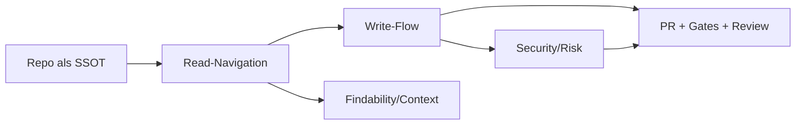

# Explanation: Apps (Connector/Sync) und MCP im KnowledgeOS – Plus vs Business

## Leitfrage

> **🟦 Ziel:** Wann lohnt sich Plus, wann Business, und wann ist MCP oder API-Integration wirklich nötig?

- In scope:
  - Read-Integration: GitHub App/Connector, Deep Research, Sync (Indexing).
  - Write-Integration: MCP (remote tool server) und Write-via-PR.
  - Trade-offs: Sicherheit, Aufwand, Kosten, Findability.
- Out of scope:
  - Detaillierte Keystatic-Konfiguration.
  - Vollständige Portal-Implementierung.

## Mentales Modell (1 Visualisierung)

## Begriffe (kurz)

- App/Connector (app; connected source): Verbindung zu externen Quellen (z. B. GitHub), um Inhalte in ChatGPT zu suchen/zitieren.
- Sync (sync; pre-indexing): Vorab-Indexing, damit ChatGPT schneller und zuverlässiger auf Repo-Inhalte referenzieren kann.
- MCP (MCP; tool protocol): Protokoll, um externe Tools (read/write) aus ChatGPT aufzurufen.
- Write-via-PR (write via PR; audited write): Schreiben nur als Pull Request mit Gates und Review.
- OpenAI API Integration (API integration; your backend): Eigene Chat-/PR-Routen im Portal, die OpenAI API + GitHub API nutzen.

## Was Apps/Connector (GitHub) heute können und nicht können

### Read

- ChatGPT kann Repo-Inhalte suchen, lesen, zitieren (inkl. README/Docs/Code).
- Einschränkung: „File name search“ ist nicht immer verfügbar; oft ist es repo- und inhaltsgetriebenes Suchen.

### Write

- OpenAI-built Apps sind „search-only“ und unterstützen keine write/modify actions.
- Write/Modify ist nur über Custom Apps via MCP sinnvoll.

## Plan-Unterschiede (Plus vs Business) – praktisch relevant

### Plus (typischer Fit)

- Gut, wenn du:
  - hauptsächlich Read (Kontext/Navigation) brauchst,
  - Write weiterhin in VS Code (Copilot/Codex) machst,
  - keine Workspace-Administration brauchst.

### Business (typischer Fit)

- Gut, wenn du:
  - Sync (Indexing) willst, um Kontextkosten/Reibung zu senken,
  - Apps workspace-weit verwalten willst,
  - MCP Write als „Chat-first Write-via-PR“ ernsthaft nutzen willst.

> **🟧 Achtung:** Dokumentation/Feature-Matrix kann sich ändern. Entscheidend ist, was deine UI aktuell anbietet. Deshalb: 1× in Settings prüfen und als Evidence in den Repo-State-Snapshot aufnehmen.

## MCP als Write-Bridge: warum es mächtig und riskant ist

MCP macht aus „Text“ (untrusted content) potenziell „Aktion“ (tool call).
Das ist genau der Sprung, der in agentischen Systemen das Risiko verschiebt:

- Read-only: Fehler sind meist „nur“ falsche Antworten.
- Write: Fehler können Branches/PRs/Labels/Kommentare erzeugen und über CI Wirkung entfalten.

Daher gilt:

- MCP Write ist nur sinnvoll mit Policy-Enforcer (policy enforcement; deterministic guardrails):
  - Repo-Allowlist, Path-Allowlist, Blocklist.
  - Größenlimits (max files, max lines).
  - „No-Secrets“ Checks.
  - „Human Approval“: Merge bleibt manuell.

## API-Integration vs Business-Bridge

### Business-Bridge

- ChatGPT wird zur Arbeitsoberfläche:
  - Read über GitHub App/Sync.
  - Write (optional) über MCP remote tool server.
- Vorteil:
  - Kein eigenes Portal nötig, um Read/Write zu „fühlen“.
- Nachteil:
  - Du betreibst trotzdem einen MCP-Server für Write.
  - Keine „Produkt-UI“: es ist dein Workspace.

### API-Integration (Portal-Chat)

- Du baust `/api/chat` und `/api/pr` im Portal (Option B Slices 2/3).
- Vorteil:
  - Produktfähig, deterministischer Gatekeeper in eigener Codebase.
- Nachteil:
  - Engineering + Betrieb + API-Kosten (inkl. file_search storage/tool calls).

## Kosten/Privacy: API File Search und Data Sharing

Wenn du file_search (vector store) über die OpenAI API nutzt:

- File search storage wird pro GB und Tag berechnet (1 GB frei).
- File search tool calls werden pro 1k Calls berechnet.

Data sharing „free tokens“ (wenn opt-in) kompensieren Tool-Nutzung nicht:
- Tool usage ist von kostenlosen Token-Programmen ausgenommen.

Für Business gilt zusätzlich:
- Business-/API-Daten werden standardmäßig nicht zum Training verwendet (opt-in möglich).

## Trade-off Matrix (entscheidungsfähig)

| Option | Read-Navigation | Write | Aufwand | Risiko | Kostenprofil | Wann wählen |
| --- | --- | --- | --- | --- | --- | --- |
| Plus + Apps + VS Code PR | gut | VS Code PR | niedrig | niedrig | Abo + wenig extra | wenn du „Dev-first“ arbeitest |
| Business + Sync + MCP Write | sehr gut | PR via MCP | mittel | mittel–hoch | Abo + MCP Betrieb | wenn du „Chat-first“ willst |
| Portal API (Slices 2/3) | sehr gut (kontrolliert) | PR via Backend | hoch | kontrollierbar | API + Hosting | wenn Portal ein Produkt wird |

## Konsequenzen für Governance (Gates)

- Egal welche Option: SSOT bleibt Repo-Dateien.
- „Write“ muss PR + Gates + Rollback liefern.
- MCP/API verändern nur die Oberfläche, nicht die Governance-Regeln.

## Evidence (External, Stand heute)

- Apps in ChatGPT (Plan-Matrix): https://help.openai.com/en/articles/11487775-connectors-in-chatgpt
- GitHub App in ChatGPT (read-only): https://help.openai.com/en/articles/11145903-Connecting-connecting-connecting-connecting-connecting
- Sync (Indexing): https://help.openai.com/en/articles/10847137-chatgpt-synced-connectors-faq
- Developer mode + MCP apps (write/modify via custom MCP): https://help.openai.com/en/articles/12584461-developer-mode-and-mcp-apps-in-chatgpt-beta
- File search pricing (storage + tool calls): https://openai.com/api/pricing/
- Data sharing free tokens: Tool-Nutzung ausgeschlossen: https://help.openai.com/de-de/articles/10306912-sharing-feedback-evaluation-and-fine-tuning-data-and-api-inputs-and-outputs-with-openai
- Business data: default no-train: https://openai.com/business-data

## See also

- ADR Bridge-Strategie: `decisions-adr/AgenticSWE_Connectors_MCP_BridgeStrategy_ADR_20260302_V1.md`
- How-to MCP Write-via-PR: `handbook/howto/AgenticSWE_ChatGPTBusiness_MCP_WriteViaPR_HowTo_20260302_V1.md`
- Reference Capability Matrix: `handbook/reference/AgenticSWE_Connectors_MCP_CapabilityMatrix_Reference_20260302_V1.md`
