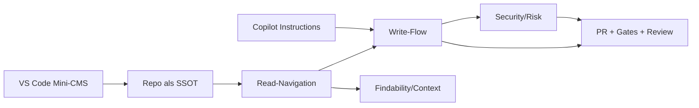

# Explanation: Apps (Connector/Sync) und MCP – Plus vs Business (inkl. Front Matter, Copilot Instructions)

## Leitfrage

> **🟦 Ziel:** Was ermoeglichen Connector/Sync/MCP in Plus vs Business wirklich im Alltag, und welche Bridge ist bis Keystatic am sinnvollsten?

## Mentales Modell

## Begriffe (kurz)

- Connector/App: Verbindung zu Quellen (z. B. GitHub), um Inhalte in ChatGPT zu suchen/zitieren.
- Chat vs Deep Research: Connector kann fuer normale Chats und/oder Deep Research nutzbar sein.
- Sync: Vorab-Indexing fuer schnelleres, automatisches Referenzieren in Chat.
- Agent: ChatGPT Agent kann verbundene Quellen nutzen, wenn aktiviert (plan-/rollout-abhaengig).
- MCP: Protokoll, um externe Tools aus ChatGPT aufzurufen (inkl. write/modify), via remote MCP server.
- Write-via-PR: Schreiben nur als Pull Request mit Gates und Review.

## Wie Connector-Nutzung praktisch funktioniert (Plus und Business)

### Schritt 1: Verbinden (beide Plaene)

In Settings → Apps & Connectors (oder Connectors) waehlt man eine App (z. B. GitHub) und verbindet sie.
Beim Verbinden kann die UI anbieten, den Connector fuer **Chat** oder **Deep Research** zu aktivieren (und teils getrennt zu verbinden).

### Schritt 2: Nutzen im Chat (wenn der Connector Chat unterstuetzt)

- In einem normalen Chat: „+“ im Composer → „More“ → Connector auswaehlen.
- Alternativ (UI-abhaengig): ChatGPT kann Connector automatisch nutzen, wenn er bereits verbunden ist und der Prompt es klar macht.

### Schritt 3: Nutzen in Deep Research (wenn unterstuetzt)

- Deep Research wird gestartet, dann Connector als Quelle ausgewaehlt.
- Deep Research liefert lange, zitierte Berichte und kann verbundene Quellen einbeziehen.

### Was Plus vs Business daran aendert (laut Plan-Matrix)

- Plus:
  - Connectoren in Chat und Deep Research.
  - Kein Sync (Indexing).
- Business:
  - Connectoren in Chat und Deep Research.
  - Sync (Indexing) verfuegbar.
  - Admin Controls fuer Apps/Sync.

> **🟧 Achtung:** Deine UI ist die Wahrheit. Wenn du in Plus in DE nur Deep Research/Agent-Use siehst, ist das ein Rollout/Region- oder Connector-spezifischer Effekt, nicht zwingend ein allgemeines Prinzip.

## Sync: warum Business hier oft „spuerbar“ ist

Sync bedeutet: ChatGPT kann **automatisch** auf indexierte Connector-Daten referenzieren, ohne dass du jedes Mal die Quelle manuell waehlst.

Das adressiert dein Problem „25 Dateien im Chat-Kontext sind zu eng“ sehr direkt:

- weniger Copy/Paste
- weniger „wo steht das?“
- bessere Findability

## MCP: Write aus ChatGPT – warum das ein Risiko-Sprung ist

OpenAI-built Connectors sind „search-only“ (Read). Write/Modify erfordert Custom MCP.

MCP macht aus Text potenziell Aktion (Tool Call). Das verschiebt Risiko:

- Read-only: Fehler sind meist falsche Antworten.
- Write: Fehler kann PRs/Commits/Kommentare erzeugen (und CI triggern).

Daher braucht MCP Write:

- Policy-Enforcer (Allowlist/Blocklist/Limits)
- Human approval (kein Auto-Merge)
- No-Secrets Gate

## Variante 2: Front Matter (VS Code Mini-CMS) + ChatGPT

Front Matter ist eine VS Code UI, die dein Repo wie ein Mini-CMS navigierbar macht (Collections, Frontmatter-Editing, Media).

Warum das in die Bridge gehoert:

- Du bekommst „Portal-Feeling“ (Navigation + Formularfelder) ohne Portal-Implementierung.
- Frontmatter/YAML Fehler sinken.
- ChatGPT kann parallel als Read-Navigator arbeiten (Connector/Sync), waehrend VS Code die Write-Oberflaeche ist.

Trade-off:

- Lokal (kein Produkt-Portal).
- Governance bleibt Repo/Gates.

## Variante 3: Copilot Instructions + ChatGPT

`.github/copilot-instructions.md` (und optional Prompt Files) standardisieren, wie Copilot/Codex im Repo arbeitet.

Warum das in die Bridge gehoert:

- weniger Wiederholung von Regeln (SSOT, Diataxis, keep diffs small)
- mehr Konsistenz bei Write-via-PR
- passt zu deinem Workflow (thin slice, gates)

ChatGPT profitiert indirekt, wenn du ein SSOT Entry-File hast, das sowohl Copilot Instructions als auch Chat-Sessions referenzieren (z. B. `ASWE_REPO_RULES.md`).

## API-Integration: wann sie sinnvoll ist

Portal-Chat im eigenen CMS (Option B Slices 2/3) braucht API-Integration.

Sie lohnt sich, wenn:

- „Chat im Portal“ ein Produktfeature wird (nicht nur Dev-Comfort)
- du deterministische Gates in eigener Codebase erzwingen willst
- du unabhaengig von ChatGPT UI/Rollouts sein willst

Kosten/Trade-off:

- file_search storage + tool calls sind zusaetzliche Kosten.

## Trade-off Matrix (entscheidungsfähig)

| Option | Read-Navigation | Write | UI-Qualitaet | Aufwand | Risiko |
| --- | --- | --- | --- | --- | --- |
| Plus + Connector + VS Code | gut (ohne Sync) | PR in VS Code | mittel | niedrig | niedrig |
| Business + Sync + VS Code | sehr gut | PR in VS Code | hoch (Chat als Navigator) | mittel | niedrig |
| Business + Sync + MCP Write | sehr gut | PR via MCP | hoch (Chat-first) | mittel–hoch | mittel–hoch |
| Portal API (Slices 2/3) | sehr gut | PR via Backend | produktfaehig | hoch | kontrollierbar |
| Front Matter + ChatGPT | gut bis sehr gut | PR in VS Code | sehr hoch lokal | niedrig | niedrig |
| Copilot Instructions + ChatGPT | indirekt besser | deutlich besser | n/a | niedrig | niedrig |

## Evidence (External)

- Connectors Plan-Matrix + Nutzung: <https://help.openai.com/en/articles/11487775-connectors-in-chatgpt>
- GitHub Connector: <https://help.openai.com/en/articles/11145903-connecting-github-to-chatgpt-deep-research-to-chatgpt-deep-research>
- Synced Connectors FAQ: <https://help.openai.com/en/articles/10847137-chatgpt-synced-connectors-faq>
- Release Notes (Rollouts/Region): <https://help.openai.com/en/articles/6825453-chatgpt-release-notes>
- Admin Controls / Sync Index: <https://help.openai.com/en/articles/11509118>
- Developer mode + MCP: <https://help.openai.com/en/articles/12584461-developer-mode-and-mcp-apps-in-chatgpt-beta>
- Pricing (File search): <https://openai.com/api/pricing/>
