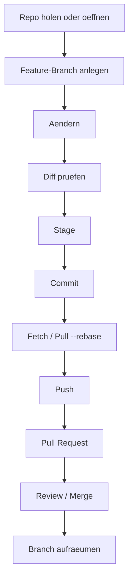

# HowTo: Git sauber ueber VS Code, GitHub Web und Codex lokal anwenden

## Kontext

> **🟦 Ziel:** Du willst dieselben Git-Kernablaeufe in verschiedenen Oberflaechen sicher ausfuehren, ohne Branches, Index, History oder PRs durcheinanderzubringen.

- In scope: Setup, Aendern, Stagen, Committen, Branching, Synchronisieren, PR, Konfliktloesung, Undo/Recovery.
- Out of scope: Spezialfaelle wie komplexe Mail-Workflows oder Serverbetrieb.
- Erfolg: Du kannst einen aenderungsarmen, reviewbaren Branch von lokal nach GitHub bringen und kontrolliert wieder aufraeumen.

> **🟧 Achtung:** GitHub Web ist fuer kleine Aenderungen gut, aber **nicht** fuer groessere Refactorings oder konfliktreiche Arbeit. Dann lokal arbeiten.

## Inputs / Outputs

| Feld | Beschreibung |
| --- | --- |
| Inputs | Repository-URL oder lokales Repo, Ziel-Branch, Aenderungsauftrag |
| Outputs | Sauberer Branch, Commits, Push, Pull Request, optional Tag |
| Constraints | kleine Diffs, sprechende Commit-Nachrichten, Konflikte frueh loesen |
| Evidence | `git status`, `git log --oneline --graph`, PR-Link oder PR-Titel |

## Rezept-Uebersicht



## 1) Erstsetup

### Ziel
Ein lokales Repo mit sauberer Identitaet und bekanntem Remote.

### CLI

```bash
git --version
git config --global user.name "Dein Name"
git config --global user.email "dein.name@example.com"
```

### VS Code

- Ordner oeffnen.
- Source Control pruefen.
- Falls noch kein Repo: **Initialize Repository**.
- Falls bereits vorhanden: Repository wird automatisch erkannt.

### GitHub Web

- Repository-Seite oeffnen.
- `Code`-Menue fuer Clone-URL verwenden.

### Verifikation

```bash
git config --get user.name
git config --get user.email
git remote -v
```

## 2) Repo anlegen oder klonen

### Neues Repo

```bash
mkdir demo && cd demo
git init
git status
```

### Vorhandenes Repo klonen

```bash
git clone <url>
cd <ordner>
git status
```

### VS Code

- **Git: Clone** nutzen oder geklonten Ordner oeffnen.

### GitHub Web

- Keine echte lokale Klon-Operation; nur URL bereitstellen.

## 3) Feature-Branch statt direkt auf `main`

### CLI

```bash
git switch -c feature/<kurzes-thema>
```

Alternativ:

```bash
git branch feature/<kurzes-thema>
git switch feature/<kurzes-thema>
```

### VS Code

- Branch Picker -> **Create new branch**.

### GitHub Web

- Branch-Dropdown -> neuen Branch erstellen.
- Fuer groessere Arbeiten trotzdem lokal weiterarbeiten.

### Verifikation

```bash
git branch --show-current
git status
```

## 4) Aendern und bewusst unterscheiden: Working Tree vs Index

### Diff vor dem Stage

```bash
git diff
```

### Gezieltes Stage

```bash
git add <pfad>
```

### Alles stage

```bash
git add .
```

### Stage kontrollieren

```bash
git diff --staged
```

### VS Code

- Dateidiff ansehen.
- Pro Datei `+` fuer Stage.
- Fuer Feingranularitaet Zeilen oder Hunk aus dem Diff stagen.

### GitHub Web

- Kleine Datei aendern -> **Commit changes**.
- Das entspricht: Aenderung + Commit in einem Schritt.

## 5) Committen

### CLI

```bash
git commit -m "feat: <kurze aussage>"
```

### Commit nach Korrektur nachbessern

```bash
git commit --amend
```

### VS Code

- Commit-Nachricht eintragen.
- Commit ausfuehren.

### Gute Commit-Regeln

- eine Absicht pro Commit
- kleine, reviewbare Diffs
- keine Misch-Commits aus Refactor + Inhalt + Formatierung

### Verifikation

```bash
git log --oneline --decorate -n 5
```

## 6) Remote-Zustand holen, bevor du pusht

### Sicherer Standard

```bash
git fetch origin
git status
git log --oneline --graph --decorate --all -n 15
```

### Branch auf neue Basis setzen

```bash
git pull --rebase origin <zielbranch>
```

### Wann Merge statt Rebase?

- **Rebase** fuer saubere Topic-Branches.
- **Merge** wenn du explizit einen Merge-Commit behalten willst.

## 7) Push und Upstream setzen

### Erster Push

```bash
git push --set-upstream origin feature/<kurzes-thema>
```

### Folge-Pushes

```bash
git push
```

### VS Code

- **Publish Branch** oder **Push**.
- Danach Sync-Status im Status-Balken beobachten.

### Codex / Agent lokal

- Patch erzeugen lassen.
- Vor jedem Push selbst `status`, `diff --staged`, `log` pruefen.
- Keine Agenten-Aenderung ohne sichtbaren Branch-Kontext uebernehmen.

## 8) Pull Request erstellen

### GitHub Web

1. Repository-Seite oeffnen.
2. Branch waehlen.
3. **Compare & pull request**.
4. Base und Compare prüfen.
5. Titel und Beschreibung setzen.
6. **Create Pull Request** oder Draft erstellen.

### GitHub CLI

```bash
gh pr create --base main --head feature/<kurzes-thema> --title "<titel>" --body "<beschreibung>"
```

### VS Code

- GitHub Pull Requests Erweiterung oder PR-Icon in Source Control nutzen.

### Verifikation

- Diff im PR lesen.
- Reviewer-Kontext, betroffene Dateien und Ziel-Branch kontrollieren.

## 9) Merge-Konflikte loesen

### Typischer Ablauf

```bash
git fetch origin
git rebase origin/main
```

oder

```bash
git merge origin/main
```

### Konfliktdateien sehen

```bash
git status
```

### Nach manueller Loesung

Bei Rebase:

```bash
git add <konfliktdatei>
git rebase --continue
```

Bei Merge:

```bash
git add <konfliktdatei>
git commit
```

### VS Code

- Merge Editor oder Inline-Konfliktaktionen verwenden.

## 10) Undo ohne Panik

### Unstaged Datei verwerfen

```bash
git restore <pfad>
```

### Datei aus Stage entfernen, aber Bearbeitung behalten

```bash
git restore --staged <pfad>
```

### Letzten Commit lokal zuruecknehmen, Aenderungen behalten

```bash
git reset --soft HEAD~1
```

### Letzten Commit lokal hart entfernen

```bash
git reset --hard HEAD~1
```

### Team-sicheres Rueckgaengigmachen eines veroeffentlichten Commits

```bash
git revert <commit>
```

### Rettungsanker

```bash
git reflog
```

## 11) Sonderfaelle, die oft spaeter wichtig werden

### Arbeit kurz parken

```bash
git stash push -m "wip"
git stash list
git stash pop
```

### Release markieren

```bash
git tag v1.0.0
git push origin v1.0.0
```

### Zweites Arbeitsverzeichnis fuer Parallelthemen

```bash
git worktree add ../repo-hotfix hotfix/<name>
```

### Einzelnen Commit uebernehmen

```bash
git cherry-pick <commit>
```

### Unterverzeichnisse als eigenes Repo einbinden

```bash
git submodule add <url> <pfad>
```

## 12) Failure Modes (kurz)

| Problem | Ursache | Fix |
| --- | --- | --- |
| `nothing to commit` | nichts gestaged oder keine Aenderung | `git status`, dann gezielt `git add` |
| falscher Branch | zu frueh gearbeitet | `git switch -c <neuer-branch>` oder Commit verschieben |
| Push rejected | Remote ist weiter | `git fetch`, dann `pull --rebase` oder Merge |
| PR zeigt zu viele Dateien | Branch von falscher Basis | auf Zielbranch rebased/merged und Diff neu pruefen |
| lokaler Stand scheinbar weg | `reset`/`checkout` falsch genutzt | zuerst `git reflog` |
| Web-Edit kollidiert lokal | unterschiedliche letzte Basis | `git fetch`, dann sauber integrieren |

## 13) Abdeckungspruefung dieser HowTo-Doku

Diese HowTo-Doku behandelt aktiv die alltagsrelevanten Kernbefehle und verweist fuer die komplette Kommandolandschaft auf die Explanation mit 82-Befehle-Matrix.

### Aktiv genutzt oder direkt erklaert

- Repo starten/holen: `git init`, `git clone`
- Zustand sehen: `git status`, `git diff`, `git log`, `git show`
- Aendern vormerken: `git add`, `git restore`, `git reset`
- Historie bauen: `git commit`, `git commit --amend`
- Branching: `git branch`, `git switch`, `git checkout`, `git merge`, `git rebase`, `git stash`, `git tag`, `git worktree`
- Sync: `git fetch`, `git pull --rebase`, `git push`, `git remote`
- Review/PR: `gh pr create` und GitHub-Web-PR-Flow
- Recovery/Debug: `git revert`, `git reflog`, `git blame`, `git grep`, `git bisect`
- Spezialfaelle: `git cherry-pick`, `git submodule`

### Komplettliste je Gruppe

| Gruppe | Anzahl | Enthaltene Befehle |
| --- | ---: | --- |
| Setup und Konfiguration | 4 | `git git`, `git config`, `git help`, `git bugreport` |
| Projekte anlegen und holen | 2 | `git init`, `git clone` |
| Snapshots und Arbeitsstand | 9 | `git add`, `git status`, `git diff`, `git commit`, `git notes`, `git restore`, `git reset`, `git rm`, `git mv` |
| Branches und Zusammenfuehren | 9 | `git branch`, `git checkout`, `git switch`, `git merge`, `git mergetool`, `git log`, `git stash`, `git tag`, `git worktree` |
| Austausch mit Remotes | 5 | `git fetch`, `git pull`, `git push`, `git remote`, `git submodule` |
| Inspektion und Vergleich | 5 | `git show`, `git difftool`, `git range-diff`, `git shortlog`, `git describe` |
| Patches und Historienkorrektur | 4 | `git apply`, `git cherry-pick`, `git rebase`, `git revert` |
| Debugging | 3 | `git bisect`, `git blame`, `git grep` |
| E-Mail-Workflow | 5 | `git am`, `git format-patch`, `git send-email`, `git request-pull`, `git imap-send` |
| Externe Systeme | 2 | `git svn`, `git fast-import` |
| Administration | 8 | `git clean`, `git gc`, `git fsck`, `git reflog`, `git filter-branch`, `git instaweb`, `git archive`, `git bundle` |
| Server-Administration | 2 | `git daemon`, `git update-server-info` |
| Plumbing-Kommandos | 20 | `git cat-file`, `git check-ignore`, `git checkout-index`, `git commit-tree`, `git count-objects`, `git diff-index`, `git for-each-ref`, `git hash-object`, `git ls-files`, `git ls-tree`, `git merge-base`, `git read-tree`, `git rev-list`, `git rev-parse`, `git show-ref`, `git symbolic-ref`, `git update-index`, `git update-ref`, `git verify-pack`, `git write-tree` |

## 14) DoD (Quick)

- Branch statt Direktarbeit auf `main`
- `git status` vor und nach jedem Commit gelesen
- `git diff --staged` vor dem Commit geprueft
- vor dem Push `fetch` und Zielbranch-Kontext geprueft
- PR mit sauberem Titel und kleinem Diff erstellt
