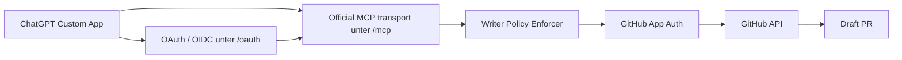

# How-to: MCP-Writer OAuth-first an Codex übergeben

## Ziel

> **🟦 Ziel:** Du gibst Codex einen klaren, engen Arbeitsauftrag, damit der bestehende Railway-MCP-Writer in **4 kleinen PR-Slices** auf **OAuth-first** mit **offiziellem MCP-Transport** umgebaut wird — ohne `.github/workflows/**`, ohne Secrets im Repo und ohne zweiten PR-Erzeuger.

## Nicht-Ziel

- Kein repo-weites Refactoring.
- Keine Lockerung der Writer-Policy.
- Keine Änderungen an `.github/workflows/**`, `infra/**`, `secrets/**`, `.env*`.
- Kein direkter Push auf `main`.
- Kein zweiter autonomer PR-Pfad neben dem Writer.

> **🟥 Stop-&-Ask:** Sobald Codex in Richtung Secrets, Deploy-Rechte, CI-Workflow-Änderungen, riskante Allowlist-Erweiterungen oder Repo-Reorg driftet.

## Arbeitsprinzip

Der Auftrag wird **nicht** als ein großer Umbau erteilt, sondern als **4 PR-Slices**:

1. **PR-1:** MCP-Transport + OAuth-Discovery
2. **PR-2:** OAuth-Server + Dynamic Client Registration (DCR)
3. **PR-3:** Scopes + Policy-Enforcer verheiraten
4. **PR-4:** Railway-CLI-Automation + Smoke-Tests

Jeder Slice läuft im selben Schema:

- **PLAN** → Scope, betroffene Dateien, Gates, Stop-Conditions
- **CHANGE** → kleiner Diff
- **VERIFY** → changed-files-orientierte Checks
- **DELIVER** → PR-Report-Draft + Evidence + nächster Slice

## Aktiver Workstream

- **WS-ID:** `WS-MCP-WRITER-RAILWAY`
- **Zielbild:** ChatGPT Custom App spricht einen ChatGPT-kompatiblen MCP-Server an; OAuth schützt den Zugang zum Writer; die GitHub App bleibt die Bot-Identität Richtung GitHub.

## Scope / Allowlist

### In scope

- `tools/mcp-writer/**`
- `handbook/howto/**`
- `handbook/reference/**`
- `meta/**` nur für kleine Status-/Evidence-Artefakte, wenn wirklich nötig
- `prompts/**`

### Out of scope

- `.github/workflows/**`
- `infra/**`
- `secrets/**`
- `.env*`
- repo-weite Refactors / Cleanups

## Sicherheitsinvarianten

Diese Regeln gelten in **jedem** Slice:

1. **PR-only:** keine Direktänderung auf `main`
2. **Writer bleibt einziger PR-Erzeuger**
3. **No-Secrets-in-Repo**
4. **Policy-Enforcer bleibt hart**
5. **Draft-PR default**
6. **Blocklist bleibt aktiv:** `.github/workflows/**`, `**/.env*`, `secrets/**`, `infra/**`
7. **Read-first bei Unsicherheit:** lieber `read_file` / `list_tree` als Pfade halluzinieren

## Zielarchitektur (kurz)



## Slice-Plan

### PR-1 — MCP-Transport + OAuth-Discovery

**Ziel**
- Den heutigen dünnen JSON-Broker so erweitern/ersetzen, dass ChatGPT den Server als MCP-Server erkennt.
- OAuth-geschützte Resource sauber annoncieren.

**Soll-Ergebnis**
- `/.well-known/oauth-protected-resource`
- `401 Unauthorized` mit passendem `WWW-Authenticate`
- MCP-Transport über `SSE` oder `streaming HTTP`
- `/healthz` bleibt grün

**Dateikandidaten (Beispiel)**
- `tools/mcp-writer/src/server.js`
- `tools/mcp-writer/src/mcp/http.js`
- `tools/mcp-writer/src/oauth/protected-resource.js`
- `tools/mcp-writer/src/config.js`
- `tools/mcp-writer/README.md`

**DoD**
- Discovery läuft ohne den bisherigen `Unauthorized`-Deadlock
- Protected-Resource-Metadata zeigt auf denselben Service unter `/oauth`

### PR-2 — OAuth-Server + DCR

**Ziel**
- Einen kleinen OAuth-/OIDC-Server im selben Railway-Service bereitstellen.
- ChatGPT soll sich mit möglichst wenig Click-Arbeit registrieren können.

**Soll-Ergebnis**
- `/oauth/.well-known/openid-configuration`
- `/oauth/.well-known/oauth-authorization-server`
- `/oauth/authorize`
- `/oauth/token`
- `/oauth/jwks`
- `/oauth/register`
- Authorization Code + PKCE
- DCR aktiviert

**Dateikandidaten (Beispiel)**
- `tools/mcp-writer/src/oauth/server.js`
- `tools/mcp-writer/src/oauth/routes.js`
- `tools/mcp-writer/src/oauth/clients.js`
- `tools/mcp-writer/src/oauth/jwks.js`
- `tools/mcp-writer/src/config.js`
- `tools/mcp-writer/.env.example`

**DoD**
- ChatGPT meldet nicht mehr „OAuth not implemented“
- DCR / Registration Endpoint ist sichtbar

### PR-3 — Scopes + Policy

**Ziel**
- OAuth schützt den Zugang.
- Die bestehende Writer-Policy schützt weiter Repo, Pfade und Diff-Fläche.

**Scopes**
- `mcp.read`
- `mcp.write`

**Tool-Mapping**
- `read_file`, `list_tree` → `mcp.read`
- `create_branch`, `commit_files`, `open_pr` → `mcp.write`

**Dateikandidaten (Beispiel)**
- `tools/mcp-writer/src/auth/require-scope.js`
- `tools/mcp-writer/src/mcp/tools.js`
- `tools/mcp-writer/src/policy/enforce.js`
- `tools/mcp-writer/policy.json`
- `tools/mcp-writer/src/report/pr-report.js`

**DoD**
- Read klappt nur mit `mcp.read`
- Write klappt nur mit `mcp.write`
- Policy blockiert weiter riskante Pfade und Secret-Muster

### PR-4 — Railway-CLI-Automation + Smoke

**Ziel**
- Deployment und Variablenpflege weitgehend ohne Dashboard-Klicks.

**Soll-Ergebnis**
- `railway variable set ... --stdin --skip-deploys`
- `railway up tools/mcp-writer --path-as-root ...`
- Smoke-Skripte für Discovery, DCR, Token, Read-Test

**Dateikandidaten (Beispiel)**
- `tools/mcp-writer/scripts/railway/set_env.sh`
- `tools/mcp-writer/scripts/railway/deploy.sh`
- `tools/mcp-writer/scripts/railway/smoke_oauth.sh`
- `tools/mcp-writer/scripts/dev/oauth_smoke.sh`
- `tools/mcp-writer/README.md`

**DoD**
- Neue Railway-Deployments laufen via CLI reproduzierbar
- Smoke-Tests liefern nachvollziehbare Evidence

## Standard-Input für Codex

Gib Codex immer diese Blöcke mit:

### A) Workstream
- `WS-ID: WS-MCP-WRITER-RAILWAY`
- `Slice-ID: PR-1 | PR-2 | PR-3 | PR-4`

### B) Ziel
- 1 Satz mit dem **konkreten** Slice-Ziel

### C) Allowed files
- explizite Dateiliste oder Pfadpräfixe

### D) Forbidden files
- immer mindestens:
  - `.github/workflows/**`
  - `infra/**`
  - `secrets/**`
  - `.env*`

### E) DoD
- 3–5 messbare Punkte

### F) Expected output
- Patch-Spec
- geplanter Diff
- Gates / Evidence
- PR-Report-Draft
- nächster Thin Slice

## Standard-Output, den Codex liefern soll

Codex soll **immer** in dieser Reihenfolge antworten:

1. **Patch-Spec**
2. **Files touched**
3. **Planned diff**
4. **Gates / Verify**
5. **PR-Report-Draft**
6. **Next Thin Slice**

## Gates / Verify

Minimal lokal, changed-files-orientiert:

- `git diff --name-only`
- markdownlint für geänderte Markdown-Dateien
- cSpell / Rechtschreibprüfung für geänderte Doku-Dateien
- No-Secrets Quickscan auf Diff
- kurze manuelle Plausibilitätsprüfung der Allowlist/Blocklist

Wenn repo-lokale Skripte verfügbar sind, kann Codex sie **benennen**, aber nur ausführen, wenn sie im Scope vorhanden und ungefährlich sind.

## PR-Report Pflichtstruktur

Jeder Slice soll einen Draft für diesen PR-Report liefern:

```md
### Summary
- <1–3 bullets>

### Scope / Files touched
- <Dateien>

### Motivation / Why
- <warum dieser Slice nötig ist>

### Risk class
- <low | medium>
- <kurze Begründung>

### Gates executed (evidence)
- <Check>: <pass/fail>
- <Check>: <pass/fail>

### Rollback
- <wie der Slice rückgängig gemacht wird>

### Next thin slice
- <PR-2 / PR-3 / PR-4>
```

## Railway-Betrieb: Grundsatz

Für den OAuth-Umbau gilt:

- **ein Railway-Service** bleibt bevorzugt
- `/oauth/*` und `/mcp` laufen im selben Dienst
- Deployments idealerweise nur noch per CLI
- Secrets nur via Railway Variables, nie im Repo

## Copy/Paste Startprompt für Codex

```text
WS-ID: WS-MCP-WRITER-RAILWAY
Slice-ID: <PR-1 | PR-2 | PR-3 | PR-4>

Lies zuerst:
1. handbook/howto/AgenticSWE_MCPWriter_OAuth_Codex_Handover_HowTo_20260309_V1.md
2. prompts/ASWE_MCPWriter_OAuth_MasterPrompt_20260309_V1.md
3. prompts/<passender Slice-Prompt>.md
4. handbook/reference/AgenticSWE_Codex_HandoverChecklist_20260309_V1.md

Auftrag:
- arbeite nur im erlaubten Scope
- liefere PLAN -> CHANGE -> VERIFY -> DELIVER
- halte den Diff klein und reviewbar
- keine `.github/workflows/**`
- keine Secrets
- kein zweiter PR-Pfad

Erwarteter Output:
1. Patch-Spec
2. Files touched
3. Geplanter Diff
4. Gates / Evidence
5. PR-Report-Draft
6. Next Thin Slice
```

## Verifikation

**🟩 Check:** Dieses HowTo ist gut genug, wenn du es an Codex geben kannst und nur noch `Slice-ID` + ggf. `Allowed files` ergänzen musst.

## Rollback

- Die Übergabedokumente selbst können als kleiner Doku-PR revertiert werden.
- Für die eigentliche Umsetzung gilt: jeder Slice separat revertierbar.
