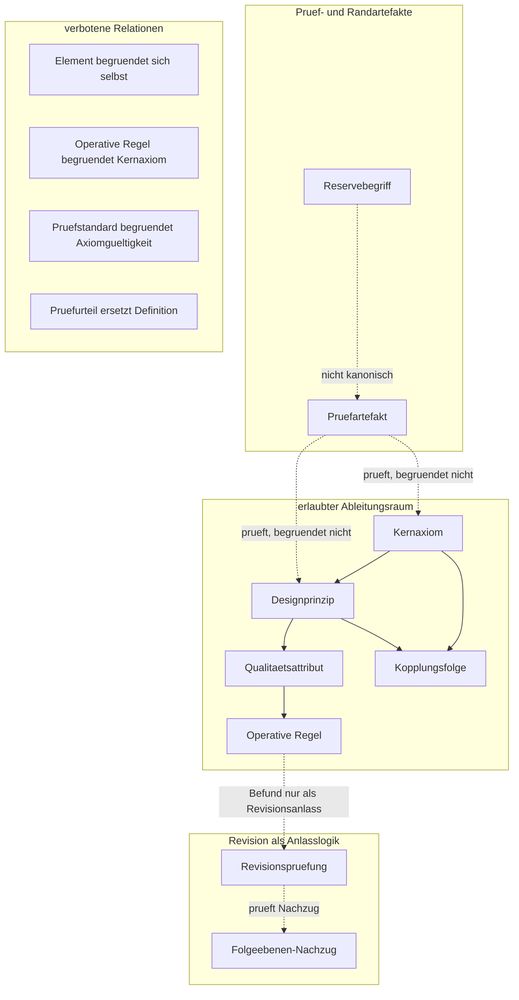
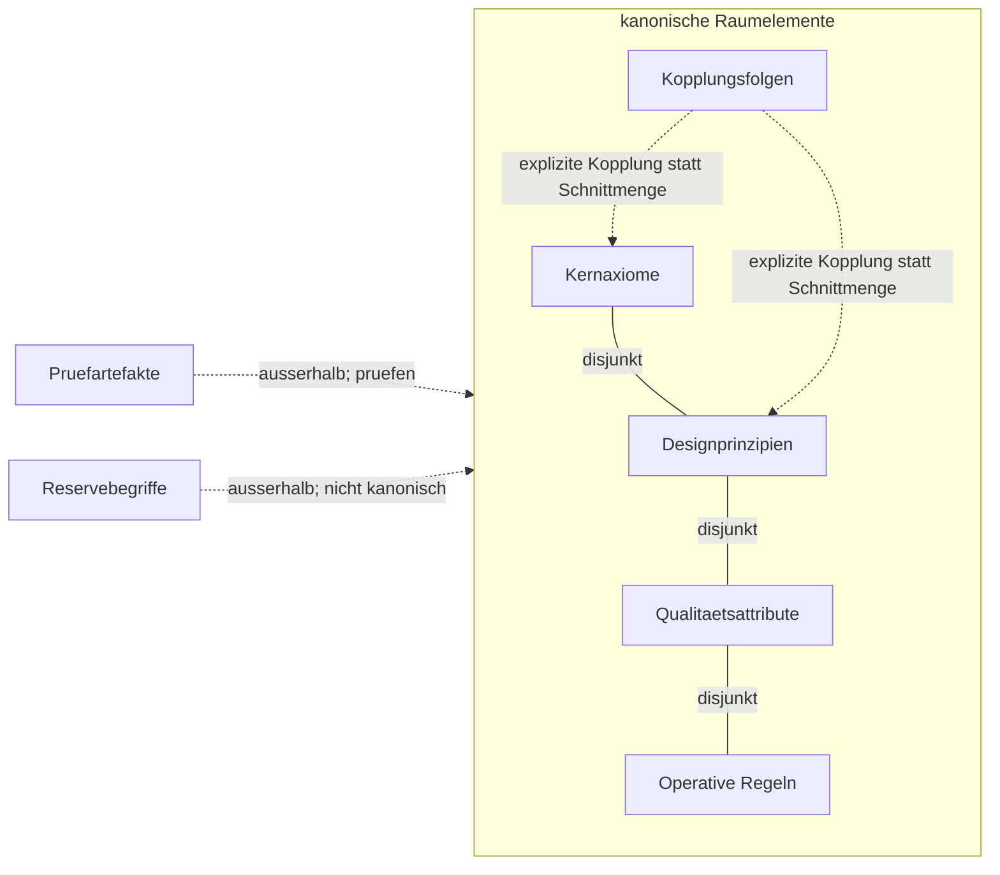
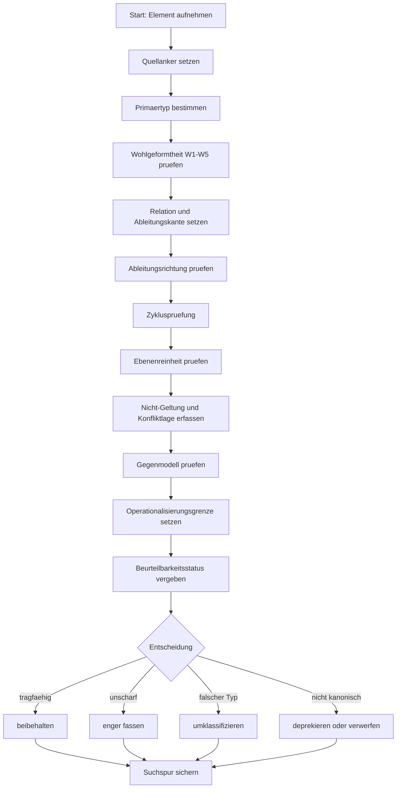

# ASWE_Axiomraum_Grundlagendokument_20260423_V11

<a id="sec-01-zielbild"></a>

<a id="sec-00-navigation"></a>
## 0. Navigation, Register und Zeilenbelegvorbereitung

> **Entscheidung:** Dieser Abschnitt ist ein Navigations- und Pruefartefakt. Er erzeugt keine neuen Raumelemente und veraendert keine fachliche Entscheidung.
> **Grenze:** Interne Verweise erleichtern Orientierung, sind aber keine Belege. Fuer Belegfaehigkeit bleiben stabile Kennung, Anker, Abschnitt und spaeterer Zeilenbereich erforderlich.

### 0.1 Inhaltsverzeichnis

- [1. Zielbild](#sec-01-zielbild)
- [2. Gegenstand](#sec-02-gegenstand)
- [3. Geltungsbereich](#sec-03-geltungsbereich)
- [4. Nicht-Geltung](#sec-04-nicht-geltung)
- [5. Epistemischer Status](#sec-05-epistemischer-status)
- [6. Leitplanken](#sec-06-leitplanken)
- [7. Begriffssystem](#sec-07-begriffssystem)
- [8. Definitorische Mindestschicht](#sec-08-definitorische-mindestschicht)
- [9. Logische Konsistenzschicht](#sec-09-logische-konsistenzschicht)
- [10. Diagrammatische Orientierung](#sec-10-diagramme)
- [11. Kernaxiome](#sec-11-kernaxiome)
- [12. Folgeebenen](#sec-12-folgeebenen)
- [13. Metaordnung](#sec-13-metaordnung)
- [14. Rekursiver Pruefstandard](#sec-14-rekursiver-pruefstandard)
- [15. Pruefalgorithmus und Suchspur](#sec-15-pruefalgorithmus-suchspur)
- [16. Routinen](#sec-16-routinen)
- [17. Rueckbindung, Bewertung und Redundanz](#sec-17-rueckbindung-bewertung-redundanz)
- [18. Leistungs- und Geschwindigkeitslogik](#sec-18-leistungslogik)
- [19. Reserve- und Pruefbegriffe](#sec-19-reserve-pruefbegriffe)
- [20. Materialisierungsregel](#sec-20-materialisierungsregel)
- [21. Minimaler Begruendungsrahmen](#sec-21-begruendungsrahmen)
- [22. Revisionsregel](#sec-22-revisionsregel)
- [22.1 Selbstpruefung](#sec-22-1-selbstpruefung-maengelbeseitigung)
- [23. Schlussstatus](#sec-23-schlussstatus)

### 0.2 Dokumentkarte

| Bereich | Rolle | Hauptabschnitte |
|---|---|---|
| Orientierung | Ziel, Geltung, Leitplanken | [1](#sec-01-zielbild) bis [6](#sec-06-leitplanken) |
| Begriffs- und Definitionsordnung | Klassen, Relationen, Wohlgeformtheit | [7](#sec-07-begriffssystem) bis [8](#sec-08-definitorische-mindestschicht) |
| Konsistenzschutz | Zirkularitaet, Ebenenreinheit, Diagramme | [9](#sec-09-logische-konsistenzschicht) bis [10](#sec-10-diagramme) |
| Gegenstandsraum | Kernaxiome und Folgeebenen | [11](#sec-11-kernaxiome) bis [12](#sec-12-folgeebenen) |
| Pruefartefakte | Pruefstandard, Algorithmus, Routinen | [13](#sec-13-metaordnung) bis [16](#sec-16-routinen) |
| Konsolidierung | Rueckbindung, Bewertung, Redundanz | [17](#sec-17-rueckbindung-bewertung-redundanz) |
| Umsetzungsvorbehalt | Leistung, Materialisierung, Revision | [18](#sec-18-leistungslogik) bis [23](#sec-23-schlussstatus) |

### 0.3 Lesepfade

| Lesepfad | Reihenfolge | Zweck |
|---|---|---|
| Schnelllesen | [1](#sec-01-zielbild) -> [6](#sec-06-leitplanken) -> [11](#sec-11-kernaxiome) -> [12](#sec-12-folgeebenen) -> [20](#sec-20-materialisierungsregel) | Kernverstaendnis |
| Pruefen | [7](#sec-07-begriffssystem) -> [8](#sec-08-definitorische-mindestschicht) -> [9](#sec-09-logische-konsistenzschicht) -> [14](#sec-14-rekursiver-pruefstandard) -> [15](#sec-15-pruefalgorithmus-suchspur) -> [16](#sec-16-routinen) | logisch-definitorische Pruefung |
| Vertiefen | [10](#sec-10-diagramme) -> [17](#sec-17-rueckbindung-bewertung-redundanz) -> [18](#sec-18-leistungslogik) -> [22](#sec-22-revisionsregel) | Operationalisierungsvorbereitung |

### 0.4 Elementregister

| Kennung | Name | Typ | Abschnitt | Zweck |
| --- | --- | --- | --- | --- |
| ka-a1 | [A1 Ziel- und Geltungsbindung](#ka-a1) | Kernaxiom | 11.1 | basale Grundordnung |
| ka-a2 | [A2 Epistemische Trennung](#ka-a2) | Kernaxiom | 11.1 | basale Grundordnung |
| ka-a3 | [A3 Auditierbarkeit und Unsicherheitsmarkierung](#ka-a3) | Kernaxiom | 11.1 | basale Grundordnung |
| ka-a4 | [A4 begrenzt-rueckgabefaehige Schrittlogik unter Aufsicht](#ka-a4) | Kernaxiom | 11.1 | basale Grundordnung |
| ka-a5 | [A5 Verhaltenstestbarkeit](#ka-a5) | Kernaxiom | 11.1 | basale Grundordnung |
| ka-b1 | [B1 Terminologische Primaerordnung](#ka-b1) | Kernaxiom | 11.2 | basale Grundordnung |
| ka-b2 | [B2 Ontologische Trennschaerfe](#ka-b2) | Kernaxiom | 11.2 | basale Grundordnung |
| ka-b3 | [B3 Provenienz und Referenzierbarkeit](#ka-b3) | Kernaxiom | 11.2 | basale Grundordnung |
| ka-b4 | [B4 Pfad- und Schnittstellenexplizitheit](#ka-b4) | Kernaxiom | 11.2 | basale Grundordnung |
| ka-b5 | [B5 Governierte Evolvierbarkeit](#ka-b5) | Kernaxiom | 11.2 | basale Grundordnung |
| ka-k1 | [K1 Beobachtung-Aussage-Beleg](#ka-k1) | Kernaxiom | 11.3 | basale Grundordnung |
| ka-k2 | [K2 Evaluation vor Operationalisierung](#ka-k2) | Kernaxiom | 11.3 | basale Grundordnung |
| ka-k3 | [K3 Spiegel-/Adapter-Asymmetrie](#ka-k3) | Kernaxiom | 11.3 | basale Grundordnung |
| dp-01-explizitheit-kritischer-annahmen | [Explizitheit kritischer Annahmen](#dp-01-explizitheit-kritischer-annahmen) | Designprinzip | 12.1 | konstruktionsleitende Folgeebene |
| dp-02-regelgebundene-selbstkritik | [regelgebundene Selbstkritik](#dp-02-regelgebundene-selbstkritik) | Designprinzip | 12.1 | konstruktionsleitende Folgeebene |
| dp-03-adversariale-pruefbarkeit | [adversariale Pruefbarkeit](#dp-03-adversariale-pruefbarkeit) | Designprinzip | 12.1 | konstruktionsleitende Folgeebene |
| dp-04-evaluator-kritische-testdisziplin | [evaluator-kritische Testdisziplin](#dp-04-evaluator-kritische-testdisziplin) | Designprinzip | 12.1 | konstruktionsleitende Folgeebene |
| dp-05-definitorische-priorisierung | [definitorische Priorisierung](#dp-05-definitorische-priorisierung) | Designprinzip | 12.1 | konstruktionsleitende Folgeebene |
| dp-06-rollen-und-relationsreinheit | [Rollen- und Relationsreinheit](#dp-06-rollen-und-relationsreinheit) | Designprinzip | 12.1 | konstruktionsleitende Folgeebene |
| dp-07-kontrollierte-kopplung | [kontrollierte Kopplung](#dp-07-kontrollierte-kopplung) | Designprinzip | 12.1 | konstruktionsleitende Folgeebene |
| dp-08-driftwachsame-revisionsdisziplin | [driftwachsame Revisionsdisziplin](#dp-08-driftwachsame-revisionsdisziplin) | Designprinzip | 12.1 | konstruktionsleitende Folgeebene |
| dp-09-verifikationsfaehigkeit | [Verifikationsfaehigkeit](#dp-09-verifikationsfaehigkeit) | Designprinzip | 12.1 | konstruktionsleitende Folgeebene |
| dp-10-epistemische-staffelung | [epistemische Staffelung](#dp-10-epistemische-staffelung) | Designprinzip | 12.1 | konstruktionsleitende Folgeebene |
| dp-11-materialisierungsdisziplin | [Materialisierungsdisziplin](#dp-11-materialisierungsdisziplin) | Designprinzip | 12.1 | konstruktionsleitende Folgeebene |
| dp-12-keine-konkurrierende-wahrheitsquelle | [keine konkurrierende Wahrheitsquelle](#dp-12-keine-konkurrierende-wahrheitsquelle) | Designprinzip | 12.1 | konstruktionsleitende Folgeebene |
| dp-13-ausnahmebehandlungs-explizitheit | [Ausnahmebehandlungs-Explizitheit](#dp-13-ausnahmebehandlungs-explizitheit) | Designprinzip | 12.1 | konstruktionsleitende Folgeebene |
| dp-14-nachzugsdisziplin-fuer-folgeebenen-bei-axiomrevision | [Nachzugsdisziplin fuer Folgeebenen bei Axiomrevision](#dp-14-nachzugsdisziplin-fuer-folgeebenen-bei-axiomrevision) | Designprinzip | 12.1 | konstruktionsleitende Folgeebene |
| qa-01-driftresistenz | [Driftresistenz](#qa-01-driftresistenz) | Qualitaetsattribut | 12.2 | bewertbare Folgeebene |
| qa-02-kontrollierbarkeit-in-enger-fassung | [Kontrollierbarkeit in enger Fassung](#qa-02-kontrollierbarkeit-in-enger-fassung) | Qualitaetsattribut | 12.2 | bewertbare Folgeebene |
| qa-03-reproduzierbarkeit | [Reproduzierbarkeit](#qa-03-reproduzierbarkeit) | Qualitaetsattribut | 12.2 | bewertbare Folgeebene |
| qa-04-argumentative-nachvollziehbarkeit | [argumentative Nachvollziehbarkeit](#qa-04-argumentative-nachvollziehbarkeit) | Qualitaetsattribut | 12.2 | bewertbare Folgeebene |
| qa-05-wiederauffindbarkeit | [Wiederauffindbarkeit](#qa-05-wiederauffindbarkeit) | Qualitaetsattribut | 12.2 | bewertbare Folgeebene |
| qa-06-persistenz-in-enger-fassung | [Persistenz in enger Fassung](#qa-06-persistenz-in-enger-fassung) | Qualitaetsattribut | 12.2 | bewertbare Folgeebene |
| qa-07-reparierbarkeit | [Reparierbarkeit](#qa-07-reparierbarkeit) | Qualitaetsattribut | 12.2 | bewertbare Folgeebene |
| qa-08-wartbarkeit | [Wartbarkeit](#qa-08-wartbarkeit) | Qualitaetsattribut | 12.2 | bewertbare Folgeebene |
| qa-09-duale-lesbarkeit-in-enger-fassung | [duale Lesbarkeit in enger Fassung](#qa-09-duale-lesbarkeit-in-enger-fassung) | Qualitaetsattribut | 12.2 | bewertbare Folgeebene |
| qa-10-wahrheitsquellenstabilitaet-in-enger-fassung | [Wahrheitsquellenstabilitaet in enger Fassung](#qa-10-wahrheitsquellenstabilitaet-in-enger-fassung) | Qualitaetsattribut | 12.2 | bewertbare Folgeebene |
| qa-11-ableitungsnachvollziehbarkeit | [Ableitungsnachvollziehbarkeit](#qa-11-ableitungsnachvollziehbarkeit) | Qualitaetsattribut | 12.2 | bewertbare Folgeebene |
| qa-12-vererbungskonsistenz | [Vererbungskonsistenz](#qa-12-vererbungskonsistenz) | Qualitaetsattribut | 12.2 | bewertbare Folgeebene |
| qa-13-rueckrollbarkeit | [Rueckrollbarkeit](#qa-13-rueckrollbarkeit) | Qualitaetsattribut | 12.2 | bewertbare Folgeebene |
| qa-14-ausfuehrungseffizienz | [Ausfuehrungseffizienz](#qa-14-ausfuehrungseffizienz) | Qualitaetsattribut | 12.2 | bewertbare Folgeebene |
| or-01-zielbild-vor-ausfuehrung-explizieren | [Zielbild vor Ausfuehrung explizieren](#or-01-zielbild-vor-ausfuehrung-explizieren) | Operative Regel | 12.3 | ausfuehrbare Folgeebene |
| or-02-aussagearten-trennen | [Aussagearten trennen](#or-02-aussagearten-trennen) | Operative Regel | 12.3 | ausfuehrbare Folgeebene |
| or-03-unsicherheiten-markieren | [Unsicherheiten markieren](#or-03-unsicherheiten-markieren) | Operative Regel | 12.3 | ausfuehrbare Folgeebene |
| or-04-kleinsten-sicheren-naechsten-schritt-waehlen | [kleinsten sicheren naechsten Schritt waehlen](#or-04-kleinsten-sicheren-naechsten-schritt-waehlen) | Operative Regel | 12.3 | ausfuehrbare Folgeebene |
| or-05-gegenbeispiele-und-testfaelle-anfuehren | [Gegenbeispiele und Testfaelle anfuehren](#or-05-gegenbeispiele-und-testfaelle-anfuehren) | Operative Regel | 12.3 | ausfuehrbare Folgeebene |
| or-06-begriff-vor-benennung-benennung-vor-regelung | [Begriff vor Benennung, Benennung vor Regelung](#or-06-begriff-vor-benennung-benennung-vor-regelung) | Operative Regel | 12.3 | ausfuehrbare Folgeebene |
| or-07-herkunft-und-referenzen-mitfuehren | [Herkunft und Referenzen mitfuehren](#or-07-herkunft-und-referenzen-mitfuehren) | Operative Regel | 12.3 | ausfuehrbare Folgeebene |
| or-08-pfadwechsel-nur-ueber-explizite-schnittstellen | [Pfadwechsel nur ueber explizite Schnittstellen](#or-08-pfadwechsel-nur-ueber-explizite-schnittstellen) | Operative Regel | 12.3 | ausfuehrbare Folgeebene |
| or-09-aenderungen-gegen-drift-und-revisionsfaehigkeit-pruefen | [Aenderungen gegen Drift und Revisionsfaehigkeit pruefen](#or-09-aenderungen-gegen-drift-und-revisionsfaehigkeit-pruefen) | Operative Regel | 12.3 | ausfuehrbare Folgeebene |
| or-10-bewertung-vor-materialisierung | [Bewertung vor Materialisierung](#or-10-bewertung-vor-materialisierung) | Operative Regel | 12.3 | ausfuehrbare Folgeebene |
| or-11-spiegel-und-adapter-nicht-als-semantischen-ursprung-behandel | [Spiegel und Adapter nicht als semantischen Ursprung behandeln](#or-11-spiegel-und-adapter-nicht-als-semantischen-ursprung-behandel) | Operative Regel | 12.3 | ausfuehrbare Folgeebene |
| or-12-kopplungen-explizit-markieren-und-asymmetrische-kopplungen-k | [Kopplungen explizit markieren und asymmetrische Kopplungen kennzeichnen](#or-12-kopplungen-explizit-markieren-und-asymmetrische-kopplungen-k) | Operative Regel | 12.3 | ausfuehrbare Folgeebene |
| or-13-deprekation-statt-stiller-entfernung-markieren | [Deprekation statt stiller Entfernung markieren](#or-13-deprekation-statt-stiller-entfernung-markieren) | Operative Regel | 12.3 | ausfuehrbare Folgeebene |
| or-14-prueftiefe-an-tragweite-und-reversibilitaet-ausrichten | [Prueftiefe an Tragweite und Reversibilitaet ausrichten](#or-14-prueftiefe-an-tragweite-und-reversibilitaet-ausrichten) | Operative Regel | 12.3 | ausfuehrbare Folgeebene |
| kf-01-scope-bindung-wirkt-bis-in-materialisierung-und-operationali | [Scope-Bindung wirkt bis in Materialisierung und Operationalisierung.](#kf-01-scope-bindung-wirkt-bis-in-materialisierung-und-operationali) | Kopplungsfolge | 12.4 | explizite A/B/K-Kopplung |
| kf-02-epistemische-reinheit-ist-in-verhalten-und-architektur-gemei | [Epistemische Reinheit ist in Verhalten und Architektur gemeinsam basal.](#kf-02-epistemische-reinheit-ist-in-verhalten-und-architektur-gemei) | Kopplungsfolge | 12.4 | explizite A/B/K-Kopplung |
| kf-03-auditierbarkeit-braucht-provenienz-und-referenzierbarkeit | [Auditierbarkeit braucht Provenienz und Referenzierbarkeit.](#kf-03-auditierbarkeit-braucht-provenienz-und-referenzierbarkeit) | Kopplungsfolge | 12.4 | explizite A/B/K-Kopplung |
| kf-04-rueckgabefaehige-schrittlogik-braucht-explizite-pfad-und-sch | [Rueckgabefaehige Schrittlogik braucht explizite Pfad- und Schnittstellenlogik.](#kf-04-rueckgabefaehige-schrittlogik-braucht-explizite-pfad-und-sch) | Kopplungsfolge | 12.4 | explizite A/B/K-Kopplung |
| kf-05-testbarkeit-muss-vor-operative-uebernahme-treten | [Testbarkeit muss vor operative Uebernahme treten.](#kf-05-testbarkeit-muss-vor-operative-uebernahme-treten) | Kopplungsfolge | 12.4 | explizite A/B/K-Kopplung |
| kf-06-ontologische-trennschaerfe-stabilisiert-spiegel-adapter-asym | [Ontologische Trennschaerfe stabilisiert Spiegel-/Adapter-Asymmetrie.](#kf-06-ontologische-trennschaerfe-stabilisiert-spiegel-adapter-asym) | Kopplungsfolge | 12.4 | explizite A/B/K-Kopplung |
| kf-07-governierte-evolvierbarkeit-verlangt-begrenzte-ausfuehrungs | [Governierte Evolvierbarkeit verlangt begrenzte Ausfuehrungs- und Rueckgabelogik.](#kf-07-governierte-evolvierbarkeit-verlangt-begrenzte-ausfuehrungs) | Kopplungsfolge | 12.4 | explizite A/B/K-Kopplung |
| kf-08-axiomrevision-erzwingt-folgeebenen-nachzug | [Axiomrevision erzwingt Folgeebenen-Nachzug.](#kf-08-axiomrevision-erzwingt-folgeebenen-nachzug) | Kopplungsfolge | 12.4 | explizite A/B/K-Kopplung |


### 0.5 Relationsregister

| Quelle | Relation | Ziel | Status | Abschnitt |
| --- | --- | --- | --- | --- |
| Kernaxiom | leitet_ab | Designprinzip | erlaubte Hauptfolge | [8.5](#sec-08-definitorische-mindestschicht) |
| Designprinzip | leitet_ab | Qualitaetsattribut | erlaubte Hauptfolge | [8.5](#sec-08-definitorische-mindestschicht) |
| Qualitaetsattribut | operationalisiert_durch | Operative Regel | erlaubte Hauptfolge | [8.5](#sec-08-definitorische-mindestschicht) |
| A/B/K-Element | koppelt | Kopplungsfolge | explizite Kopplung | [8.3](#sec-08-definitorische-mindestschicht) |
| Pruefartefakt | prueft | Raumelement | begruendet nicht | [13](#sec-13-metaordnung) |
| Pruefroutine | wendet_an | Pruefalgorithmus | Anwendungsebene | [16](#sec-16-routinen) |
| Pruefurteil | entscheidet_ueber | Elementstatus | kein Definitionsursprung | [13.5](#sec-13-metaordnung) |


### 0.6 Pruefartefaktregister

| Kennung | Name | Untertyp | Abschnitt | Zweck |
| --- | --- | --- | --- | --- |
| pa-01-pruefkriterium | Pruefkriterium | Pruefartefakt-Untertyp | [13.3](#sec-13-metaordnung) | einzelner Massstab |
| pa-02-pruefstandard | Rekursiver Pruefstandard | Pruefartefakt-Untertyp | [14](#sec-14-rekursiver-pruefstandard) | allgemeines Pruefschema |
| pa-03-pruefalgorithmus | Pruefalgorithmus | Pruefartefakt-Untertyp | [15](#sec-15-pruefalgorithmus-suchspur) | determinierte Pruefschrittreihenfolge |
| pa-04-pruefroutine | Pruefroutine | Pruefartefakt-Untertyp | [16](#sec-16-routinen) | anlassbezogener Pruefablauf |
| pa-05-suchspur | Suchspur | Pruefartefakt-Untertyp | [15.3](#sec-15-pruefalgorithmus-suchspur) | protokollierte Pruefentscheidungen |
| pa-06-pruefurteil | Pruefurteil | Pruefartefakt-Untertyp | [13.5](#sec-13-metaordnung) | Ergebnis einer Pruefung |


### 0.7 Begriffskarten

| Begriff | Typ | Nicht gleichzusetzen mit | Zweck |
|---|---|---|---|
| Raumelement | Gegenstandsklasse | Pruefartefakt | kanonischer Inhalt des Axiomraums |
| Pruefartefakt | Meta-Klasse | Raumelement | Pruefung, Anwendung oder Dokumentation des Axiomraums |
| Pruefstandard | Pruefartefakt | Definition | allgemeines Pruefschema |
| Pruefalgorithmus | Pruefartefakt | Pruefroutine | determinierte Pruefschrittreihenfolge |
| Pruefroutine | Pruefartefakt | operative Regel | anlassbezogener Ablauf zur Anwendung des Pruefalgorithmus |
| Suchspur | Pruefartefakt | Beleg selbst | protokollierte Pruefentscheidung |
| Pruefurteil | Pruefartefakt | Definition | Ergebnis einer Pruefung |
| Rueckbindung | Relation | freier Beleg | Zuordnung eines Folgeelements zu seiner Grundlage |
| Beurteilbarkeitsstatus | Pruefstatus | Wahrheitsbeweis | Grad interner Nachweisbarkeit |

### 0.8 Zeilenbelegvorbereitung

| Pruefaussage-Kennung | Anker | Abschnitt | Zeilenbereich | pruefbare Aussage |
|---|---|---|---|---|
| PA-001 | `#sec-01-zielbild` | 1 | [nach finaler Zeilenzaehlung] | Dokument begruendet einen rekursiv pruefbaren Axiomraum |
| PA-002 | `#sec-04-nicht-geltung` | 4 | [nach finaler Zeilenzaehlung] | Dokument ist keine direkte Repo-Materialisierungsanweisung |
| PA-003 | `#sec-08-definitorische-mindestschicht` | 8 | [nach finaler Zeilenzaehlung] | Definitorische Mindestschicht definiert Typen und Relationen |
| PA-004 | `#sec-09-logische-konsistenzschicht` | 9 | [nach finaler Zeilenzaehlung] | Logische Konsistenzschicht sperrt Zirkularitaet und Ebenenvermischung |
| PA-005 | `#sec-11-kernaxiome` | 11 | [nach finaler Zeilenzaehlung] | Kernaxiome bilden basalen Gegenstandsraum |
| PA-006 | `#sec-12-folgeebenen` | 12 | [nach finaler Zeilenzaehlung] | Folgeebenen bleiben von Kernaxiomen getrennt |
| PA-007 | `#sec-13-metaordnung` | 13 | [nach finaler Zeilenzaehlung] | Pruefartefakte sind keine Raumelemente |
| PA-008 | `#sec-14-rekursiver-pruefstandard` | 14 | [nach finaler Zeilenzaehlung] | Pruefstandard ist Pruefschema, nicht Definitionsursprung |
| PA-009 | `#sec-15-pruefalgorithmus-suchspur` | 15 | [nach finaler Zeilenzaehlung] | Pruefalgorithmus bestimmt die Reihenfolge der Anwendung |
| PA-010 | `#sec-16-routinen` | 16 | [nach finaler Zeilenzaehlung] | Routinen sind anlassgebundene Pruefartefakte |
| PA-011 | `#sec-17-rueckbindung-bewertung-redundanz` | 17 | [nach finaler Zeilenzaehlung] | Rueckbindungsmatrix und Bewertungslogik sind Pruefartefakte |
| PA-012 | `#sec-20-materialisierungsregel` | 20 | [nach finaler Zeilenzaehlung] | Repo-Materialisierung bleibt an separate Entscheidung gebunden |

### 0.9 Pruefsumme

Die Pruefsumme der finalen Datei ist nach stabiler Dateierstellung extern zu berechnen. Sie wird hier nicht vorweggenommen, um keine Scheingenauigkeit zu erzeugen.


## 1. Zielbild

Dieses Dokument begruendet einen rekursiv pruefbaren Axiomraum fuer zwei gekoppelte Gegenstandsbereiche:

- **A: LLM-Verhaltenssteuerung**
- **B: ASWE_KnowledgeOS-Architektur**
- **K: explizite Kopplungen zwischen A und B**

Es ist als alleinstehendes Grundlagendokument formuliert. Es ist kein Pruefbericht, keine Prozesschronik, kein Korrekturauftrag und kein Rohdatenmanifest.

<a id="sec-02-gegenstand"></a>
## 2. Gegenstand

Gegenstand sind:

- Kernaxiome,
- starke Designprinzipien,
- sekundaere Qualitaetsattribute,
- operative Regeln,
- Kopplungsfolgen,
- rekursive Pruefachsen,
- Pruefartefakte,
- und Routinen fuer Neuaufnahme, Umklassifizierung, Axiomrevision und Gesamt-Konsistenzaudit.

<a id="sec-03-geltungsbereich"></a>
## 3. Geltungsbereich

Das Dokument gilt als fachlicher Grundlagenstand fuer spaetere Dokumentations-, Architektur-, Prompt-Governance- und Integrationsentscheidungen. Es kann in ein Repo integriert werden, erzwingt aber keine konkrete Pfad-, Commit- oder SSOT-Entscheidung.

<a id="sec-04-nicht-geltung"></a>
## 4. Nicht-Geltung

Dieses Dokument ist nicht:

- eine abgeschlossene Pruefbewertung,
- eine Prozessdokumentation,
- ein Rohdatenkorpus,
- eine direkte Repo-Materialisierungsanweisung,
- eine Runtime-, Rollen- oder Tool-Spezifikation,
- ein Ersatz fuer spaetere repo-lokale Pruef- und Autorisationsregeln.

<a id="sec-05-epistemischer-status"></a>
## 5. Epistemischer Status

Der Axiomraum ist ein konsolidierter, weiterentwickelbarer Grundlagenstand. Seine Elemente sind nach interner Konsistenz, rekursiver Pruefbarkeit, Trennschaerfe, Rueckbindung, Nicht-Geltung, Konfliktlage und Materialisierbarkeit strukturiert. Er beansprucht keine absolute Vollstaendigkeit, sondern einen belastbaren Ausgangspunkt fuer kontrollierte Weiterentwicklung.

<a id="sec-06-leitplanken"></a>
## 6. Leitplanken

1. Kernaxiome bleiben Kernaxiome.
2. Designprinzipien, Qualitaetsattribute und operative Regeln bleiben abgeleitete Folgeebenen.
3. Externe wissenschaftliche Quellen und Standards bleiben primaere Begruendungsanker.
4. Repo-interne Referenzen dienen nur als Anwendungs-, Passungs- oder Materialisierungsbelege.
5. A, B und K bleiben getrennt; Kopplungen werden explizit gefuehrt.
6. Governierte Evolvierbarkeit hat Vorrang vor freier Selbstverbesserung.
7. Begriffe stehen vor Strukturen, Strukturen vor Prozessen, Prozesse vor Implementierung.
8. Leistungs- und Geschwindigkeitsaspekte sind nachgeordnet und duerfen Zielbild, Rueckbindung, Trennschaerfe oder Evidenzstatus nicht uebersteuern.
9. Pruefkriterien, Unterfaelle und Nutzungseffekte werden nicht ungeprueft als kanonische Raumelemente gefuehrt.

<a id="sec-07-begriffssystem"></a>
## 7. Begriffssystem

> **Abschnittsvorspann:**
> Zweck: zentrale Klassen und Meta-Klassen ordnen.
> Gilt fuer: Benennungen, Klassen und Konfliktbegriffe.
> Gilt nicht fuer: konkrete Pruefentscheidungen.
> Ergebnis: terminologische Grundlage fuer die folgenden Definitionen.


### 7.1 Elementklassen und Meta-Klassen

| Klasse | Funktion | Rang |
|---|---|---|
| Kernaxiom | Basale, nicht lokal abgeleitete Grundregel | basal |
| Starkes Designprinzip | Konstruktionsleitendes, aus Kernaxiomen abgeleitetes Prinzip | Folgeebene |
| Sekundaeres Qualitaetsattribut | Bewertbare Gueteeigenschaft | Folgeebene |
| Operative Regel | Handlungsnahe Ausfuehrungsregel innerhalb des Axiomraums | Folgeebene |
| Kopplungsfolge | Explizite Folge aus Verbindung von A-, B- oder K-Elementen | Kopplung |
| Pruefartefakt | Nicht-kanonisches Meta-Artefakt zur Pruefung, Anwendung oder Dokumentation des Axiomraums | Metaebene |
| Reservebegriff | Bewusst nicht kanonisierter Begriff fuer spaetere Pruefung | Randbereich |

`Pruefartefakt` ist die Oberklasse fuer Pruefkriterium, Pruefstandard, Pruefalgorithmus, Pruefroutine, Suchspur, Pruefprotokoll und Pruefurteil. Pruefartefakte pruefen oder dokumentieren Raumelemente; sie sind selbst keine kanonischen Raumelemente.


### 7.2 Konfliktlage

`Konfliktlage` ist der Oberbegriff fuer:

- einfache Spannungen,
- vererbte Spannungen,
- konflikttraechtige Mehrfachableitungen,
- Regelkollisionen,
- Ebenenkollisionen,
- Zielbildkollisionen.

`Spannungen` und `vererbte Spannungen` sind operationalisierte Unterformen der Konfliktlage.

<a id="sec-08-definitorische-mindestschicht"></a>
## 8. Definitorische Mindestschicht

> **Entscheidung:** Die definitorische Mindestschicht ist Definitionsgrundlage, nicht Pruefvollzug.
> **Folge:** Pruefalgorithmus, Pruefstandard und Routinen bleiben Anwendungsebene.

> **Abschnittsvorspann:**
> Zweck: Typen, Relationen und Wohlgeformtheit definieren.
> Gilt fuer: Elementklassen und Pruefartefakte.
> Gilt nicht fuer: Pruefvollzug oder Pruefurteile.
> Ergebnis: definitorische Grammatik des Axiomraums.


### 8.1 Zweck

Die definitorische Mindestschicht reduziert die heuristische Last dieses Dokuments. Sie legt fest, **wie** Kernaxiome, Designprinzipien, Qualitaetsattribute, operative Regeln und Kopplungsfolgen logisch voneinander unterschieden und voneinander abgeleitet werden.

Sie ist kein neues Axiom und keine neue Folgeebene. Sie ist ein Zwischenartefakt zur Ebenenreinheit, Ableitungspruefung und spaeteren Operationalisierung.

### 8.2 Primitive Klassen

| Klasse | Prueffrage | Messbarkeit |
|---|---|---|
| Kernaxiom | Ist das Element basal, nicht lokal abgeleitet und grundordnend? | nein |
| Designprinzip | Leitet das Element eine Konstruktionshaltung aus Kernaxiomen ab? | nein |
| Qualitaetsattribut | Beschreibt das Element eine bewertbare Gueteeigenschaft? | ja, ueber Indikatoren |
| Operative Regel | Beschreibt das Element eine ausfuehrbare Handlung oder Pruefhandlung innerhalb des Axiomraums? | indirekt ueber Vollzug |
| Kopplungsfolge | Folgt das Element aus der expliziten Verbindung von A, B oder K? | fallabhaengig |
| Pruefartefakt | Prueft, steuert oder dokumentiert das Pruefen des Axiomraums? | ja, als Pruef- oder Protokollstruktur |
| Reservebegriff | Ist das Element noch nicht kanonisierbar? | nein |

`Pruefkriterium` ist keine eigene Raumelementklasse, sondern ein Untertyp von `Pruefartefakt`.


### 8.2.1 Begriffskorrektur: Pruefartefakte

Die fruehere Verwendung des Audit-Begriffs fuer einzelne Kriterien war mehrdeutig. Die Fehlerquelle war eine Vermischung von Einzelmassstab, Standard, Algorithmus, Routine, Suchspur und Urteil.

Daher gilt:

```text
Pruefartefakt
  ├─ Pruefkriterium
  ├─ Pruefstandard
  ├─ Pruefalgorithmus
  ├─ Pruefroutine
  ├─ Suchspur / Pruefprotokoll
  └─ Pruefurteil / Entscheidung
```

Begriffsordnung:

```text
Pruefkriterium  = einzelner Massstab
Pruefstandard   = geordnete Menge von Prueffragen und Pruefachsen
Pruefalgorithmus = determinierte Reihenfolge der Pruefschritte
Pruefroutine    = Anlass- und Ablaufmuster zur Anwendung des Pruefalgorithmus
Suchspur        = protokollierte Spur der Pruefentscheidungen
Pruefurteil     = Ergebnis einer Pruefung
Raumelement     = Kernaxiom, Designprinzip, Qualitaetsattribut, operative Regel oder Kopplungsfolge
```

Folge: Abschnitt 12 `Rekursiver Pruefstandard` ist ein Pruefartefakt, aber kein Raumelement. Abschnitt 13 `Routinen` sind Pruefartefakte in Form von Meta-Verfahren am Raum, nicht operative Regeln im Raum.


### 8.3 Relationstypen

| Relation | Bedeutung | Erlaubte Richtung |
|---|---|---|
| `leitet_ab` | Element wird aus anderem Element abgeleitet | Axiom -> Prinzip/Attribut/Regel; Prinzip -> Attribut/Regel |
| `operationalisiert` | Regel macht Prinzip oder Attribut handhabbar | Prinzip/Attribut -> Regel |
| `bewertet_durch` | Attribut wird ueber Indikator pruefbar | Attribut -> Indikator |
| `begrenzt_durch` | Element hat Nicht-Geltung oder Grenze | jedes kanonische Element -> Grenze |
| `steht_in_spannung_mit` | Element steht in produktiver oder kritischer Spannung | jedes Element -> jedes Element |
| `vererbt_an` | Nicht-Geltung oder Spannung wirkt in Folgeebene fort | Axiom/Prinzip -> Folgeelement |
| `deprekiert` | Element wird nicht mehr kanonisch gefuehrt | Element -> Reserve/Pruefstatus/Entfernung |
| `koppelt` | Verbindung zwischen A, B oder K wird explizit gemacht | A/B/K -> Kopplungsfolge |

### 8.4 Wohlgeformtheitsregeln

#### W1 Kernaxiom
Ein Kernaxiom ist wohlgeformt, wenn es:
1. basal fuer den Gegenstandsbereich ist,
2. nicht selbst als Qualitaetsattribut oder operative Regel formuliert ist,
3. Geltungsbereich und Nicht-Geltung erlaubt,
4. Folgeelemente begruenden kann,
5. nicht aus einem lokalen Folgeelement abgeleitet wird.

#### W2 Designprinzip
Ein Designprinzip ist wohlgeformt, wenn es:
1. aus mindestens einem Kernaxiom ableitbar ist,
2. eine konstruktionsleitende Funktion hat,
3. keine Messgroesse und keine blosse Handlungsanweisung ist,
4. seine Rolle gegen benachbarte Prinzipien abgrenzt,
5. Folgeattribute oder Regeln ermoeglicht.

#### W3 Qualitaetsattribut
Ein Qualitaetsattribut ist wohlgeformt, wenn es:
1. eine bewertbare Eigenschaft beschreibt,
2. aus Axiom oder Designprinzip ableitbar ist,
3. mindestens einen moeglichen Indikator oder Bewertungsmodus erlaubt,
4. nicht selbst als Normbefehl formuliert ist,
5. mit Nicht-Geltung und Konfliktlage versehen werden kann.

#### W4 Operative Regel
Eine operative Regel ist wohlgeformt, wenn sie:
1. eine ausfuehrbare Handlung, Pruefhandlung oder Stoppregel beschreibt,
2. einen Trigger oder Anwendungskontext hat,
3. ein erwartbares Pruefergebnis oder Vollzugskriterium hat,
4. aus Axiom, Prinzip oder Attribut ableitbar ist,
5. nicht selbst als Ausgangswahrheit behandelt wird.

#### W5 Kopplungsfolge
Eine Kopplungsfolge ist wohlgeformt, wenn sie:
1. mindestens zwei Bereiche aus A, B oder K explizit verbindet,
2. die Kopplungsrichtung oder Kopplungsasymmetrie sichtbar macht,
3. nicht bloss Analogie ist,
4. nicht stillschweigend eine Repo-Materialisierung erzwingt,
5. Nicht-Geltung, Spannung oder Grenze ausweisen kann.

#### W6 Pruefartefakt
Ein Pruefartefakt ist wohlgeformt, wenn es:
1. seine Unterart explizit benennt: Pruefkriterium, Pruefstandard, Pruefalgorithmus, Pruefroutine, Suchspur, Pruefprotokoll oder Pruefurteil,
2. den geprueften Gegenstand ausweist,
3. nicht als Raumelement behandelt wird,
4. keine Kernaxiome begruendet,
5. seinen Eingriffspunkt im Pruefablauf angibt.

### 8.5 Ableitungsregeln

1. **Keine Messung vor Ebenenreinheit:** Kernaxiome und Designprinzipien werden nicht gemessen, sondern logisch-definitorisch geprueft.
2. **Messbarkeit beginnt auf Attributebene:** Qualitaetsattribute muessen zumindest prinzipiell indikatorfaehig sein.
3. **Regeln sind Vollzugsformen:** Operative Regeln muessen ausfuehrbar und pruefbar sein, aber nicht selbst basal werden.
4. **Kopplung bleibt explizit:** Eine A/B/K-Verbindung darf nur als Kopplungsfolge oder explizite Relation auftreten.
5. **Deprekation statt stiller Entfernung:** Nicht tragfaehige Elemente werden begruendet umklassifiziert, verengt oder deprekiert.
6. **Axiomrevision zieht Folgeebenen nach:** Jede Aenderung eines Kernaxioms erzwingt eine Pruefung aller direkt und indirekt abgeleiteten Elemente.

### 8.6 Beurteilbarkeitsstatus

Jede Pruefaussage erhaelt einen der folgenden Status:

| Status | Bedeutung |
|---|---|
| objektiv artefaktbelegt | Aussage ist direkt in Datei, Abschnitt, Manifest oder Rohdaten belegbar |
| prozessual rekonstruierbar | Aussage folgt plausibel aus dokumentiertem Verlauf und Versionen |
| heuristisch plausibel | Aussage ist begruendet, aber nicht streng belegbar |
| nicht belastbar beurteilbar | Beleg- oder Ableitungsgrundlage fehlt |

### 8.7 Schnittstelle zur Anwendungsebene

Die definitorische Mindestschicht endet bei Typen, Relationen, Wohlgeformtheitsregeln, Ableitungsregeln und Beurteilbarkeitsstatus. Sie enthaelt keinen Pruefvollzug.

Pruefalgorithmus, Pruefstandard, Pruefroutine, Suchspur und Pruefurteil sind Pruefartefakte auf der Anwendungsebene. Sie werden in den Abschnitten 14 bis 16 gefuehrt.

<a id="sec-09-logische-konsistenzschicht"></a>
## 9. Logische Konsistenzschicht

> **Abschnittsvorspann:**
> Zweck: Zirkularitaet und Ebenenvermischung verhindern.
> Gilt fuer: Ableitungen, Typisierung und Pruefgrenzen.
> Gilt nicht fuer: inhaltliche Neusetzung von Axiomen.
> Ergebnis: logische Sperren und Invarianten.


Diese Schicht ergaenzt die definitorische Mindestschicht. Sie dient dazu, Zirkularitaet, Ebenenvermischung und unkontrollierte Selbstbestaetigung zu vermeiden.

#### L1 Vorrang der Definition vor der Pruefung
Die definitorische Mindestschicht definiert Typen, Relationen und Ableitungsrichtungen. Der rekursive Pruefstandard wendet diese Definitionen an, ersetzt oder begruendet sie aber nicht.

#### L2 Strikte Primaertypisierung
Jedes Element erhaelt genau einen Primaertyp: Kernaxiom, Designprinzip, Qualitaetsattribut, operative Regel, Kopplungsfolge, Pruefkriterium oder Reservebegriff.

#### L3 Keine Ebenenvermischung
Kernaxiome werden nicht gemessen. Designprinzipien werden nicht als operative Regeln behandelt. Qualitaetsattribute sind bewertbar. Operative Regeln sind ausfuehrbar.

#### L4 Gerichtete azyklische Ableitung
Die regulaere Ableitungsrichtung lautet:

```text
Kernaxiom -> Designprinzip -> Qualitaetsattribut -> operative Regel
```

Rueckwaertsbegruedungen und Selbstableitungen sind unzulaessig.

#### L5 Mengenlogische Disjunktheit
Elementklassen werden als grundsaetzlich getrennte Mengen behandelt. Schnittmengen sind nur zulaessig, wenn sie als explizite Kopplungsfolge oder Relation modelliert werden.

#### L6 Zirkularitaetssperren
Unzulaessig sind:
1. Selbstableitung,
2. indirekte Ableitungszyklen,
3. Rueckwaertsbegruendung von Axiomen durch Folgeelemente,
4. Selbstvalidierung des Pruefstandards durch seine eigene Anwendung.

#### L7 Invarianten
Die folgenden Invarianten duerfen nicht verletzt werden:
1. Jedes kanonische Folgeelement hat eine Rueckbindung.
2. Jede Axiomrevision zieht Folgeebenenpruefung nach sich.
3. Keine operative Regel wird als Kernaxiom behandelt.
4. Kein Pruefartefakt wird ohne Neuaufnahmepruefung zum Raumelement.
5. Keine Kopplung bleibt implizit, wenn sie Geltung oder Materialisierung beeinflusst.

#### L8 Gegenmodellpruefung
Fuer jedes Element wird geprueft, ob es plausibel einem anderen Typ zugeordnet werden koennte. Falls ja, ist es enger zu fassen, zu unterordnen, umzuklassifizieren oder zu deprekieren.

#### L9 Beurteilbarkeitsstatus
Jede Pruefaussage erhaelt einen Status:
1. objektiv artefaktbelegt,
2. prozessual rekonstruierbar,
3. heuristisch plausibel,
4. nicht belastbar beurteilbar.

#### L10 Messbarkeit erst ab Qualitaetsattributen
Messrahmen setzen Ebenenreinheit voraus. Qualitaetsattribute erhalten Indikatoren; operative Regeln erhalten Vollzugs- oder Pruefkriterien. Kernaxiome und Designprinzipien werden logisch-definitorisch geprueft, nicht gemessen.

<a id="sec-10-diagramme"></a>
## 10. Diagrammatische Abbildung der logischen-relationalen Hierarchie

Diagramme sind hier **Pruef- und Orientierungswerkzeuge**, keine zusaetzlichen Axiome. Massgeblich bleiben die definitorische Mindestschicht, die logische Konsistenzschicht und der rekursive Pruefstandard.

#### Diagrammtyp 1: Gerichteter Ableitungsgraph
Dieser Diagrammtyp ist am wichtigsten, weil er Zirkularitaet, Rueckwaertsbegruendung und unzulaessige Selbstvalidierung sichtbar macht.

Die Darstellung trennt bewusst:
1. erlaubte Ableitungen,
2. Pruef- und Randartefakte,
3. Revision als Anlasslogik,
4. verbotene Relationen.



Hinweis: Verbotene Relationen werden als eigene Sperrknoten dargestellt und nicht als reale Kanten modelliert. Dadurch erzeugt das Diagramm selbst keinen Scheinkreislauf.


#### Diagrammtyp 2: Mengenlogische Partition
Dieser Diagrammtyp eignet sich, um Ebenenreinheit und Disjunktheit der Elementklassen zu pruefen.



#### Diagrammtyp 3: Pruefalgorithmus mit Suchspur
Dieser Diagrammtyp macht die Anwendung des Algorithmus nachvollziehbar und reduziert nachtraegliche Heuristik.



#### Priorisierung der Diagrammarten
1. **Gerichteter Ableitungsgraph:** primaer fuer Zirkularitaet, Rueckwaertsbegruendung und Ableitungsrichtung.
2. **Mengenlogische Partition:** primaer fuer Disjunktheit, Ebenenreinheit und Kopplungsgrenzen.
3. **Pruefalgorithmus mit Suchspur:** primaer fuer Nachvollziehbarkeit, Beurteilbarkeitsstatus und reproduzierbare Anwendung.

<a id="sec-11-kernaxiome"></a>
## 11. Kernaxiome

> **Abschnittsvorspann:**
> Zweck: basale Ausgangsordnung ausweisen.
> Gilt fuer: A, B und K.
> Gilt nicht fuer: Messung oder operative Ausfuehrung.
> Ergebnis: nicht lokal abgeleitete Grundlagen.


### 11.1 A – LLM-Verhaltenssteuerung

<a id="ka-a1"></a>
#### A1 Ziel- und Geltungsbindung
Jede verhaltenssteuernde Instruktion bindet Zielbild, Gegenstand, Geltungsbereich und Nicht-Geltung vor Ausfuehrung.

<a id="ka-a2"></a>
#### A2 Epistemische Trennung
Beobachtung, Aussage, Beleg, Hypothese, Kriterium und Empfehlung duerfen nicht stillschweigend kollabieren.

<a id="ka-a3"></a>
#### A3 Auditierbarkeit und Unsicherheitsmarkierung
Pruefpflichtige Arbeit markiert Annahmen, Unsicherheiten, Belegbasis und Entscheidungsschritte.

<a id="ka-a4"></a>
#### A4 begrenzt-rueckgabefaehige Schrittlogik unter Aufsicht
Mehrstufige Arbeit wird nur in begrenzten, rueckgabefaehigen und uebersteuerbaren Schritten ausgefuehrt.

<a id="ka-a5"></a>
#### A5 Verhaltenstestbarkeit
Verhalten wird anhand expliziter, reproduzierbarer und verifizierbarer Tests bewertet.

### 11.2 B – ASWE_KnowledgeOS-Architektur

<a id="ka-b1"></a>
#### B1 Terminologische Primaerordnung
Begriff vor Benennung, Benennung vor Regelung, Regelung vor Prozess.

<a id="ka-b2"></a>
#### B2 Ontologische Trennschaerfe
Kategorie, Instanz, Beobachtung, Aussage, Beleg, Regel, Rolle und Adapterflaeche duerfen nicht kollabieren.

<a id="ka-b3"></a>
#### B3 Provenienz und Referenzierbarkeit
Wissen, Zustaende, Entscheidungen und Belege muessen adressierbar und herkunftsgebunden sein.

<a id="ka-b4"></a>
#### B4 Pfad- und Schnittstellenexplizitheit
Uebergaenge zwischen Erkenntnis-, Steuerungs- und Ausfuehrungspfaden duerfen nur explizit erfolgen.

<a id="ka-b5"></a>
#### B5 Governierte Evolvierbarkeit
Veraenderung bleibt moeglich, aber nur unter Drift-Sichtbarkeit, Pruefbarkeit und Revisionsfaehigkeit.

### 11.3 K – Kopplungsaxiome

<a id="ka-k1"></a>
#### K1 Beobachtung-Aussage-Beleg
Beobachtung ist nicht Aussage; Aussage ist nicht Beleg.

<a id="ka-k2"></a>
#### K2 Evaluation vor Operationalisierung
Vorpruefung und Bewertung gehen Materialisierung und Operationalisierung voraus.

<a id="ka-k3"></a>
#### K3 Spiegel-/Adapter-Asymmetrie
Spiegelungen und Adapter sind abgeleitete Flaechen, nicht semantischer Ursprung.

<a id="sec-12-folgeebenen"></a>
## 12. Folgeebenen

> **Abschnittsvorspann:**
> Zweck: abgeleitete Elemente trennen.
> Gilt fuer: Designprinzipien, Qualitaetsattribute, operative Regeln und Kopplungsfolgen.
> Gilt nicht fuer: neue Axiome.
> Ergebnis: geordnete Folgeebenen.


### 12.1 Starke Designprinzipien

<a id="dp-01-explizitheit-kritischer-annahmen"></a>
- Explizitheit kritischer Annahmen
<a id="dp-02-regelgebundene-selbstkritik"></a>
- regelgebundene Selbstkritik
<a id="dp-03-adversariale-pruefbarkeit"></a>
- adversariale Pruefbarkeit
<a id="dp-04-evaluator-kritische-testdisziplin"></a>
- evaluator-kritische Testdisziplin
<a id="dp-05-definitorische-priorisierung"></a>
- definitorische Priorisierung
<a id="dp-06-rollen-und-relationsreinheit"></a>
- Rollen- und Relationsreinheit
<a id="dp-07-kontrollierte-kopplung"></a>
- kontrollierte Kopplung
<a id="dp-08-driftwachsame-revisionsdisziplin"></a>
- driftwachsame Revisionsdisziplin
<a id="dp-09-verifikationsfaehigkeit"></a>
- Verifikationsfaehigkeit
<a id="dp-10-epistemische-staffelung"></a>
- epistemische Staffelung
<a id="dp-11-materialisierungsdisziplin"></a>
- Materialisierungsdisziplin
<a id="dp-12-keine-konkurrierende-wahrheitsquelle"></a>
- keine konkurrierende Wahrheitsquelle
<a id="dp-13-ausnahmebehandlungs-explizitheit"></a>
- Ausnahmebehandlungs-Explizitheit
<a id="dp-14-nachzugsdisziplin-fuer-folgeebenen-bei-axiomrevision"></a>
- Nachzugsdisziplin fuer Folgeebenen bei Axiomrevision

### 12.2 Sekundaere Qualitaetsattribute

<a id="qa-01-driftresistenz"></a>
- Driftresistenz
<a id="qa-02-kontrollierbarkeit-in-enger-fassung"></a>
- Kontrollierbarkeit in enger Fassung
<a id="qa-03-reproduzierbarkeit"></a>
- Reproduzierbarkeit
<a id="qa-04-argumentative-nachvollziehbarkeit"></a>
- argumentative Nachvollziehbarkeit
<a id="qa-05-wiederauffindbarkeit"></a>
- Wiederauffindbarkeit
<a id="qa-06-persistenz-in-enger-fassung"></a>
- Persistenz in enger Fassung
<a id="qa-07-reparierbarkeit"></a>
- Reparierbarkeit
<a id="qa-08-wartbarkeit"></a>
- Wartbarkeit
<a id="qa-09-duale-lesbarkeit-in-enger-fassung"></a>
- duale Lesbarkeit in enger Fassung
<a id="qa-10-wahrheitsquellenstabilitaet-in-enger-fassung"></a>
- Wahrheitsquellenstabilitaet in enger Fassung
<a id="qa-11-ableitungsnachvollziehbarkeit"></a>
- Ableitungsnachvollziehbarkeit
<a id="qa-12-vererbungskonsistenz"></a>
- Vererbungskonsistenz
<a id="qa-13-rueckrollbarkeit"></a>
- Rueckrollbarkeit
<a id="qa-14-ausfuehrungseffizienz"></a>
- Ausfuehrungseffizienz

### 12.3 Operative Regeln

<a id="or-01-zielbild-vor-ausfuehrung-explizieren"></a>
- Zielbild vor Ausfuehrung explizieren
<a id="or-02-aussagearten-trennen"></a>
- Aussagearten trennen
<a id="or-03-unsicherheiten-markieren"></a>
- Unsicherheiten markieren
<a id="or-04-kleinsten-sicheren-naechsten-schritt-waehlen"></a>
- kleinsten sicheren naechsten Schritt waehlen
<a id="or-05-gegenbeispiele-und-testfaelle-anfuehren"></a>
- Gegenbeispiele und Testfaelle anfuehren
<a id="or-06-begriff-vor-benennung-benennung-vor-regelung"></a>
- Begriff vor Benennung, Benennung vor Regelung
<a id="or-07-herkunft-und-referenzen-mitfuehren"></a>
- Herkunft und Referenzen mitfuehren
<a id="or-08-pfadwechsel-nur-ueber-explizite-schnittstellen"></a>
- Pfadwechsel nur ueber explizite Schnittstellen
<a id="or-09-aenderungen-gegen-drift-und-revisionsfaehigkeit-pruefen"></a>
- Aenderungen gegen Drift und Revisionsfaehigkeit pruefen
<a id="or-10-bewertung-vor-materialisierung"></a>
- Bewertung vor Materialisierung
<a id="or-11-spiegel-und-adapter-nicht-als-semantischen-ursprung-behandel"></a>
- Spiegel und Adapter nicht als semantischen Ursprung behandeln
<a id="or-12-kopplungen-explizit-markieren-und-asymmetrische-kopplungen-k"></a>
- Kopplungen explizit markieren und asymmetrische Kopplungen kennzeichnen
<a id="or-13-deprekation-statt-stiller-entfernung-markieren"></a>
- Deprekation statt stiller Entfernung markieren
<a id="or-14-prueftiefe-an-tragweite-und-reversibilitaet-ausrichten"></a>
- Prueftiefe an Tragweite und Reversibilitaet ausrichten

### 12.4 Kopplungsfolgen

<a id="kf-01-scope-bindung-wirkt-bis-in-materialisierung-und-operationali"></a>
- Scope-Bindung wirkt bis in Materialisierung und Operationalisierung.
<a id="kf-02-epistemische-reinheit-ist-in-verhalten-und-architektur-gemei"></a>
- Epistemische Reinheit ist in Verhalten und Architektur gemeinsam basal.
<a id="kf-03-auditierbarkeit-braucht-provenienz-und-referenzierbarkeit"></a>
- Auditierbarkeit braucht Provenienz und Referenzierbarkeit.
<a id="kf-04-rueckgabefaehige-schrittlogik-braucht-explizite-pfad-und-sch"></a>
- Rueckgabefaehige Schrittlogik braucht explizite Pfad- und Schnittstellenlogik.
<a id="kf-05-testbarkeit-muss-vor-operative-uebernahme-treten"></a>
- Testbarkeit muss vor operative Uebernahme treten.
<a id="kf-06-ontologische-trennschaerfe-stabilisiert-spiegel-adapter-asym"></a>
- Ontologische Trennschaerfe stabilisiert Spiegel-/Adapter-Asymmetrie.
<a id="kf-07-governierte-evolvierbarkeit-verlangt-begrenzte-ausfuehrungs"></a>
- Governierte Evolvierbarkeit verlangt begrenzte Ausfuehrungs- und Rueckgabelogik.
<a id="kf-08-axiomrevision-erzwingt-folgeebenen-nachzug"></a>
- Axiomrevision erzwingt Folgeebenen-Nachzug.

<a id="sec-13-metaordnung"></a>
## 13. Verhaeltnis von Dokumentstruktur und logisch-inhaltlicher Struktur

> **Entscheidung:** Pruefartefakte pruefen Raumelemente, sind aber selbst keine Raumelemente.
> **Restunsicherheit:** Interne Verweise erleichtern Navigation, ersetzen aber keine Zeilenbelege.

> **Abschnittsvorspann:**
> Zweck: Dokumentstruktur und Logikstruktur synchronisieren.
> Gilt fuer: Abschnittsrollen und Pruefartefakte.
> Gilt nicht fuer: neue Raumelemente.
> Ergebnis: strukturelle Nicht-Gleichsetzungen.


### 13.1 Strukturprinzip

Die Dokumentstruktur folgt der logisch-inhaltlichen Ordnung. Definitionen, Konsistenzsperren, Darstellungen, Gegenstandsraum, Pruefartefakte und Routinen duerfen nicht in derselben Abschnittsrolle vermischt werden.

```text
Begriffssystem
  -> Definitorische Mindestschicht
  -> Logische Konsistenzschicht
  -> Diagrammatische Darstellung
  -> Gegenstandsraum
  -> Pruefstandard
  -> Pruefalgorithmus
  -> Pruefroutinen
  -> Pruefurteil
```

### 13.2 Abschnittsrollen

| Abschnitt | Rolle | Darf definieren? | Darf pruefen? | Darf entscheiden? |
|---|---|---:|---:|---:|
| 7 Begriffssystem | Begriffs- und Klassenuebersicht | ja | nein | nein |
| 8 Definitorische Mindestschicht | Typen, Relationen, Wohlgeformtheit | ja | nein | nein |
| 9 Logische Konsistenzschicht | Zirkularitaets- und Ebenensperren | ja | nein | nein |
| 10 Diagramme | Darstellungs- und Orientierungshilfe | nein | nein | nein |
| 11 Kernaxiome | basaler Gegenstandsraum | ja, basal | nein | nein |
| 12 Folgeebenen | abgeleiteter Gegenstandsraum | nein | nein | nein |
| 14 Rekursiver Pruefstandard | allgemeines Pruefschema | nein | ja | nein |
| 15 Pruefalgorithmus und Suchspur | determinierte Anwendung | nein | ja | nein |
| 16 Routinen | anlassgebundene Pruef- und Aenderungsablaeufe | nein | ja | ja, prozedural |

### 13.3 Pruefartefaktordnung

```text
Pruefkriterium  = einzelner Massstab
Pruefstandard   = geordnete Menge von Prueffragen und Pruefachsen
Pruefalgorithmus = determinierte Reihenfolge der Pruefschritte
Pruefroutine    = Anlass- und Ablaufmuster zur Anwendung des Pruefalgorithmus
Suchspur        = protokollierte Spur der Pruefentscheidungen
Pruefurteil     = Ergebnis einer Pruefung
```

### 13.4 Nicht-Gleichsetzungen

| Begriff | Nicht gleichzusetzen mit |
|---|---|
| Pruefkriterium | Pruefstandard |
| Pruefstandard | Pruefalgorithmus |
| Pruefalgorithmus | Pruefroutine |
| Pruefroutine | operative Regel |
| operative Regel | Pruefroutine |
| Pruefurteil | Definition |
| Pruefartefakt | kanonisches Raumelement |

### 13.5 Zirkularitaetsschutz

Zulaessig:

```text
Definitorische Mindestschicht -> Pruefstandard -> Pruefalgorithmus -> Pruefroutine -> Pruefurteil
```

Unzulaessig:

```text
Pruefroutine -> Pruefstandard -> Definition
Pruefstandard -> Axiomgueltigkeit
Pruefurteil -> Definition
operative Regel -> Kernaxiom
```

### 13.6 Verhaeltnis zum Gesamt-Konsistenzaudit

Der Gesamt-Konsistenzaudit ist eine Pruefroutine. Er ist kein einzelnes Pruefkriterium, kein Pruefstandard, kein Pruefalgorithmus und kein Raumelement. Er wendet den Pruefalgorithmus auf den gesamten Elementbestand an.

<a id="sec-14-rekursiver-pruefstandard"></a>
## 14. Rekursiver Pruefstandard

> **Abschnittsvorspann:**
> Zweck: allgemeine Pruefachsen festlegen.
> Gilt fuer: alle Raumelemente.
> Gilt nicht fuer: Definition der Elementtypen.
> Ergebnis: Fragenkatalog fuer Pruefungen.


Jedes Raumelement wird bei Neuaufnahme, Umklassifizierung, Revision oder Materialisierung mindestens gegen folgende Achsen geprueft:

1. Funktion
2. Rueckbindung
3. Trennschaerfe
4. Ebenenangemessenheit
5. Evidenzstatus
6. Quellenrolle
7. Nicht-Geltung
8. vererbte Nicht-Geltung
9. Spannungen
10. vererbte Spannungen
11. Konfliktlage
12. Mehrfachableitung
13. Typ der Mehrfachableitung
14. Redundanzstatus
15. Orthogonalitaet
16. Verwaisungsstatus
17. Kollapstest / Aufwertung
18. Unterordnungstest
19. Leistungs- / Geschwindigkeitsgrenze
20. Revisionsfolgen
21. finale Entscheidung

<a id="sec-15-pruefalgorithmus-suchspur"></a>
## 15. Pruefalgorithmus und Suchspur

> **Abschnittsvorspann:**
> Zweck: Pruefschritte determinieren.
> Gilt fuer: Anwendung der Definitionen und Pruefachsen.
> Gilt nicht fuer: anlassbezogene Routineauswahl.
> Ergebnis: Reihenfolge und Suchspur-Minimum.


Der Pruefalgorithmus ist ein Pruefartefakt auf der Anwendungsebene. Er gehoert nicht zur definitorischen Mindestschicht, sondern bestimmt die Reihenfolge, in der deren Typen, Relationen und Wohlgeformtheitsregeln angewendet werden.


### 15.1 Aktualitaetsbefund
Der bisherige Pruefalgorithmus war fuer Typisierung, Rueckbindung, Wohlgeformtheit, Konfliktlage und Entscheidung brauchbar. Nach Integration der logischen Konsistenzschicht muss er jedoch ausdruecklich auch Zirkularitaet, Ableitungsrichtung, Ebenenreinheit, Gegenmodellpruefung und Suchspur abdecken.

### 15.2 Algorithmus
Ein Element wird in folgender Reihenfolge geprueft:

1. **Quellanker setzen:** Element, Fundstelle, Version und Kontext notieren.
2. **Primaertyp bestimmen:** genau einen Primaertyp zuweisen: Kernaxiom, Designprinzip, Qualitaetsattribut, operative Regel, Kopplungsfolge, Pruefartefakt oder Reservebegriff.
3. **Wohlgeformtheit pruefen:** je nach Typ W1 bis W5 anwenden.
4. **Ableitungskante setzen:** erlaubte Relation bestimmen, etwa `leitet_ab`, `operationalisiert`, `bewertet_durch`, `begrenzt_durch`, `vererbt_an`, `koppelt`.
5. **Ableitungsrichtung pruefen:** regulaere Richtung ist `Kernaxiom -> Designprinzip -> Qualitaetsattribut -> operative Regel`; Rueckwaertsbegruendung ist unzulaessig.
6. **Zykluspruefung durchfuehren:** direkte Selbstableitung und indirekte Ableitungszyklen ausschliessen.
7. **Ebenenreinheit pruefen:** kein Axiom als Messgroesse, kein Prinzip als Regel, kein Attribut als Normbefehl, keine Regel als Ausgangswahrheit.
8. **Nicht-Geltung und Konfliktlage erfassen:** Grenzen, Spannungen, vererbte Spannungen und Regelkollisionen notieren.
9. **Gegenmodell pruefen:** fragen, ob das Element plausibel einem anderen Typ zugeordnet werden koennte.
10. **Operationalisierungsgrenze setzen:** Messbarkeit erst ab Qualitaetsattributen; Vollzug erst bei operativen Regeln.
11. **Beurteilbarkeitsstatus vergeben:** objektiv artefaktbelegt, prozessual rekonstruierbar, heuristisch plausibel oder nicht belastbar beurteilbar.
12. **Entscheidung treffen:** beibehalten, enger fassen, unterordnen, umklassifizieren, deprekieren oder verwerfen.
13. **Suchspur sichern:** alle relevanten Pruefentscheidungen in einer nachvollziehbaren Spur dokumentieren.

### 15.3 Suchspur-Minimum
Jede Pruefung erzeugt mindestens folgende Spur:

| Feld | Inhalt |
|---|---|
| Suchspur-ID | eindeutige Pruefkennung |
| Element | gepruefter Begriff oder Satz |
| Fundstelle | Datei, Abschnitt oder Rohdatenanker |
| Primaertyp | gewaehlter Elementtyp |
| Rueckbindung | Axiom, Prinzip oder Relation |
| angewendete Regeln | W-Regeln, L-Regeln, Invarianten |
| Ableitungskanten | gerichtete Relationen |
| Zyklusbefund | kein Zyklus / Zyklusverdacht / Zyklus |
| Gegenmodell | alternative Typisierung oder Gegenbeispiel |
| Beurteilbarkeitsstatus | objektiv / rekonstruierbar / heuristisch / nicht belastbar |
| Entscheidung | beibehalten, enger fassen, umklassifizieren, deprekieren, verwerfen |
| Restunsicherheit | offen, begrenzt oder keine |

### 15.4 Verhaeltnis zum rekursiven Pruefstandard
Der rekursive Pruefstandard in Abschnitt 14 ist der allgemeine Fragenkatalog. Die definitorische Mindestschicht und die logische Konsistenzschicht liefern die Grammatik, nach der dieser Fragenkatalog angewendet wird. Der Pruefstandard prueft also innerhalb dieser Grammatik; er begruendet sie nicht selbst.

<a id="sec-16-routinen"></a>
## 16. Routinen

> **Abschnittsvorspann:**
> Zweck: Anlaesse und Ablaeufe der Pruefung regeln.
> Gilt fuer: Neuaufnahme, Umklassifizierung, Axiomrevision und Gesamt-Konsistenzaudit.
> Gilt nicht fuer: operative Regeln im Gegenstandsraum.
> Ergebnis: Pruefroutinen.


### 16.1 Neuaufnahme eines Folgeelements

1. Ebenentest
2. Funktionsdefinition
3. Rueckbindungstest
4. Evidenzstatus bestimmen
5. Quellenrolle bestimmen
6. Nicht-Geltung und Spannungen bestimmen
7. vererbte Nicht-Geltung pruefen
8. vererbte Spannungen pruefen
9. Mehrfachableitungspruefung
10. Orthogonalitaets- und Redundanzpruefung
11. Verwaisungsstatus pruefen
12. Kollapstest / Aufwertung pruefen
13. Unterordnungstest pruefen
14. Leistungs- und Geschwindigkeitsgrenze pruefen
15. Revisionsfolgen bestimmen
16. Entscheidung: aufnehmen, unterordnen, umklassifizieren oder verwerfen

### 16.2 Umklassifizierung

1. Aktuelle Ebene markieren
2. Ziel-Ebene markieren
3. Begruenden, warum aktuelle Ebene unpassend ist
4. Kollapstest pruefen
5. Unterordnungstest pruefen
6. Rueckbindung nachziehen
7. Evidenzstatus und Quellenrolle aktualisieren
8. Nicht-Geltung und Spannungen nachziehen
9. vererbte Nicht-Geltung und vererbte Spannungen nachziehen
10. Verwaisungsstatus erneut pruefen
11. Orthogonalitaet und Redundanz erneut pruefen
12. Leistungs- und Geschwindigkeitsgrenze erneut pruefen
13. Revisionsfolgen aktualisieren
14. Deprekationslog aktualisieren
15. Matrix und Grundlagendokument spiegeln

### 16.3 Axiomrevision -> Folgeebenen-Nachzug

1. Geaendertes Axiom markieren
2. Direkt abgeleitete Folgeelemente identifizieren
3. Indirekt betroffene Folgeelemente identifizieren
4. vererbte Nicht-Geltung und vererbte Spannungen neu pruefen
5. Evidenzstatus und Quellenrolle erneut pruefen, falls betroffen
6. Verwaisungsstatus erneut pruefen
7. Orthogonalitaet und Redundanz erneut pruefen, falls Axiomnaehe oder Funktionsverteilung betroffen ist
8. Leistungs- und Geschwindigkeitsgrenze erneut pruefen, falls Regeln, Attribute oder Ausfuehrungsfolgen betroffen sind
9. Mehrfachableitungen neu klassifizieren
10. Revisionsfolgen aktualisieren
11. Matrix aktualisieren
12. Deprekationslog aktualisieren
13. Abschlusscheckliste erneut anwenden

### 16.4 Gesamt-Konsistenzaudit

Der Gesamt-Konsistenzaudit ist eine Pruefroutine fuer den gesamten Elementbestand.

#### Anlass
Er ist auszufuehren:
1. vor der Bildung eines Messrahmens fuer Qualitaetsattribute,
2. vor der Uebersetzung operativer Regeln in Pruefverfahren,
3. nach Aenderungen an definitorischer Mindestschicht oder logischer Konsistenzschicht,
4. vor Repo-Architekturmapping oder Materialisierungsentscheidungen.

#### Zweck
Er prueft:
1. Primaertypisierung,
2. Rueckbindung,
3. Ableitungsrichtung,
4. Zirkularitaetsfreiheit,
5. Ebenenreinheit,
6. Gegenmodellrisiko,
7. Konfliktlage,
8. Beurteilbarkeitsstatus.

#### Ablauf
1. Elementinventar erstellen.
2. Primaertyp je Element bestimmen.
3. Rueckbindung je Folgeelement pruefen.
4. Ableitungsgraph erstellen.
5. Zyklus- und Rueckwaertsbegruendung pruefen.
6. Gegenmodell je Element formulieren.
7. Fehler als beibehalten, enger fassen, unterordnen, umklassifizieren, deprekieren oder verwerfen entscheiden.
8. Suchspur je Entscheidung sichern.

#### Ergebnis
Das Ergebnis ist eine Prueftabelle, kein neues Raumelement.

<a id="sec-17-rueckbindung-bewertung-redundanz"></a>
## 17. Elementgenaue Rueckbindung, Bewertungslogik und Redundanzpruefung

> **Entscheidung:** Die Matrizen in diesem Abschnitt sind Pruefartefakte.
> **Grenze:** Rueckbindungen bleiben ueberwiegend strukturimplizit rekonstruierbar, sofern keine explizite externe Belegquelle vorliegt.

> **Abschnittsvorspann:**
> Zweck: Rueckbindung, Bewertung und Redundanz pruefbar machen.
> Gilt fuer: bestehende Folgeelemente.
> Gilt nicht fuer: neue Folgeelemente.
> Ergebnis: Matrizen und Statusmarkierungen.


### 17.1 Zweck

Dieser Abschnitt beseitigt drei logisch-definitorische Maengel aus dem Pruefartefakt `ASWE_Axiomraum_Schritte_1_bis_4_Pruefung_20260423_V3.md`:

1. fehlende elementgenaue Rueckbindungsmatrix,
2. fehlende Schwellen- beziehungsweise Bewertungslogik fuer Qualitaetsattribute,
3. begrenzt entscheidbare Redundanz zwischen Folgeelementen.

Er erzeugt keine neuen Kernaxiome, keine neuen Folgeebenen und keine neuen Raumelemente. Die Tabellen sind Pruef- und Ordnungsartefakte. Unsichere Zuordnungen werden markiert statt als Scheingenauigkeit formuliert.

### 17.2 Elementgenaue Rueckbindungsmatrix

| Element | Primaertyp | Rueckbindung auf Kernaxiom | Rueckbindung auf Folgeelement | Rueckbindungsstatus | Ableitungsrichtung | Beurteilbarkeitsstatus | Entscheidung |
| --- | --- | --- | --- | --- | --- | --- | --- |
| Explizitheit kritischer Annahmen | Designprinzip | [A1](#ka-a1), [A3](#ka-a3) | Unsicherheiten markieren | strukturimplizit rekonstruierbar | Kernaxiom -> Designprinzip | strukturimplizit rekonstruierbar | beibehalten |
| regelgebundene Selbstkritik | Designprinzip | [A3](#ka-a3), [A5](#ka-a5), [B5](#ka-b5) | Gegenbeispiele und Testfaelle anfuehren | strukturimplizit rekonstruierbar | Kernaxiom -> Designprinzip | strukturimplizit rekonstruierbar | beibehalten |
| adversariale Pruefbarkeit | Designprinzip | [A5](#ka-a5), [K2](#ka-k2) | Gegenbeispiele und Testfaelle anfuehren | strukturimplizit rekonstruierbar | Kernaxiom -> Designprinzip | strukturimplizit rekonstruierbar | beibehalten |
| evaluator-kritische Testdisziplin | Designprinzip | [A5](#ka-a5), [K2](#ka-k2) | Prueftiefe an Tragweite und Reversibilitaet ausrichten | strukturimplizit rekonstruierbar | Kernaxiom -> Designprinzip | strukturimplizit rekonstruierbar | beibehalten |
| definitorische Priorisierung | Designprinzip | [B1](#ka-b1), [B2](#ka-b2) | Begriff vor Benennung, Benennung vor Regelung | strukturimplizit rekonstruierbar | Kernaxiom -> Designprinzip | strukturimplizit rekonstruierbar | beibehalten |
| Rollen- und Relationsreinheit | Designprinzip | [B2](#ka-b2), [K3](#ka-k3) | Spiegel und Adapter nicht als semantischen Ursprung behandeln | strukturimplizit rekonstruierbar | Kernaxiom -> Designprinzip | strukturimplizit rekonstruierbar | beibehalten |
| kontrollierte Kopplung | Designprinzip | [B4](#ka-b4), [K3](#ka-k3) | Kopplungen explizit markieren und asymmetrische Kopplungen kennzeichnen | strukturimplizit rekonstruierbar | Kernaxiom -> Designprinzip | strukturimplizit rekonstruierbar | beibehalten |
| driftwachsame Revisionsdisziplin | Designprinzip | [B5](#ka-b5), [A3](#ka-a3) | Aenderungen gegen Drift und Revisionsfaehigkeit pruefen | strukturimplizit rekonstruierbar | Kernaxiom -> Designprinzip | strukturimplizit rekonstruierbar | beibehalten |
| Verifikationsfaehigkeit | Designprinzip | [A5](#ka-a5), [K2](#ka-k2) | Bewertung vor Materialisierung | strukturimplizit rekonstruierbar | Kernaxiom -> Designprinzip | strukturimplizit rekonstruierbar | beibehalten |
| epistemische Staffelung | Designprinzip | [A2](#ka-a2), [K1](#ka-k1) | Aussagearten trennen | strukturimplizit rekonstruierbar | Kernaxiom -> Designprinzip | strukturimplizit rekonstruierbar | beibehalten |
| Materialisierungsdisziplin | Designprinzip | [K2](#ka-k2), [B4](#ka-b4), [K3](#ka-k3) | Bewertung vor Materialisierung | strukturimplizit rekonstruierbar | Kernaxiom -> Designprinzip | strukturimplizit rekonstruierbar | beibehalten |
| keine konkurrierende Wahrheitsquelle | Designprinzip | [B3](#ka-b3), [K3](#ka-k3) | Herkunft und Referenzen mitfuehren | strukturimplizit rekonstruierbar | Kernaxiom -> Designprinzip | strukturimplizit rekonstruierbar | beibehalten |
| Ausnahmebehandlungs-Explizitheit | Designprinzip | [A1](#ka-a1), [A3](#ka-a3), [B4](#ka-b4) | Unsicherheiten markieren | strukturimplizit rekonstruierbar | Kernaxiom -> Designprinzip | strukturimplizit rekonstruierbar | beibehalten |
| Nachzugsdisziplin fuer Folgeebenen bei Axiomrevision | Designprinzip | [B5](#ka-b5), [K2](#ka-k2) | Aenderungen gegen Drift und Revisionsfaehigkeit pruefen | strukturimplizit rekonstruierbar | Kernaxiom -> Designprinzip | strukturimplizit rekonstruierbar | beibehalten |
| Driftresistenz | Qualitaetsattribut | [B5](#ka-b5) | driftwachsame Revisionsdisziplin | strukturimplizit rekonstruierbar | Designprinzip -> Qualitaetsattribut | strukturimplizit rekonstruierbar | beibehalten |
| Kontrollierbarkeit in enger Fassung | Qualitaetsattribut | [A4](#ka-a4), [B5](#ka-b5) | regelgebundene Selbstkritik | strukturimplizit rekonstruierbar | Designprinzip -> Qualitaetsattribut | strukturimplizit rekonstruierbar | beibehalten |
| Reproduzierbarkeit | Qualitaetsattribut | [A5](#ka-a5) | Verifikationsfaehigkeit | strukturimplizit rekonstruierbar | Designprinzip -> Qualitaetsattribut | strukturimplizit rekonstruierbar | beibehalten |
| argumentative Nachvollziehbarkeit | Qualitaetsattribut | [A2](#ka-a2), [K1](#ka-k1) | epistemische Staffelung | strukturimplizit rekonstruierbar | Designprinzip -> Qualitaetsattribut | strukturimplizit rekonstruierbar | beibehalten |
| Wiederauffindbarkeit | Qualitaetsattribut | [B3](#ka-b3) | keine konkurrierende Wahrheitsquelle | strukturimplizit rekonstruierbar | Designprinzip -> Qualitaetsattribut | strukturimplizit rekonstruierbar | beibehalten |
| Persistenz in enger Fassung | Qualitaetsattribut | [B3](#ka-b3), [B5](#ka-b5) | Materialisierungsdisziplin | strukturimplizit rekonstruierbar | Designprinzip -> Qualitaetsattribut | strukturimplizit rekonstruierbar | beibehalten |
| Reparierbarkeit | Qualitaetsattribut | [B5](#ka-b5), [A4](#ka-a4) | driftwachsame Revisionsdisziplin | strukturimplizit rekonstruierbar | Designprinzip -> Qualitaetsattribut | strukturimplizit rekonstruierbar | beibehalten |
| Wartbarkeit | Qualitaetsattribut | [B5](#ka-b5), [B4](#ka-b4) | kontrollierte Kopplung | strukturimplizit rekonstruierbar | Designprinzip -> Qualitaetsattribut | strukturimplizit rekonstruierbar | beibehalten |
| duale Lesbarkeit in enger Fassung | Qualitaetsattribut | [B3](#ka-b3), [B4](#ka-b4) | Rollen- und Relationsreinheit | heuristisch plausibel | Designprinzip -> Qualitaetsattribut | heuristisch plausibel | beibehalten; enger fassen |
| Wahrheitsquellenstabilitaet in enger Fassung | Qualitaetsattribut | [B3](#ka-b3), [K3](#ka-k3) | keine konkurrierende Wahrheitsquelle | strukturimplizit rekonstruierbar | Designprinzip -> Qualitaetsattribut | strukturimplizit rekonstruierbar | beibehalten |
| Ableitungsnachvollziehbarkeit | Qualitaetsattribut | [A3](#ka-a3), [B3](#ka-b3), [K1](#ka-k1) | epistemische Staffelung | strukturimplizit rekonstruierbar | Designprinzip -> Qualitaetsattribut | strukturimplizit rekonstruierbar | beibehalten |
| Vererbungskonsistenz | Qualitaetsattribut | [B5](#ka-b5), [K2](#ka-k2) | Nachzugsdisziplin fuer Folgeebenen bei Axiomrevision | strukturimplizit rekonstruierbar | Designprinzip -> Qualitaetsattribut | strukturimplizit rekonstruierbar | beibehalten |
| Rueckrollbarkeit | Qualitaetsattribut | [A4](#ka-a4), [B5](#ka-b5) | Materialisierungsdisziplin | strukturimplizit rekonstruierbar | Designprinzip -> Qualitaetsattribut | strukturimplizit rekonstruierbar | beibehalten |
| Ausfuehrungseffizienz | Qualitaetsattribut | [A4](#ka-a4) | Prueftiefe an Tragweite und Reversibilitaet ausrichten | heuristisch plausibel | Qualitaetsattribut bleibt nachgeordnet | heuristisch plausibel | beibehalten; nicht zielbildsteuernd |
| Zielbild vor Ausfuehrung explizieren | Operative Regel | [A1](#ka-a1) | Explizitheit kritischer Annahmen | strukturimplizit rekonstruierbar | Designprinzip -> operative Regel | strukturimplizit rekonstruierbar | beibehalten |
| Aussagearten trennen | Operative Regel | [A2](#ka-a2), [K1](#ka-k1) | epistemische Staffelung | strukturimplizit rekonstruierbar | Designprinzip -> operative Regel | strukturimplizit rekonstruierbar | beibehalten |
| Unsicherheiten markieren | Operative Regel | [A3](#ka-a3) | Explizitheit kritischer Annahmen | strukturimplizit rekonstruierbar | Designprinzip -> operative Regel | strukturimplizit rekonstruierbar | beibehalten |
| kleinsten sicheren naechsten Schritt waehlen | Operative Regel | [A4](#ka-a4) | regelgebundene Selbstkritik | strukturimplizit rekonstruierbar | Designprinzip -> operative Regel | strukturimplizit rekonstruierbar | beibehalten |
| Gegenbeispiele und Testfaelle anfuehren | Operative Regel | [A5](#ka-a5) | adversariale Pruefbarkeit | strukturimplizit rekonstruierbar | Designprinzip -> operative Regel | strukturimplizit rekonstruierbar | beibehalten |
| Begriff vor Benennung, Benennung vor Regelung | Operative Regel | [B1](#ka-b1) | definitorische Priorisierung | strukturimplizit rekonstruierbar | Designprinzip -> operative Regel | strukturimplizit rekonstruierbar | beibehalten |
| Herkunft und Referenzen mitfuehren | Operative Regel | [B3](#ka-b3) | keine konkurrierende Wahrheitsquelle | strukturimplizit rekonstruierbar | Designprinzip -> operative Regel | strukturimplizit rekonstruierbar | beibehalten |
| Pfadwechsel nur ueber explizite Schnittstellen | Operative Regel | [B4](#ka-b4) | kontrollierte Kopplung | strukturimplizit rekonstruierbar | Designprinzip -> operative Regel | strukturimplizit rekonstruierbar | beibehalten |
| Aenderungen gegen Drift und Revisionsfaehigkeit pruefen | Operative Regel | [B5](#ka-b5) | driftwachsame Revisionsdisziplin | strukturimplizit rekonstruierbar | Designprinzip -> operative Regel | strukturimplizit rekonstruierbar | beibehalten |
| Bewertung vor Materialisierung | Operative Regel | [K2](#ka-k2) | Materialisierungsdisziplin | strukturimplizit rekonstruierbar | Designprinzip -> operative Regel | strukturimplizit rekonstruierbar | beibehalten |
| Spiegel und Adapter nicht als semantischen Ursprung behandeln | Operative Regel | [K3](#ka-k3) | Rollen- und Relationsreinheit | strukturimplizit rekonstruierbar | Designprinzip -> operative Regel | strukturimplizit rekonstruierbar | beibehalten |
| Kopplungen explizit markieren und asymmetrische Kopplungen kennzeichnen | Operative Regel | [K3](#ka-k3), [B4](#ka-b4) | kontrollierte Kopplung | strukturimplizit rekonstruierbar | Designprinzip -> operative Regel | strukturimplizit rekonstruierbar | beibehalten |
| Deprekation statt stiller Entfernung markieren | Operative Regel | [B5](#ka-b5), [A3](#ka-a3) | driftwachsame Revisionsdisziplin | strukturimplizit rekonstruierbar | Designprinzip -> operative Regel | strukturimplizit rekonstruierbar | beibehalten |
| Prueftiefe an Tragweite und Reversibilitaet ausrichten | Operative Regel | [A4](#ka-a4), [K2](#ka-k2) | evaluator-kritische Testdisziplin | strukturimplizit rekonstruierbar | Designprinzip -> operative Regel | strukturimplizit rekonstruierbar | beibehalten |
| Scope-Bindung wirkt bis in Materialisierung und Operationalisierung. | Kopplungsfolge | [A1](#ka-a1), [K2](#ka-k2) | Materialisierungsdisziplin | strukturimplizit rekonstruierbar | A/K -> Kopplungsfolge | strukturimplizit rekonstruierbar | beibehalten |
| Epistemische Reinheit ist in Verhalten und Architektur gemeinsam basal. | Kopplungsfolge | [A2](#ka-a2), [B2](#ka-b2), [K1](#ka-k1) | epistemische Staffelung | strukturimplizit rekonstruierbar | A/B/K -> Kopplungsfolge | strukturimplizit rekonstruierbar | beibehalten |
| Auditierbarkeit braucht Provenienz und Referenzierbarkeit. | Kopplungsfolge | [A3](#ka-a3), [B3](#ka-b3) | keine konkurrierende Wahrheitsquelle | strukturimplizit rekonstruierbar | A/B -> Kopplungsfolge | strukturimplizit rekonstruierbar | beibehalten |
| Rueckgabefaehige Schrittlogik braucht explizite Pfad- und Schnittstellenlogik. | Kopplungsfolge | [A4](#ka-a4), [B4](#ka-b4) | kontrollierte Kopplung | strukturimplizit rekonstruierbar | A/B -> Kopplungsfolge | strukturimplizit rekonstruierbar | beibehalten |
| Testbarkeit muss vor operative Uebernahme treten. | Kopplungsfolge | [A5](#ka-a5), [K2](#ka-k2) | Verifikationsfaehigkeit | strukturimplizit rekonstruierbar | A/K -> Kopplungsfolge | strukturimplizit rekonstruierbar | beibehalten |
| Ontologische Trennschaerfe stabilisiert Spiegel-/Adapter-Asymmetrie. | Kopplungsfolge | [B2](#ka-b2), [K3](#ka-k3) | Rollen- und Relationsreinheit | strukturimplizit rekonstruierbar | B/K -> Kopplungsfolge | strukturimplizit rekonstruierbar | beibehalten |
| Governierte Evolvierbarkeit verlangt begrenzte Ausfuehrungs- und Rueckgabelogik. | Kopplungsfolge | [B5](#ka-b5), [A4](#ka-a4) | driftwachsame Revisionsdisziplin | strukturimplizit rekonstruierbar | B/A -> Kopplungsfolge | strukturimplizit rekonstruierbar | beibehalten |
| Axiomrevision erzwingt Folgeebenen-Nachzug. | Kopplungsfolge | [B5](#ka-b5), [K2](#ka-k2) | Nachzugsdisziplin fuer Folgeebenen bei Axiomrevision | strukturimplizit rekonstruierbar | Axiomrevision -> Kopplungsfolge | strukturimplizit rekonstruierbar | beibehalten |

### 17.3 Bewertungslogik fuer Qualitaetsattribute

Die folgenden Schwellen sind qualitative Mindest-, Warn- und Korrekturschwellen. Quantitative Schwellen werden nicht erzwungen, wenn sie aus dem Dokument nicht belastbar ableitbar sind.

| Qualitaetsattribut | Bewertungsgegenstand | Indikator | Bewertungsmodus | Mindestschwelle | Warnschwelle | Korrekturschwelle | Nicht-Geltung | Konfliktlage | Status |
| --- | --- | --- | --- | --- | --- | --- | --- | --- | --- |
| Driftresistenz | Dokument- oder Begriffsstand | unbegruendete Bedeutungs-/Statusverschiebung | qualitativ ordinal; Driftfaelle zaehlen | keine unbegruendete Drift in kanonischen Elementen | ein ungepruefter Driftverdacht | unklaerbare oder wiederholte Drift | nicht fuer bewusst dokumentierte Revision | Effizienz kann Driftpruefung verkuerzen | heuristisch plausibel |
| Kontrollierbarkeit in enger Fassung | Pruef- oder Aenderungsprozess | Rueckgabe-, Stopp- oder Korrekturpunkt vorhanden | binaer je nichttrivialer Entscheidung | Entscheidung hat Kontrollpunkt | Kontrollpunkt nur implizit | kein Kontrollpunkt bei weitreichender Entscheidung | nicht fuer rein lesende Beobachtung | Kontrolle vs. Ausfuehrungseffizienz | heuristisch plausibel |
| Reproduzierbarkeit | Pruefergebnis | gleiche Eingabe fuehrt zu gleicher Klassifikation/Entscheidung | ordinal: gleich / abweichend / nicht pruefbar | gleiche Klassifikation bei Wiederholung | abweichende Begruendung bei gleicher Entscheidung | abweichende Entscheidung ohne neue Evidenz | nicht fuer explorative Ideation | Reproduzierbarkeit vs. Deutungsspielraum | heuristisch plausibel |
| argumentative Nachvollziehbarkeit | Bewertungsabschnitt | explizite Begruendung und Statusangabe | Anteil begruendeter Urteile | jedes Urteil hat Begruendung und Status | Begruendung ohne Status | Urteil ohne Begruendung | nicht fuer reine Listenuebernahme | Kuerze vs. Begruendungstiefe | heuristisch plausibel |
| Wiederauffindbarkeit | Referenz oder Element | Datei-, Abschnitts- oder Tabellenanker | binaer je Element | kanonisches Element hat Fundstelle | Fundstelle nur Abschnittsebene | keine Fundstelle | nicht fuer nichtmaterialisierte Chatfragmente | Granularitaet vs. Pflegeaufwand | heuristisch plausibel |
| Persistenz in enger Fassung | persistenzpflichtige Entscheidung | dauerhafte Ablage im Dokument oder Support-Artefakt | binaer je Entscheidung | kanonische Entscheidung ist persistiert | Support-Beleg statt Hauptdokument | kanonische Entscheidung nur transient | nicht fuer Arbeitshypothesen | Persistenz vs. Ueberdokumentation | heuristisch plausibel |
| Reparierbarkeit | Fehler oder Mangel | lokalisierbarer Korrekturpunkt | ordinal: lokal / verteilt / unklar | Mangel ist lokal korrigierbar | Korrektur beruehrt mehrere Abschnitte | Mangel ohne lokalisierbare Ursache | nicht fuer offene Forschungsfragen | Reparatur vs. Neuentwurf | heuristisch plausibel |
| Wartbarkeit | Dokumentstruktur | Aenderung betrifft klare Abschnittsrolle | ordinal | Aenderungsort eindeutig | mehrere konsistente Nachzuege noetig | unklare Aenderungsstelle | nicht fuer einmalige Belegsammlung | Modularitaet vs. Lesefluss | heuristisch plausibel |
| duale Lesbarkeit in enger Fassung | Dokument und Pruefartefakt | Prosa plus strukturierte Tabelle/Diagramm | qualitativ | pruefkritische Inhalte strukturiert greifbar | nur teilweise strukturiert | nur Fliesstext fuer pruefkritische Inhalte | nicht fuer rein erklaerende Abschnitte | Lesbarkeit vs. Formalisierung | heuristisch plausibel |
| Wahrheitsquellenstabilitaet in enger Fassung | Wahrheitsquelle | eindeutiges Primaerartefakt je Entscheidung | binaer je Entscheidung | Primaerartefakt eindeutig | Support-Artefakt konkurriert scheinbar | mehrere konkurrierende Primaerquellen | nicht fuer bewusst parallele Belege | Stabilitaet vs. Aktualisierung | heuristisch plausibel |
| Ableitungsnachvollziehbarkeit | Folgeelement | Rueckbindung in Matrix | Anteil Folgeelemente mit Rueckbindung | alle Folgeelemente mit Status und Entscheidung | Rueckbindung nur strukturimplizit | keine Rueckbindung | nicht fuer Reservebegriffe | Strenge vs. Scheingenauigkeit | heuristisch plausibel |
| Vererbungskonsistenz | Folgeelement nach Axiomrevision | nachgezogene Nicht-Geltung/Spannung | binaer je betroffener Folge | betroffene Folgen geprueft | Nachzug nur auf Cluster-Ebene | kein Nachzug trotz Aenderung | nicht ohne Aenderungsanlass | Nachzugspflicht vs. Aufwand | heuristisch plausibel |
| Rueckrollbarkeit | Aenderung/Materialisierung | Ruecknahmeoption vorhanden | binaer je Aenderung | Rueckrollpfad oder Vorversion vorhanden | Rueckroll nur manuell rekonstruierbar | keine Rueckrollmoeglichkeit bei materialisierter Aenderung | nicht fuer rein lesende Pruefung | Rueckrollbarkeit vs. Persistenz | heuristisch plausibel |
| Ausfuehrungseffizienz | Pruefablauf | Aufwand pro belastbarem Urteil | qualitativ oder zaehlend | Effizienz unterlaeuft keine Pruefpflicht | Effizienz reduziert nur Detailtiefe | Effizienz ersetzt Pruefpflicht | nicht bei hohem Zielbildrisiko | Effizienz vs. Prueftiefe | heuristisch plausibel |

### 17.4 Redundanz- und Orthogonalitaetspruefung

| Element A | Element B/Cluster | Redundanztyp | Konfliktlage | Rueckbindungsvergleich | Entscheidung | Begruendung | Status |
| --- | --- | --- | --- | --- | --- | --- | --- |
| Explizitheit kritischer Annahmen | Ausnahmebehandlungs-Explizitheit | funktionale Ueberlappung | produktive Spannung | [A1](#ka-a1)/[A3](#ka-a3) vs. [A1](#ka-a1)/[A3](#ka-a3)/[B4](#ka-b4) | beibehalten; Ausnahmebezug enger | Ausnahmebehandlung ist Unterfall kritischer Annahmen mit Schnittstellenbezug; keine Dublette | heuristisch plausibel |
| regelgebundene Selbstkritik | adversariale Pruefbarkeit / evaluator-kritische Testdisziplin | komplementaere Mehrfachableitung | produktive Spannung | [A3](#ka-a3)/[A5](#ka-a5)/[B5](#ka-b5) vs. [A5](#ka-a5)/[K2](#ka-k2) | beibehalten; Rollen getrennt | Selbstkritik ist Haltung, adversarialer Test Gegenmodelllogik, evaluator-kritische Disziplin prueft Verfahren | heuristisch plausibel |
| Rollen- und Relationsreinheit | kontrollierte Kopplung | komplementaere Mehrfachableitung | keine Dublette | [B2](#ka-b2)/[K3](#ka-k3) vs. [B4](#ka-b4)/[K3](#ka-k3) | beibehalten | Rollenreinheit trennt Klassen; kontrollierte Kopplung regelt erlaubte Verbindungen | strukturimplizit rekonstruierbar |
| definitorische Priorisierung | epistemische Staffelung | semantische Naehe | keine Dublette | [B1](#ka-b1)/[B2](#ka-b2) vs. [A2](#ka-a2)/[K1](#ka-k1) | beibehalten | Definition ordnet Begriffe; Staffelung ordnet Aussagearten | strukturimplizit rekonstruierbar |
| Materialisierungsdisziplin | Bewertung vor Materialisierung | Prinzip-Regel-Ableitung | keine Redundanz | [K2](#ka-k2)/[B4](#ka-b4)/[K3](#ka-k3) vs. [K2](#ka-k2) | beibehalten; Regel operationalisiert Prinzip | Designprinzip und operative Regel sind verschiedene Ebenen | strukturimplizit rekonstruierbar |
| keine konkurrierende Wahrheitsquelle | Wahrheitsquellenstabilitaet in enger Fassung | Prinzip-Attribut-Ableitung | keine Redundanz | [B3](#ka-b3)/[K3](#ka-k3) vs. [B3](#ka-b3)/[K3](#ka-k3) | beibehalten | Prinzip fordert keine Konkurrenz; Attribut bewertet Stabilitaet | strukturimplizit rekonstruierbar |
| driftwachsame Revisionsdisziplin | Driftresistenz | Prinzip-Attribut-Ableitung | keine Redundanz | [B5](#ka-b5)/[A3](#ka-a3) vs. [B5](#ka-b5) | beibehalten | Prinzip steuert Revision; Attribut bewertet Driftarmut | strukturimplizit rekonstruierbar |
| Wiederauffindbarkeit | Persistenz in enger Fassung | semantische Naehe | echte Spannung | [B3](#ka-b3) vs. [B3](#ka-b3)/[B5](#ka-b5) | beibehalten; Persistenz enger | Persistenz bedeutet dauerhafte Ablage; Wiederauffindbarkeit bedeutet adressierbare Auffindung | heuristisch plausibel |
| Reparierbarkeit | Rueckrollbarkeit | funktionale Naehe | komplementaer | [B5](#ka-b5)/[A4](#ka-a4) vs. [A4](#ka-a4)/[B5](#ka-b5) | beibehalten | Reparierbarkeit behebt Fehler; Rueckrollbarkeit stellt Zustand wieder her | heuristisch plausibel |
| Wartbarkeit | Reparierbarkeit / Rueckrollbarkeit | funktionale Naehe | komplementaer | [B5](#ka-b5)/[B4](#ka-b4) vs. [B5](#ka-b5)/[A4](#ka-a4) | beibehalten | Wartbarkeit ist dauerhafte Aenderbarkeit; Reparatur/Rueckroll sind spezifische Faelle | heuristisch plausibel |
| duale Lesbarkeit in enger Fassung | Wiederauffindbarkeit | Scheinkonflikt | keine Dublette | [B3](#ka-b3)/[B4](#ka-b4) vs. [B3](#ka-b3) | beibehalten; duale Lesbarkeit eng fuehren | Lesbarkeit fuer Mensch/Maschine ist nicht identisch mit Auffindbarkeit | heuristisch plausibel |
| Ableitungsnachvollziehbarkeit | argumentative Nachvollziehbarkeit | semantische Naehe | komplementaer | [A3](#ka-a3)/[B3](#ka-b3)/[K1](#ka-k1) vs. [A2](#ka-a2)/[K1](#ka-k1) | beibehalten | Ableitung betrifft Herkunft von Elementen; Argumentation betrifft Begruendung von Urteilen | strukturimplizit rekonstruierbar |
| Vererbungskonsistenz | Nachzugsdisziplin fuer Folgeebenen bei Axiomrevision | Prinzip-Attribut-Ableitung | keine Redundanz | [B5](#ka-b5)/[K2](#ka-k2) vs. [B5](#ka-b5)/[K2](#ka-k2) | beibehalten | Prinzip fordert Nachzug; Attribut bewertet konsistenten Nachzug | strukturimplizit rekonstruierbar |
| Ausfuehrungseffizienz | Prueftiefe an Tragweite und Reversibilitaet ausrichten | Attribut-Regel-Spannung | echte Spannung | [A4](#ka-a4) vs. [A4](#ka-a4)/[K2](#ka-k2) | beibehalten; Effizienz nachgeordnet | Effizienz darf Prueftiefe nicht uebersteuern | strukturimplizit rekonstruierbar |
| Axiomrevision erzwingt Folgeebenen-Nachzug | Nachzugsdisziplin / Vererbungskonsistenz | Kopplungsfolge-Prinzip-Attribut-Cluster | komplementaer | [B5](#ka-b5)/[K2](#ka-k2) | beibehalten | Kopplungsfolge setzt Pflicht, Prinzip fuehrt Haltung, Attribut bewertet Ergebnis | strukturimplizit rekonstruierbar |

### 17.5 Ergebnis der Maengelbeseitigung

| Mangel | Status | Begruendung |
| --- | --- | --- |
| fehlende elementgenaue Rueckbindungsmatrix | beseitigt mit Statusmarkierung | jedes Folgeelement hat Rueckbindung, Rueckbindungsstatus und Entscheidung |
| fehlende Schwellen-/Bewertungslogik fuer Qualitaetsattribute | beseitigt qualitativ | jedes Qualitaetsattribut hat Bewertungsgegenstand, Indikator, Bewertungsmodus und Schwellenlogik |
| begrenzt entscheidbare Redundanz | ueberwiegend beseitigt | zentrale auffaellige Paare/Cluster sind entschieden; vollstaendige formale Redundanzpruefung bleibt von kuenftiger Graphauswertung abhaengig |

<a id="sec-18-leistungslogik"></a>
## 18. Leistungs- und Geschwindigkeitslogik

Leistungs- und Geschwindigkeitsaspekte sind nicht basal.

Kanonisch zugelassen sind:

- **Ausfuehrungseffizienz** als sekundaeres Qualitaetsattribut.
- **Prueftiefenangemessenheit** als operative Regel.

Nicht kanonisiert sind:

- Antwortzeitangemessenheit
- Leistungsstabilitaet
- leitplankenkonforme Leistungsoptimierung

Beschleunigung, verringerte Prueftiefe oder Effizienzsteigerung sind unzulaessig, wenn sie Rueckbindung, Trennschaerfe, Leitplanken, Konfliktklaerung, Vererbungslogik oder Zielbildschutz unterlaufen.

<a id="sec-19-reserve-pruefbegriffe"></a>
## 19. Bewusst nicht kanonisierte Reserve- und Pruefbegriffe

Nicht als feste Raumelemente gefuehrt werden:

- Portierbarkeit
- Evidenzdisziplin
- Antwortzeitangemessenheit
- Leistungsstabilitaet
- leitplankenkonforme Leistungsoptimierung
- Transformationsdisziplin zwischen Ebenen
- Konfliktpriorisierungsklarheit
- Mindestkontextdisziplin
- Begriffsversionsdisziplin
- Umklassifizierungsrobustheit
- Revisionskostenbeherrschbarkeit
- Nachzugskonsistenz
- Ausnahmeprotokollierbarkeit
- Kontextsparsamkeit

<a id="sec-20-materialisierungsregel"></a>
## 20. Materialisierungsregel

> **Abschnittsvorspann:**
> Zweck: Repo-Materialisierung begrenzen.
> Gilt fuer: spaetere Integrationsentscheidungen.
> Gilt nicht fuer: direkte Umsetzung.
> Ergebnis: Materialisierung bleibt entscheidungsgebunden.


Dieses Dokument ist repo-materialisierbar, weil es alleinstehend ist. Die konkrete Repo-Integration bleibt dennoch an eine separate Entscheidung gebunden:

1. Zielpfad bestimmen.
2. Artefaktrolle bestimmen.
3. Abgleich mit bestehender Repo-Governance.
4. Pruef- oder Aenderungsverfahren festlegen.
5. Rueckrollmoeglichkeit definieren.

<a id="sec-21-begruendungsrahmen"></a>
## 21. Minimaler Begruendungsrahmen

Die folgenden Referenzklassen bleiben fuer Weiterentwicklung primaer:

- Terminologie- und Begriffsarbeit: ISO 704
- Architektur- und Systembeschreibung: ISO/IEC/IEEE 42010
- Wissensorganisation und semantische Relationen: SKOS
- Provenienzmodellierung: PROV-O
- Beobachtungs- und Sensormodellierung: SOSA/SSN
- LLM-Verhaltenspruefung und Evaluationsmethodik: behaviorale Tests, adversariale Pruefung und evaluator-kritische Pruefansaetze
- Selbstadaptive Systeme und governierte Evolvierbarkeit: Arbeiten zu selbstadaptiven Systemen und autonomer Systemsteuerung

Dieses Dokument setzt diese Referenzen nicht als vollstaendigen Literaturapparat, sondern als stabile Begruendungsklassen fuer spaetere Ausarbeitung.

<a id="sec-22-revisionsregel"></a>
## 22. Revisionsregel

Eine spaetere Revision dieses Dokuments ist nur zulaessig, wenn sie:

- Zielbild, Gegenstand, Geltungsbereich und Nicht-Geltung erneut expliziert,
- A, B und K getrennt behandelt,
- Folgeebenen nicht implizit zu Kernaxiomen aufwertet,
- Axiomrevisionen bis in Folgeebenen nachzieht,
- Konfliktlagen sichtbar macht,
- Deprekation statt stiller Entfernung nutzt,
- und die Materialisierungsregel erhaelt.

<a id="sec-22-1-selbstpruefung-maengelbeseitigung"></a>
## 22.1 Selbstpruefung der Maengelbeseitigung

| Pruefpunkt | Ergebnis |
| --- | --- |
| Rueckbindungsmatrix fuer alle Folgeelemente vorhanden | erfuellt |
| jedes Folgeelement hat Rueckbindungsstatus | erfuellt |
| kein Folgeelement ohne Entscheidung | erfuellt |
| Qualitaetsattribute haben Bewertungslogik | erfuellt |
| keine Messung von Kernaxiomen oder Designprinzipien | erfuellt |
| Redundanzpruefung durchgefuehrt | erfuellt fuer zentrale auffaellige Paare/Cluster |
| keine neuen Axiome erzeugt | erfuellt |
| keine neuen Folgeebenen erzeugt | erfuellt |
| Pruefartefakte nicht als Raumelemente behandelt | erfuellt |
| keine Rueckwaertsbegruendung | erfuellt |
| keine Zirkularitaet | kein belegter Fall |
| Unsicherheiten statt Scheingenauigkeit markiert | erfuellt durch Rueckbindungs- und Beurteilbarkeitsstatus |

**Endurteil:** Maengel beseitigt, mit verbleibender methodischer Grenze: Die Rueckbindungen sind ueberwiegend strukturimplizit rekonstruierbar und nicht objektiv zeilen- oder quellenextern belegt.


<a id="sec-23-schlussstatus"></a>
## 22.2 Selbstpruefung der Navigations- und Zeilenbelegverbesserung

| Pruefpunkt | Ergebnis |
|---|---|
| keine neuen Raumelemente erzeugt | erfuellt |
| keine fachlichen Entscheidungen veraendert | erfuellt |
| keine unnoetigen englischen Begriffe eingefuehrt | erfuellt fuer neue Inhalte |
| deutsche Primaerbenennung eingehalten | erfuellt |
| interne Verweise als Navigationsartefakte behandelt | erfuellt |
| interne Verweise nicht als Belege behandelt | erfuellt |
| Pruefartefakte bleiben von Raumelementen getrennt | erfuellt |
| Inhaltsverzeichnis, Register und Anker konsistent | erfuellt |
| Pruefaussage-Kennungen und Suchspur-Kennungen vorbereitet | erfuellt |
| Tabellen zeilenbelegfaehiger | erfuellt, soweit ohne fachliche Tabellenneuschreibung moeglich |
| Menschenlesbarkeit verbessert | erfuellt durch Lesepfade, Vorspanne, Begriffskarten und Entscheidungsboxen |
| Dokumentstruktur kompatibel mit logisch-inhaltlicher Struktur | erfuellt |

## 23. Schlussstatus

Dieses Grundlagendokument ist ein repo-materialisierbarer, aber weiter entwickelbarer Ausgangspunkt. Es ist kein Abschlussbericht, sondern ein kanonischer Grundlagenstand fuer spaetere Integration, Anwendung und kontrollierte Revision.
