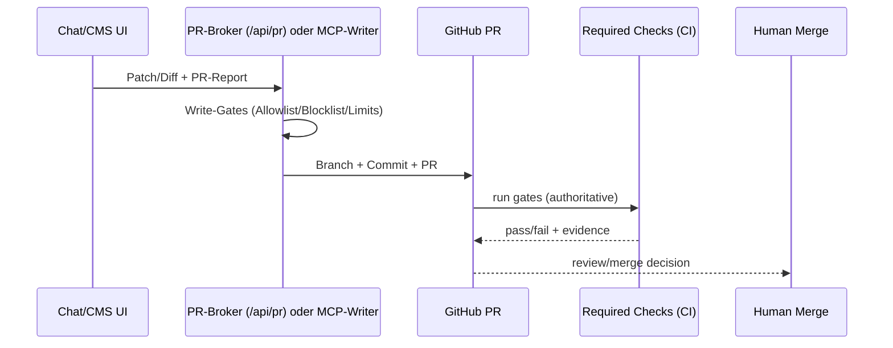

## Scope & Zielbild (End-to-End)

**Ziel:** Kontrollierte Repo-Änderungen direkt aus einer UI (ChatGPT-GUI oder eingebettet im CMS-Portal) inkl. Prüfungen, Evidence und Governance.

**Zielbild (5 Zeilen):**

1) UI (Chat/CMS) erzeugt Change-Intent + Patch/Diff.  
2) Schreiben erfolgt ausschließlich über Writer-Interface (PR-Broker `/api/pr` oder MCP-Writer) als **PR-only**.  
3) Writer erzwingt Write-Gates (Allowlist/Blocklist/Limits + PR-Report Pflicht).  
4) GitHub PR löst **Required Checks/CI** aus (authoritative enforcement).  
5) Merge bleibt menschlich (Default).

---

## Invarianten & Stop-&-Ask

**Invarianten (nicht verhandelbar):**

- PR-only: niemals direkt auf default/main schreiben.
- Schreibfläche (write surface) strikt per Allowlist; riskante Bereiche per Blocklist.
- Keine Secrets: bei Verdacht abbrechen; Fund dokumentieren (ohne sensible Inhalte).

**Stop-&-Ask Trigger (Beispiele):**

- Änderungen an `.github/workflows/**` (Workflow-/Automation-Sicherheitsbereich)
- GitHub App Permissions / Hosting-Secrets / Token-Handling (Betrieb)

---

## Zwei-Ebenen-Modell (Feedback vs Enforcement)

**Feedback-Ebene (schnell, optional, darf ausfallen):**

- VS Code Extensions/Problems/Diagnostics
- lokale Tasks/Hooks
- Agent-in-Editor (Copilot/Codex) nutzt Editor-Kontext/Diagnosen als Feedback

**Enforcement-Ebene (nicht umgehbar, auditierbar):**

- PR-Broker `/api/pr` **oder** MCP-Writer mit Policy-Enforcer (PR-only)
- GitHub PR mit Required Checks/CI
- Merge-Policy (z. B. Branch Protection)

**Redundanzregel:**

- Redundanz ist ok, wenn sie Feedback vs Enforcement trennt.
- Keine doppelte Enforcement-Implementierung je Gate (Drift vermeiden).

---

## Interaktionsschleifen (Control Planes) + Boundaries

**Control Planes:**

- UI/Chat
- Agent-in-Editor (Copilot/Codex)
- VS Code (Extensions/Tasks)
- Git Hooks
- Writer-Interface: PR-Broker `/api/pr` oder MCP-Writer
- GitHub PR
- CI/Required Checks
- Merge/Release

**Trust/Write Boundaries:**

- UI → Writer (Trust boundary)
- Writer → GitHub PR (Write boundary; PR-only)
- PR → CI (Enforcement boundary; nicht umgehbar)

### Diagramm 1/2 — Sequence (UI→Writer→PR→CI→Merge)



---

## Gate-Inventar (SSOT)

**SSOT-Prinzip:** Checks/Gates werden als Repo-Skripte definiert, die sowohl lokal als auch in CI/Portal/MCP aufgerufen werden (keine Logik-Duplizierung).

**Beispiele vorhandener SSOT-Gates (Python-Skripte):**

- Repo-Lint
- Link-Check
- Taxonomy↔Glossary Mapping
- Frontmatter/Tags Validation

**Security-Scans (Option-B / read-only):**

- inkrementelle/all Scans (z. B. gitleaks/osv/trivy/bandit/shellcheck) — als basisfähige Scan-Skripte.

**Bekannte Probleme (Impact auf Autonomie):**

- `npx`/npm-Registry-Restriktionen → lokale CLI-Gates nicht zuverlässig (müssen CI/Portal-tauglich gemacht werden).
- Frontmatter/Tag-Validation kann durch Legacy-Verstöße außerhalb Thin Slice fehlschlagen → braucht changed-files-only/baseline-mode.

---

## Capability- & Berechtigungsmodell (ToolingSnapshot)

**Aus ToolingSnapshot (lokale Capabilities, exemplarisch):**

- `gh` vorhanden → PR-Automation möglich.
- VS Code + Extensions vorhanden → starke Feedback-Sensorik.
- Codex-Config kann zu permissiv sein → für Autonomie nur als Feedback, Writes nur über Writer-Interface.
- Python-Paketstände ggf. nicht reproduzierbar → Evidence-Completeness beachten (fail-closed).

> **Regel:** ToolingSnapshot „kann“ ≠ End-to-End „kann“. Für Autonomie zählen nur SSOT/CI/Portal-Enforcement.

---

## Kernartefakt: Gate × Layer × Capability Matrix

| Gate | Feedback-Ausführung | **Authoritative Enforcement** | Permissions | Evidence | Fail-closed | Redundanz-Note |
|---|---|---|---|---|---|---|
| Write-Surface Policy | n/a | PR-Broker `/api/pr` Gatekeeper | PR-write (App) | PR-Report + Logs | reject | enforcement-only |
| Repo-Lint | VS Code Diagnostics (optional) | CI: SSOT lint script | CI read | CI log | fail | Feedback ok |
| Links | optional lokal | CI: SSOT link script | CI read | CI log | fail | keine Doppel-Enforcement |
| Taxonomy↔Glossary | optional lokal | CI: SSOT validator | CI read | CI log | fail | SSOT zentral |
| Frontmatter/Tags | Front Matter Extension (optional) | CI: SSOT validator | CI read | CI log | fail | braucht baseline-mode |
| Spell/Markdown CLI | cSpell/markdownlint Extension | (noch) kein stabiles CLI-Enforcement | n/a | n/a | missing | Coverage-Lücke E2E |
| Security Scan | optional lokal | genau 1 Tool als enforcement (später) | CI read | report | fail | Scanner-Entscheidung |

---

## Minimal-Enforcement-Kern (für Autonomie)

1) Write-Gates im Writer-Interface: Allowlist/Blocklist/Limits + PR-Report Pflicht.  
2) CI Required Checks: Lint, Links, Taxonomy↔Glossary, Frontmatter/Tags (SSOT-Skripte).  
3) Merge-Policy: Merge nur bei grünen Checks.  
4) Secrets/Workflows/Permissions: Stop-&-Ask.  
5) Ersetze instabile lokale CLI-Gates (npx) durch CI/Portal-taugliche Ausführung.

---

## Thin Slices (3–5) mit DoD

**Slice 1 — CI-Enforcement-Kern als Draft stabilisieren**

- Änderung: CI-Draft so, dass er SSOT-Skripte für relevante Pfade zuverlässig ausführt.
- DoD: PR zeigt deterministische Pass/Fail + Evidence.

**Slice 2 — Frontmatter/Tags baseline-mode**

- Änderung: Validator unterstützt changed-files-only/baseline.
- DoD: Gate ist enforceable in Thin Slices ohne Legacy-Noise.

**Slice 3 — No-npx Lint/Spell Enforcement**

- Änderung: markdownlint/cSpell ohne `npx` (devDependencies/Container).
- DoD: CLI-Gates laufen deterministisch in CI.

**Slice 4 — Writer operationalisieren (Chat-first controlled writes)**

- Änderung: `/api/pr` oder MCP-Writer produktionsnah (Policy-Enforcer, App Permissions, Logs).
- DoD: 1 Change aus UI → PR mit Evidence; nur Allowlist-Pfade.

---

## Visualisierung: Policy/Stop-&-Ask Flow

### Diagramm 2/2 — Flowchart

```mermaid
flowchart TD
  A[UI Patch/Diff] --> B{Write-Gates ok?}
  B -- nein --> X[Reject + Reason log]
  B -- ja --> C[Create PR]
  C --> D{CI Checks grün?}
  D -- nein --> E[Fix-Loop (thin slice)]
  D -- ja --> F{Stop-&-Ask Bereich berührt?}
  F -- ja --> S[Explizite Freigabe]
  F -- nein --> M[Human Merge]
```

---

## Evidence-Pointer (Repo-Dateien / Inputs)

- ToolingSnapshot: `meta/state/tooling/AgenticSWE_KnowledgeOS_ToolingSnapshot_20260303_V3.yml`
- CI Workflow Draft: `meta/..._CI_Gates_Workflow_Draft_....yml` (Draft; Promotion nach `.github/workflows/**` ist Stop-&-Ask)
- PR-Broker/Write-Gates: Portal `/api/pr` + Gate-Policy (Allow/Block/Limits)
- Option-B Security Scans: `scripts/optionb/scan_all.sh`, `scripts/optionb/scan_incremental.sh`
- Prompt-Ritual: `prompts/SESSION_BOOTSTRAP.md`, `prompts/SESSION_CLOSEOUT.md`
