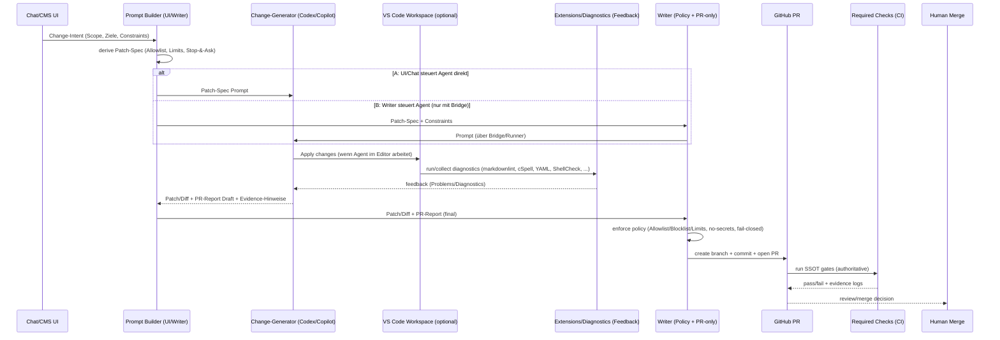

## Zielbild (End-to-End)

UI (Chat/CMS) → **Change-Generator** (Codex/Copilot) → **Writer** (PR-only) → PR → Required Checks → Merge.

**Invarianten**
- PR-only (kein Direktwrite auf default/main)
- Allowlist/Blocklist (Workflows = Stop-&-Ask)
- No-Secrets, fail-closed
- SSOT: Gates als Repo-Skripte; CI/Writer nutzen dieselben Einstiegspunkte

---

## Schichten (Feedback vs Enforcement)

**Feedback (optional):** VS Code Extensions/Diagnostics, lokale Tasks/Hooks, Agent-in-Editor.  
**Enforcement (authoritative):** Writer-Policy + CI Required Checks (+ Branch Protection).

---

## Interaktionsschleifen: verfeinertes E2E-Sequenzdiagramm

> Das Diagramm zeigt **zwei Wege** für “Change-Generator”:
> - **A (typisch):** UI/Chat liefert Prompt direkt an Codex/Copilot (Agent-in-Editor oder Service).
> - **B (optional):** Writer baut einen “Patch-Spec-Prompt” (aus Policy/Allowlist) und reicht ihn an den Change-Generator weiter (nur wenn eine Bridge existiert).

### Tool-/Extension-Overlay (direkt unter dem Diagramm)

| Kante/Schritt | Schicht | Tools/Extensions (aus Snapshot) | Rolle |
|---|---|---|---|
| UI→PB (Intent→Patch-Spec) | Orchestrierung | (Prompt/Template) | Normierung von Scope/Constraints |
| PB→AG (Prompt) | Feedback | Copilot Chat `0.37.9` / (Codex config im Snapshot) | Change-Generierung |
| VS→EX (Diagnostics) | Feedback | markdownlint `0.61.1`; cSpell `4.5.6` + DE `2.3.4`; YAML `1.21.0`; Front Matter `10.9.0`; ShellCheck `0.39.1`; SonarLint `4.44.0` | Schnelles Feedback, nicht authoritative |
| PB→W (Patch+Report) | Enforcement | PR-Report Template (SSOT) | Übergabe an einzigen Schreibpfad |
| W→GH (PR) | Enforcement | GitHub CLI/SDK (über App/Token) | PR-only Write |
| GH→CI (Checks) | Enforcement | SSOT-Skripte (Lint/Links/Taxonomy/Frontmatter) | Nicht-umgehbare Durchsetzung |
| (optional) Security | Feedback/Enforcement | Trivy `1.8.11` / Snyk `2.29.0` | **Genau 1** als Enforcement, Rest Feedback |
| PR/Actions UI | Feedback | PR Extension `0.128.0`; Actions `0.31.0` | Bedienkomfort, nicht authoritative |

---

## Gate×Layer×Capability (Kurzregeln)

- **Writer enforced Policy** (Write-surface, Limits, PR-Report, Stop-&-Ask).
- **CI enforced Content/Quality** (SSOT-Skripte als Required Checks).
- **Agent/Extensions = Feedback-only** (dürfen helfen, sind aber nicht die Wahrheit).

---

## Offene Punkte (für nächste Slices)

1) Bridge definieren, falls Weg B (Writer→Agent) gewünscht ist (sonst Weg A).
2) Frontmatter/Tags baseline-mode (Legacy entkoppeln).
3) No-`npx` Lint/Spell Enforcement (CI-tauglich).
4) Security: 1 authoritative Scanner auswählen.
