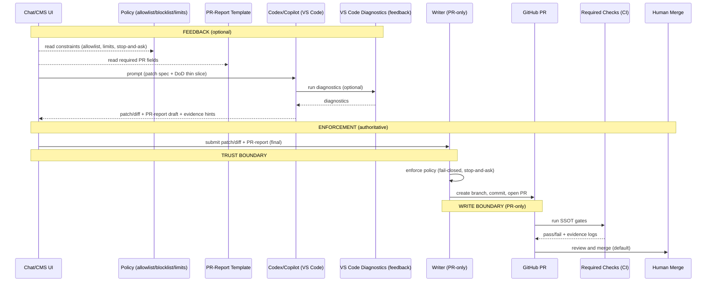

## Interaktionen (VS-Code-kompatibles Mermaid, ohne Parser-Fallen)

**10-Sekunden-Story**
- **FEEDBACK (optional):** Prompt → Patch/Diff + lokale Diagnosen
- **ENFORCEMENT (authoritative):** Policy erzwingen → PR → Checks → Merge

**Legende**
- `->>` Aktion (führt etwas aus)
- `-->>` Datenfluss (read-only Artefakt)

### Tool-/Extension-Overlay (aus ToolingSnapshot)

| Schritt | Schicht | Tools/Extensions | Rolle |
|---|---|---|---|
| Prompt + Patch-Spec | Feedback | Copilot Chat `0.37.9` / Codex (Konfig im Snapshot) | Change-Generierung (Patch/Diff) |
| Diagnostics | Feedback | markdownlint `0.61.1`; cSpell `4.5.6` + DE `2.3.4`; YAML `1.21.0`; Front Matter `10.9.0`; ShellCheck `0.39.1`; SonarLint `4.44.0` | Schnelles Feedback, nicht authoritative |
| PR/Checks UX | Feedback | PR `0.128.0`; Actions `0.31.0` | Komfort (Review/Checks), keine Policies |
| Writer | Enforcement | (GitHub App/Token; Portal/MCP Implementation) | **Einziger** Schreibpfad |
| Checks | Enforcement | SSOT-Skripte (Lint/Links/Taxonomy/Frontmatter) | Nicht umgehbar |
| Security (optional) | Feedback/Enforcement | Trivy `1.8.11` / Snyk `2.29.0` | **Genau 1** als Enforcement, Rest Feedback |
