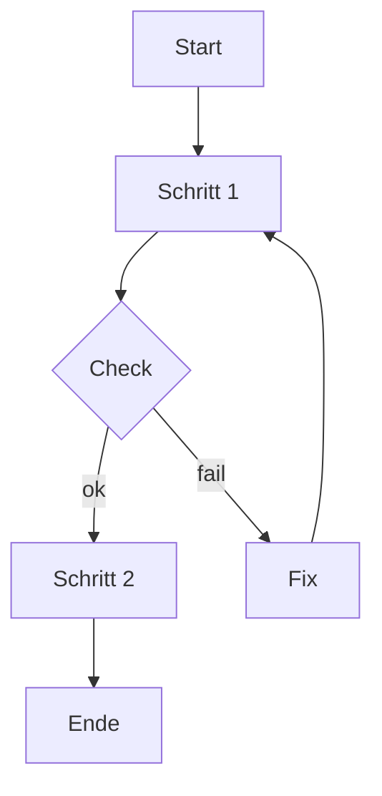

# Tutorial: Diagramme im Repo erstellen, rendern und einbetten (D2/Mermaid)

## Reader Contract

> **🟦 Ziel:** Du erstellst ein Diagramm als Source (D2 oder Mermaid), renderst es bei Bedarf zu SVG und bettest es in ein Markdown-Dokument ein, ohne Diff-Explosion.

- Zielgruppe: Solo-Dev, der Doku als Code pflegt.
- Startzustand: Repo geöffnet in VS Code; Preflight-Extensions aktiv (markdownlint, cSpell, EditorConfig).
- Endzustand: Source-Datei + (optional) gerenderte SVG + Markdown-Embed + Preflight-Gates sauber (im Scope).

## Warum dieses Setup

Mermaid ist schnell, aber optisch und layout-technisch oft „raw“.
D2 liefert hochwertigere Diagramme als Text-Source (diff-bar) und kann in SVG gerendert werden.

> **🟧 Achtung:** Bis das Portal/CMS steht, gilt: „SSOT = Repo-Dateien“. Bilder müssen versionierbar und reviewbar sein.

## Voraussetzungen

- VS Code geöffnet im Repo-Root.
- Extensions (mindestens):
  - EditorConfig
  - markdownlint
  - Code Spell Checker (cSpell) + German Dictionary
- Tools (optional, für D2 render):
  - D2 CLI installiert (für SVG/PNG).
- Minimal: Mermaid-only ist möglich (kein Render).

## Ordnerlayout (empfohlen bis Portal)

- `diagrams/src/` (SSOT der Diagramm-Quellen)
- `diagrams/rendered/` (gerenderte SVGs, wenn genutzt)

Beispiel:

```text
diagrams/
  src/
    option-b-workflow.d2
  rendered/
    option-b-workflow.svg
```

> **🟩 Check:** Du weißt, wo Source vs Rendered liegt.

## Schritt 1: Diagrammtyp wählen (D2 vs Mermaid)

Wähle nach Zweck:

- Mermaid: klein, schnell, „gut genug“ für Flows im Tutorial/How-to.
- D2: wenn es „schön“ sein soll (Architektur, Maps, Trust-Boundary, Systemübersicht).

Regel:

- Pro Dokument maximal 1–2 Visualisierungen.
- Bei Unsicherheit: Mermaid zuerst, D2 nur wenn Mehrwert.

## Schritt 2: Diagramm-Spec schreiben (10-Sekunden-Story)

Bevor du zeichnest, schreib 5–10 Bulletpoints:

- Ziel (1 Satz)
- Actors/Komponenten
- Datenobjekte
- Trust-Boundary (falls relevant)
- 1–2 Failure Modes

> **🟩 Check:** Du kannst das Diagramm in einem Satz erklären.

## Schritt 3A: Mermaid (inline) erstellen

In deinem Markdown:



> **🟩 Check:** Markdown Preview zeigt das Diagramm.

## Schritt 3B: D2 Source erstellen (diff-bar)

Lege eine Datei an: `diagrams/src/<name>.d2`

Minimalbeispiel:

```d2
Direction: right

User -> "VS Code": edit
"VS Code" -> markdownlint: lint
"VS Code" -> cSpell: spellcheck
"VS Code" -> Git: commit
Git -> GitHub: PR
```

> **🟩 Check:** Die Source ist klein und verständlich.

## Schritt 4: Render (nur für D2)

Render zu SVG (Beispiel):

```bash
d2 diagrams/src/option-b-workflow.d2 diagrams/rendered/option-b-workflow.svg
```

> **🟩 Check:** SVG-Datei existiert und wird im Preview angezeigt.

## Schritt 5: Embed in Markdown

Mermaid:

- Diagramm bleibt im Markdown (kein Asset).

D2 SVG:

```md

```

> **🟧 Achtung:** Nutze relative Links, damit es im Repo stabil bleibt.

## Schritt 6: Preflight (lokal, nur Scope)

1. markdownlint (VS Code Problems Panel)
1. cSpell (Tippfehler fixen; stabiler Jargon ins Wörterbuch)
1. YAML Frontmatter (falls du ein Dokument mit Frontmatter geändert hast)
1. No-Secrets Quickscan (Diff)

> **🟩 Check:** Im Problems Panel sind keine Blocker im Scope.

## Mini-Übung (2–5 Minuten)

- Erstelle ein Diagramm „Preflight Loop“ als Mermaid oder D2.
- Betten es in ein Dokument ein.
- Stelle sicher, dass markdownlint/cSpell sauber sind.

## Troubleshooting (Top 3)

- **Symptom:** Diagramm wird im Preview nicht angezeigt.
  - **Ursache:** Mermaid-Preview fehlt oder SVG-Pfad ist falsch.
  - **Fix:** Mermaid-Extension installieren oder Link/Path korrigieren.

- **Symptom:** D2 Render klappt, aber SVG ist „leer“ oder komisch.
  - **Ursache:** Layout/Direction/Labels zu dicht.
  - **Fix:** Knoten reduzieren, Direction setzen, Labels kürzen.

- **Symptom:** Diff wird groß durch Formatierung.
  - **Ursache:** Repo-weites Formatieren.
  - **Fix:** Nur geänderte Dateien anfassen, Quick Fix pro Datei.

## Glossar und Taxonomie

- Canonical terms verwenden (Glossar).
- Tags: genau 1× `layer/*`, 1× `artifact/*` (Taxonomie).
- Diagramm-Namen als „stable tokens“ pflegen (cSpell Dictionary).

## See also

- How-to: Diagramme mit Codex erzeugen und integrieren: `AgenticSWE_Diagramme_Codex_HowTo_20260226_V1.md`
- How-to: Write-via-PR mit Copilot & Codex: `AgenticSWE_WriteViaPR_CopilotCodex_HowTo_20260220_V1.md`
- Policy: Diátaxis-Stilregeln: `AgenticSWE_Docs_Diataxis_Policy_20260226_V2.md`
- Toolbox: Doku-Instrumente (Visualisierungen, Checks): `AgenticSWE_Docs_Instrumente_Toolbox_20260226_V2.md`

## DoD (Quick)

- Source und (falls genutzt) Rendered sind konsistent.
- Embed funktioniert in Markdown Preview.
- markdownlint clean (mindestens MD022, MD032, MD029).
- cSpell: keine Tippfehler; Jargon bewusst gepflegt.
