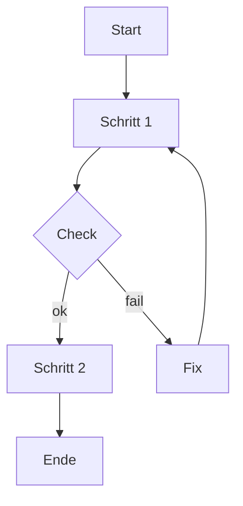

# Tutorial: Diagramme im Repo erstellen, rendern und einbetten

## Reader Contract

> **🟦 Ziel:** Du erstellst ein Diagramm als Source (Mermaid oder D2; optional draw.io oder Excalidraw), renderst es bei Bedarf zu SVG und bettest es in ein Markdown-Dokument ein, ohne Diff-Explosion.

- Zielgruppe: Solo-Dev, der Docs-as-Code nutzt.
- Startzustand: Repo im VS Code geöffnet; Diagramm-Extensions installiert; Baseline-Configs im Repo (`.editorconfig`, `.markdownlint.jsonc`, `cspell.json`).
- Endzustand: Diagramm-Source + (optional) gerenderte SVG + Markdown-Embed + Preflight-Gates sauber (im Scope).

## Warum dieses Setup

- Mermaid ist schnell und direkt im Markdown.
- D2 liefert hochwertigere Diagramme als Text-Source (diff-bar) und kann in SVG gerendert werden.
- draw.io / Excalidraw sind optional für WYSIWYG bzw. Whiteboard-Story.

> **🟧 Achtung:** Bis das Portal/CMS steht, gilt: SSOT = Repo-Dateien. Diagramme müssen reviewbar und versionierbar bleiben.

## Voraussetzungen

- VS Code geöffnet im Repo-Root.
- Extensions installiert (siehe How-to mit Links/IDs).
- D2 CLI optional installiert (nur wenn du D2 zu SVG rendern willst).

> **🟩 Check:** Du kannst Mermaid im Preview sehen und cSpell/markdownlint laufen im Problems Panel.

## Ordnerlayout (empfohlen bis Portal)

- `diagrams/src/` (SSOT der Diagramm-Quellen)
- `diagrams/rendered/` (gerenderte SVGs, wenn genutzt)

Beispiel:

```text
diagrams/
  src/
    preflight-loop.d2
  rendered/
    preflight-loop.svg
```

## Schritt 0: Extension-Sanity-Check (2 Minuten)

1. Öffne eine beliebige `.md` Datei.
1. Füge einen Mermaid-Block ein:

   ```mermaid
   flowchart TD
     A[Start] --> B[Ende]
   ```

1. Öffne Markdown Preview.

> **🟩 Check:** Das Diagramm wird gerendert (Mermaid-Preview aktiv).

Optional:

1. Erzeuge eine Datei `diagrams/src/sanity.d2`.
1. Füge ein:

   ```d2
   A -> B
   ```

> **🟩 Check:** Syntax-Highlighting oder Preview der D2-Extension ist aktiv.

## Schritt 1: Diagrammtyp wählen (Mermaid vs D2 vs optional)

Wähle nach Zweck:

- Mermaid: klein, schnell, „gut genug“ für Flows in Tutorial/How-to.
- D2: Architektur, Maps, Trust-Boundary, Systemübersicht (optisch „polished“).
- draw.io: selten, wenn WYSIWYG zwingend ist (Hero-Diagramm).
- Excalidraw: Story/Didaktik, Skizze, „Explain-first“ (Whiteboard).

Regel:

- Pro Dokument maximal 1–2 Visualisierungen.
- Bei Unsicherheit: Mermaid zuerst, D2 nur wenn Mehrwert.

## Schritt 2: Diagramm-Spec schreiben (10-Sekunden-Story)

Bevor du zeichnest, schreib 5–10 Bulletpoints:

- Ziel (1 Satz)
- Actors/Komponenten
- Datenobjekte
- Trust-Boundary (falls relevant)
- 1–2 Failure Modes

> **🟩 Check:** Du kannst das Diagramm in einem Satz erklären.

## Schritt 3A: Mermaid (inline) erstellen

In deinem Markdown:



> **🟩 Check:** Markdown Preview zeigt das Diagramm.

## Schritt 3B: D2 Source erstellen (diff-bar)

Lege eine Datei an: `diagrams/src/<name>.d2`

Minimalbeispiel:

```d2
Direction: right

User -> "VS Code": edit
"VS Code" -> markdownlint: lint
"VS Code" -> cSpell: spellcheck
"VS Code" -> Git: commit
Git -> GitHub: PR
```

> **🟩 Check:** Die Source ist klein und verständlich.

## Schritt 4: Render (nur für D2)

Render zu SVG (Beispiel):

```bash
d2 diagrams/src/<name>.d2 diagrams/rendered/<name>.svg
```

> **🟧 Achtung:** Wenn `d2` nicht gefunden wird, ist die CLI nicht installiert oder nicht im PATH.

> **🟩 Check:** SVG-Datei existiert und wird im Preview angezeigt.

## Schritt 5: Embed in Markdown

Mermaid:

- Diagramm bleibt im Markdown (kein Asset).

D2 SVG:

```md

```

> **🟧 Achtung:** Nutze relative Links, damit es im Repo stabil bleibt.

## Schritt 6: Preflight (lokal, nur Scope)

1. markdownlint (VS Code Problems Panel)
1. cSpell (Tippfehler fixen; stabiler Jargon ins Wörterbuch)
1. YAML Frontmatter (falls du ein Dokument mit Frontmatter geändert hast)
1. No-Secrets Quickscan (Diff)

> **🟩 Check:** Im Problems Panel sind keine Blocker im Scope.

## Mini-Übung (2–5 Minuten)

- Erstelle ein Diagramm „Preflight Loop“ als Mermaid oder D2.
- Betten es in ein Dokument ein.
- Stelle sicher, dass markdownlint/cSpell sauber sind.

## Troubleshooting (Top 5)

- **Symptom:** Mermaid wird nicht gerendert.
  - **Fix:** Mermaid Preview Extension aktivieren; Datei als Markdown erkannt.

- **Symptom:** D2 Preview/Highlighting fehlt.
  - **Fix:** D2-Extension prüfen; Datei-Endung `.d2`.

- **Symptom:** `d2` wird im Terminal nicht gefunden.
  - **Fix:** D2 CLI installieren (empfohlen: winget/choco); VS Code neu starten.

- **Symptom:** D2 Render klappt, aber SVG ist „leer“ oder komisch.
  - **Fix:** Knoten reduzieren, Direction setzen, Labels kürzen.

- **Symptom:** Diff wird groß durch Formatierung.
  - **Fix:** Nur geänderte Dateien anfassen, Quick Fix pro Datei.

## Glossar und Taxonomie

- Canonical terms verwenden (Glossar).
- Tags: genau 1× `layer/*`, 1× `artifact/*` (Taxonomie).
- Diagramm-Namen als „stable tokens“ pflegen (cSpell Dictionary).

## See also

- How-to: Diagramme mit Codex erzeugen und integrieren (inkl. Extension-Links/IDs): `AgenticSWE_Diagramme_Codex_HowTo_20260226_V2.md`
- Explanation: Diagramm-Varianten im Vergleich (Trade-offs): `AgenticSWE_Diagramme_Varianten_Explanation_20260226_V1.md`
- How-to: Write-via-PR mit Copilot & Codex: `AgenticSWE_WriteViaPR_CopilotCodex_HowTo_20260220_V1.md`
- Policy: Diátaxis-Stilregeln: `AgenticSWE_Docs_Diataxis_Policy_20260226_V2.md`
- Toolbox: Doku-Instrumente (Visualisierungen, Checks): `AgenticSWE_Docs_Instrumente_Toolbox_20260226_V2.md`

## DoD (Quick)

- Source und (falls genutzt) Rendered sind konsistent.
- Embed funktioniert in Markdown Preview.
- markdownlint clean (mindestens MD022, MD032, MD029).
- cSpell: keine Tippfehler; Jargon bewusst gepflegt.
