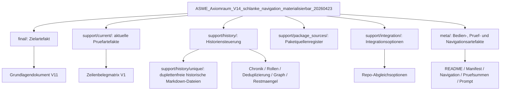

# ASWE_Axiomraum_Paketnavigation_20260423_V1

## Zielbild
Diese Datei buendelt Navigation, Paketkarte, Historienindex, Dateifamilienindex sowie die Abgrenzung angrenzender Element- und Paketklassen. Sie ersetzt mehrere getrennte Navigationsdateien aus V13 und ist selbst ein Navigationsartefakt.

## Grenze
Interne Verweise und Navigationspfade sind keine Belege. Zeilenbelegung liegt in `support/current/ASWE_Axiomraum_Zeilenbelegmatrix_20260423_V1.md`; Deduplizierung und Versionsverlauf liegen in `support/history/`.

## Sofortstart

| Ziel | Einstieg | Danach |
|---|---|---|
| aktueller Grundlagenstand | `final/ASWE_Axiomraum_Grundlagendokument_20260423_V11.md` | `support/current/ASWE_Axiomraum_Zeilenbelegmatrix_20260423_V1.md` |
| interne Zeilenbelegung | `support/current/ASWE_Axiomraum_Zeilenbelegmatrix_20260423_V1.md` | `support/history/ASWE_Axiomraum_Deduplizierungsbericht_20260423_V1.md` |
| Versionsverlauf | `support/history/ASWE_Axiomraum_Versionschronik_20260423_V1.md` | `support/history/ASWE_Axiomraum_Ableitungs_und_Supersessionsgraph_20260423_V1.md` |
| duplettenfreie Historie | `support/history/unique/` | `support/history/ASWE_Axiomraum_Deduplizierungsbericht_20260423_V1.md` |
| Paketquellen | `support/package_sources/ASWE_Axiomraum_Paketquellenregister_20260423_V1.md` | `meta/checksums.sha256` |
| Repo-Abgleich | `support/integration/ASWE_Axiomraum_Repo_Integrationsoptionen_20260423_V1.md` | `meta/pro_prompt.md` |

## Lesepfade

| Lesepfad | Reihenfolge | Zweck |
|---|---|---|
| Minimal | `README.md` -> `meta/README.md` -> `meta/ASWE_Axiomraum_Paketnavigation_20260423_V1.md` -> `final/ASWE_Axiomraum_Grundlagendokument_20260423_V11.md` | schneller Paketstart |
| Pruefung | `final/ASWE_Axiomraum_Grundlagendokument_20260423_V11.md` -> `support/current/ASWE_Axiomraum_Zeilenbelegmatrix_20260423_V1.md` -> `meta/paket_pruefung.md` | aktueller Pruefstatus |
| Historie | `support/history/ASWE_Axiomraum_Versionschronik_20260423_V1.md` -> `support/history/ASWE_Axiomraum_Ableitungs_und_Supersessionsgraph_20260423_V1.md` -> `support/history/unique/` | Versionsverlauf |
| Deduplizierung | `support/history/ASWE_Axiomraum_Deduplizierungsbericht_20260423_V1.md` -> `support/package_sources/ASWE_Axiomraum_Paketquellenregister_20260423_V1.md` -> `meta/checksums.sha256` | Nachweis der Eindeutigkeit |
| Repo-Abgleich | `support/integration/ASWE_Axiomraum_Repo_Integrationsoptionen_20260423_V1.md` -> `support/history/ASWE_Axiomraum_Dateirollen_20260423_V1.md` -> `meta/pro_prompt.md` | Integrationsvorbereitung |

## Paketkarte

| Pfad | Rolle | enthaelt | Grenze |
|---|---|---|---|
| `final/` | aktueller kanonischer Zielbereich | genau ein Grundlagendokument | keine Historie |
| `support/current/` | aktuelle Pruefartefakte | Zeilenbelegmatrix | nicht als Zielartefakt behandeln |
| `support/history/unique/` | duplettenfreie Historie | eindeutige historische Markdown-Dateien | nicht als aktuelle Wahrheit behandeln |
| `support/history/` | Historiensteuerung | Chronik, Rollen, Deduplizierung, Graph, Restmaengel | keine zweite Wahrheitsquelle |
| `support/package_sources/` | Paketquellenregister | alte ZIPs als Herkunftsbelege | keine ZIP-in-ZIP-Historie |
| `support/integration/` | Integrationsplanung | Repo-Integrationsoptionen | keine direkte Repo-Umsetzung |
| `meta/` | Bedien- und Prueflogik | README, Manifest, Navigation, Pruefsummen, Prompt | keine fachliche Neusetzung |

## Paketrollen und angrenzende Elementklassen

| Klasse/Rolle | Bedeutung | Ort | Grenze |
| --- | --- | --- | --- |
| Zielartefakt | aktuell materialisierbares Grundlagendokument | final/ | einzige primaere Zieldatei |
| aktuelles Pruefartefakt | aktuelle interne Beleg- oder Pruefdatei | support/current/ | unterstuetzt, ersetzt aber nicht das Zielartefakt |
| Historienartefakt | eindeutige historische Markdown-Datei | support/history/unique/ | historischer Status, keine aktuelle Wahrheit |
| Historien-Pruefartefakt | Chronik, Rollen, Deduplizierung, Graph, Nachzugslog | support/history/ | ordnet Verlauf und Deduplizierung |
| Paketquelle | registriertes altes ZIP | support/package_sources/ | nicht als ZIP-in-ZIP eingebettet |
| Integrationsplanungsartefakt | Ausgangspunkt fuer Repoabgleich | support/integration/ | keine direkte Repo-Integration |
| Paketmetadatum | Manifest, Pruefsummen, Prompt, Pruefung | meta/ | strukturiert Paket, setzt keine Fachinhalte |

## Rollenbasierter Historienindex

| Rolle | Anzahl Dateien | Versionen |
| --- | --- | --- |
| historische Paketmetadaten | 6 | V1, V2, V3, V4, V5 |
| historische Verbesserungsschleife | 16 | V1, V2, V3, V4 |
| historischer Integrationsadapter | 3 | V1, V2, V3 |
| historisches Deprekationslog | 3 | V1, V2, V3 |
| historisches Grundlagendokument | 10 | V1, V10, V2, V3, V4, V5, V6, V7, V8, V9 |
| historisches Pruefartefakt | 15 | V1, V10, V2, V3 |
| historisches Routinenblatt | 3 | V1, V2, V3 |
| historisches Support-Artefakt | 16 | V1, V2, V3, V4 |

## Dateifamilienindex

| Dateifamilie | Anzahl eindeutiger Dateien | Versionen | letzte verfuegbare Datei |
| --- | --- | --- | --- |
| ASWE_Ablaufblatt_Paketpruefung_Aenderung_Materialisierung_20260423_V*.md | 2 | V1, V2 | `support/history/unique/ASWE_Ablaufblatt_Paketpruefung_Aenderung_Materialisierung_20260423_V2.md` |
| ASWE_Abschluss_Selbstverbesserungsschleife_ProModel_20260423_V*.md | 4 | V1, V2, V3, V4 | `support/history/unique/ASWE_Abschluss_Selbstverbesserungsschleife_ProModel_20260423_V4.md` |
| ASWE_Abschlusscheckliste_Metaqualitaet_20260423_V*.md | 3 | V1, V2, V3 | `support/history/unique/ASWE_Abschlusscheckliste_Metaqualitaet_20260423_V3.md` |
| ASWE_Abschlussdokument_Kern_Folgeebenenraum_20260423_V*.md | 3 | V1, V2, V3 | `support/history/unique/ASWE_Abschlussdokument_Kern_Folgeebenenraum_20260423_V3.md` |
| ASWE_Abschlusspaket_README_20260423_V*.md | 5 | V1, V2, V3, V4, V5 | `support/history/unique/ASWE_Abschlusspaket_README_20260423_V5.md` |
| ASWE_Abschlusspruefung_ProModel_20260423_V*.md | 2 | V1, V2 | `support/history/unique/ASWE_Abschlusspruefung_ProModel_20260423_V2.md` |
| ASWE_Axiomenkandidaten_Kernaxiomen_Promptanalyse_20260423_V*.md | 1 | V1 | `support/history/unique/ASWE_Axiomenkandidaten_Kernaxiomen_Promptanalyse_20260423_V1.md` |
| ASWE_Axiomkandidaten_Verbesserungsschleife_Sprachgovernance_20260423_V*.md | 1 | V1 | `support/history/unique/ASWE_Axiomkandidaten_Verbesserungsschleife_Sprachgovernance_20260423_V1.md` |
| ASWE_Axiomkandidatenraum_Analyse_Kernaxiome_20260423_V*.md | 3 | V1, V2, V3 | `support/history/unique/ASWE_Axiomkandidatenraum_Analyse_Kernaxiome_20260423_V3.md` |
| ASWE_Axiomkandidatenraum_Verbesserungsschleife_Selbstanwendung_Folgeprompt_20260423_V*.md | 1 | V1 | `support/history/unique/ASWE_Axiomkandidatenraum_Verbesserungsschleife_Selbstanwendung_Folgeprompt_20260423_V1.md` |
| ASWE_Axiomkandidatenraum_Verbesserungsschleife_V*_Abdeckung_Folgeprompt_20260423_V*.md | 1 | V3 | `support/history/unique/ASWE_Axiomkandidatenraum_Verbesserungsschleife_V3_Abdeckung_Folgeprompt_20260423_V1.md` |
| ASWE_Axiomkandidatenraum_Verbesserungsschleife_V*_Folgeebenen_Handlungsfolgen_20260423_V*.md | 2 | V4, V4 | `support/history/unique/ASWE_Axiomkandidatenraum_Verbesserungsschleife_V4_Folgeebenen_Handlungsfolgen_20260423_V2.md` |
| ASWE_Axiomkandidatenraum_Verbesserungsschleife_V*_Standardschaerfung_20260423_V*.md | 1 | V3 | `support/history/unique/ASWE_Axiomkandidatenraum_Verbesserungsschleife_V3_Standardschaerfung_20260423_V2.md` |
| ASWE_Axiomraum_Grundlagendokument_20260423_V*.md | 10 | V1, V2, V3, V4, V5, V6, V7, V8, V9, V10 | `support/history/unique/ASWE_Axiomraum_Grundlagendokument_20260423_V10.md` |
| ASWE_Axiomraum_Kanon_Materialisierbar_20260423_V*.md | 1 | V4 | `support/history/unique/ASWE_Axiomraum_Kanon_Materialisierbar_20260423_V4.md` |
| ASWE_Axiomraum_Schritte_1_bis_4_Pruefung_20260423_V*.md | 1 | V3 | `support/history/unique/ASWE_Axiomraum_Schritte_1_bis_4_Pruefung_20260423_V3.md` |
| ASWE_Axiomraum_V*_Endpruefung_20260423_V*.md | 1 | V10 | `support/history/unique/ASWE_Axiomraum_V10_Endpruefung_20260423_V1.md` |
| ASWE_Axiomraum_Verbesserungsprozess_20260423_V*.md | 2 | V2, V3 | `support/history/unique/ASWE_Axiomraum_Verbesserungsprozess_20260423_V3.md` |
| ASWE_Axiomraum_Verbesserungsprozess_20260423_V*_b1eada6121.md | 1 | V3 | `support/history/unique/ASWE_Axiomraum_Verbesserungsprozess_20260423_V3_b1eada6121.md` |
| ASWE_Axiomraum_Verbesserungsprozess_20260423_V*_d7dcf356aa.md | 1 | V3 | `support/history/unique/ASWE_Axiomraum_Verbesserungsprozess_20260423_V3_d7dcf356aa.md` |
| ASWE_Definitorische_Mindestschicht_Moeglichkeitsraum_Pruefplan_20260423_V*.md | 1 | V1 | `support/history/unique/ASWE_Definitorische_Mindestschicht_Moeglichkeitsraum_Pruefplan_20260423_V1.md` |
| ASWE_Definitorische_Mindestschicht_Moeglichkeitsraum_Pruefplan_20260423_V*_fe4f547679.md | 1 | V1 | `support/history/unique/ASWE_Definitorische_Mindestschicht_Moeglichkeitsraum_Pruefplan_20260423_V1_fe4f547679.md` |
| ASWE_Deprekations_Umschichtungslog_20260423_V*.md | 3 | V1, V2, V3 | `support/history/unique/ASWE_Deprekations_Umschichtungslog_20260423_V3.md` |
| ASWE_Finaler_Korrekturauftrag_20260423_V*.md | 2 | V1, V2 | `support/history/unique/ASWE_Finaler_Korrekturauftrag_20260423_V2.md` |
| ASWE_Folgeebenen_Audit_20260423_V*.md | 1 | V2 | `support/history/unique/ASWE_Folgeebenen_Audit_20260423_V2.md` |
| ASWE_Folgeebenen_Audit_Pruefrahmen_20260423_V*.md | 2 | V1, V2 | `support/history/unique/ASWE_Folgeebenen_Audit_Pruefrahmen_20260423_V2.md` |
| ASWE_Folgeebenen_Konsolidierung_und_Kandidatensiebung_20260423_V*.md | 1 | V1 | `support/history/unique/ASWE_Folgeebenen_Konsolidierung_und_Kandidatensiebung_20260423_V1.md` |
| ASWE_Kritikableitung_und_Paketdelta_20260423_V*.md | 1 | V1 | `support/history/unique/ASWE_Kritikableitung_und_Paketdelta_20260423_V1.md` |
| ASWE_Rekursive_Pruefmatrix_Kern_bis_Operative_Regeln_20260423_V*.md | 3 | V1, V2, V3 | `support/history/unique/ASWE_Rekursive_Pruefmatrix_Kern_bis_Operative_Regeln_20260423_V3.md` |
| ASWE_Repo_Integration_Materialisierung_Adapterkonzept_20260423_V*.md | 3 | V1, V2, V3 | `support/history/unique/ASWE_Repo_Integration_Materialisierung_Adapterkonzept_20260423_V3.md` |
| ASWE_Rohdaten_Manifest_20260423_V*.md | 1 | V1 | `support/history/unique/ASWE_Rohdaten_Manifest_20260423_V1.md` |
| ASWE_Rohdatenbasierte_Abschlusspruefung_ProModel_20260423_V*.md | 1 | V1 | `support/history/unique/ASWE_Rohdatenbasierte_Abschlusspruefung_ProModel_20260423_V1.md` |
| ASWE_Rohdatenkorpus_Alle_Verfuegbaren_Dokumente_20260423_V*.md | 1 | V1 | `support/history/unique/ASWE_Rohdatenkorpus_Alle_Verfuegbaren_Dokumente_20260423_V1.md` |
| ASWE_Rohdatenkorpus_Eindeutige_Inhalte_20260423_V*.md | 1 | V2 | `support/history/unique/ASWE_Rohdatenkorpus_Eindeutige_Inhalte_20260423_V2.md` |
| ASWE_Routinenblatt_Axiomraum_20260423_V*.md | 3 | V1, V2, V3 | `support/history/unique/ASWE_Routinenblatt_Axiomraum_20260423_V3.md` |
| ASWE_Selbstverbesserungsprozess_Chronik_20260423_V*.md | 1 | V1 | `support/history/unique/ASWE_Selbstverbesserungsprozess_Chronik_20260423_V1.md` |

## Strukturdiagramm

## Endurteil
Die Navigationsoberflaeche ist auf eine zentrale Paketnavigation reduziert. Historische Inhalte bleiben vollstaendig und duplettenfrei erhalten.
