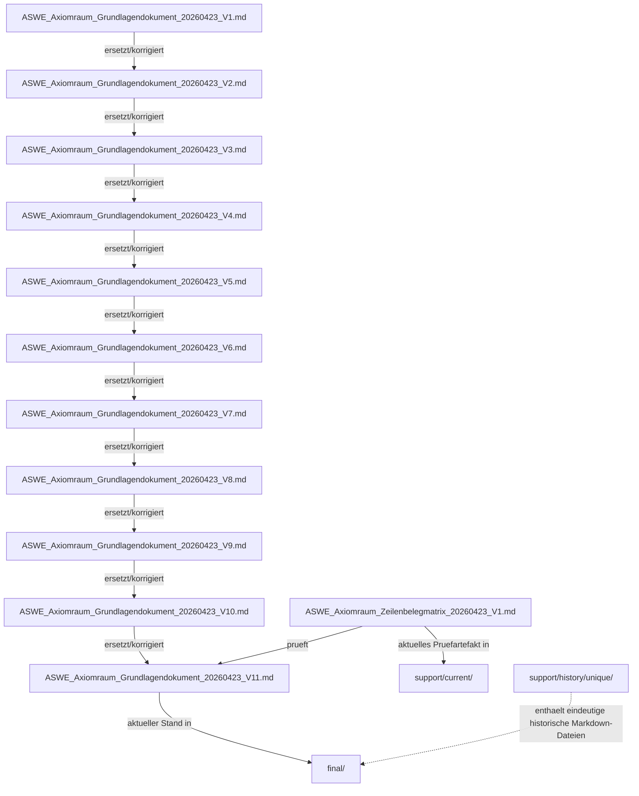

# ASWE_Axiomraum_Ableitungs_und_Supersessionsgraph_20260423_V1

## Zielbild
Dieses Pruefartefakt stellt die ersetzenden, pruefenden und dokumentierenden Beziehungen zwischen den wichtigsten Dateien dar. Es ist ein Navigations- und Pruefartefakt, keine fachliche Neusetzung.

## Mermaid-Graph

## Legende

| Relation | Bedeutung |
|---|---|
| ersetzt/korrigiert | spaetere Version der gleichen Dateifamilie |
| prueft | Pruefartefakt bewertet oder belegt Zielartefakt |
| aktueller Stand in | Materialisierbare Paketrolle |
| enthaelt | Historiencontainer fuer eindeutige Inhalte |
