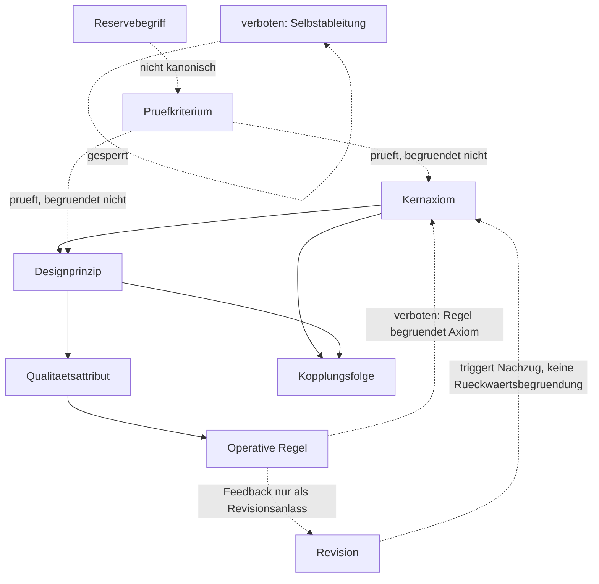
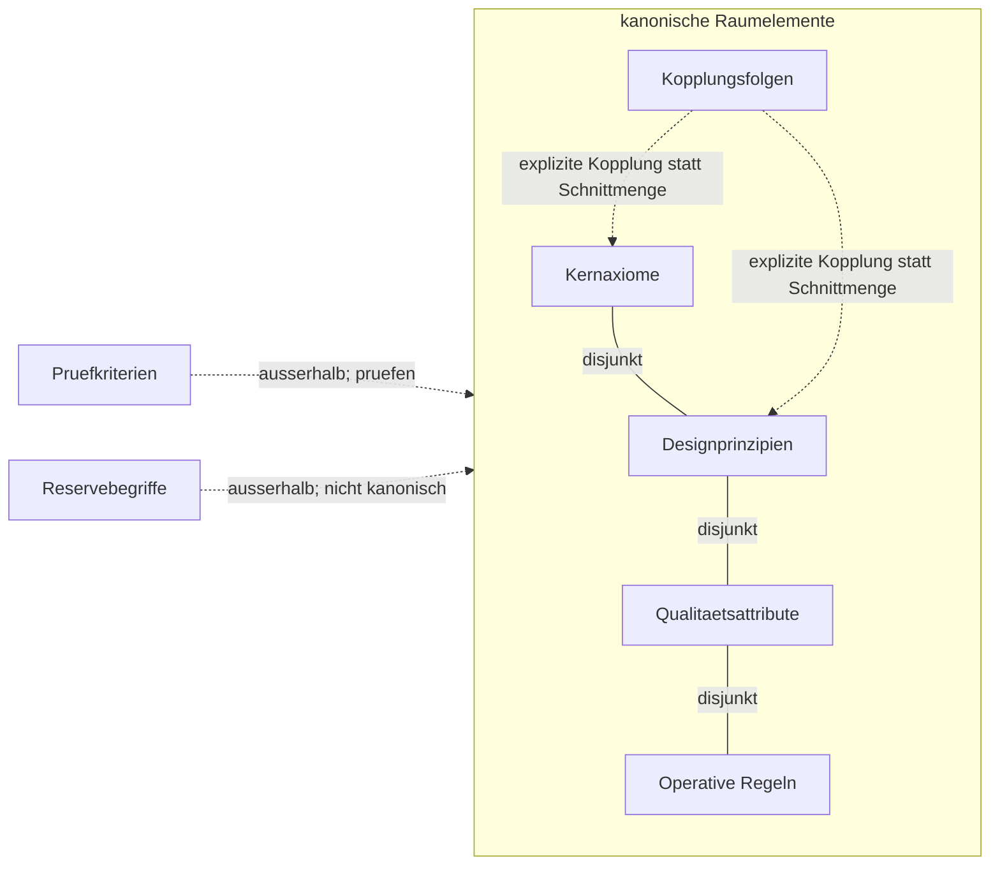
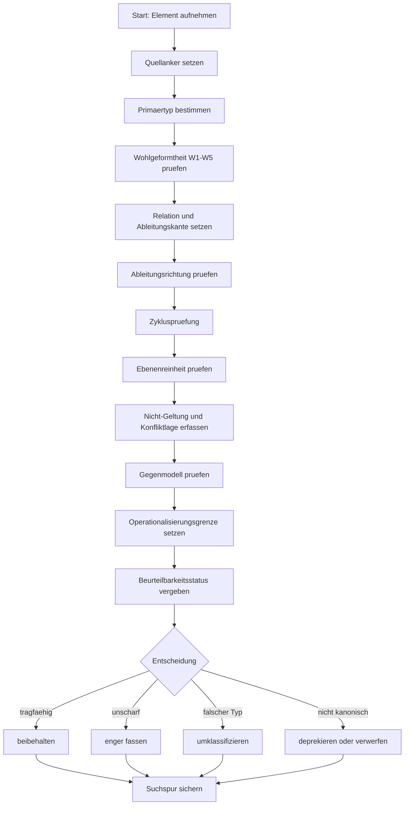

# ASWE_Axiomraum_Grundlagendokument_20260423_V6

## 1. Zielbild

Dieses Dokument begruendet einen rekursiv pruefbaren Axiomraum fuer zwei gekoppelte Gegenstandsbereiche:

- **A: LLM-Verhaltenssteuerung**
- **B: ASWE_KnowledgeOS-Architektur**
- **K: explizite Kopplungen zwischen A und B**

Es ist als alleinstehendes Grundlagendokument formuliert. Es ist kein Pruefbericht, keine Prozesschronik, kein Korrekturauftrag und kein Rohdatenmanifest.

## 2. Gegenstand

Gegenstand sind:

- Kernaxiome,
- starke Designprinzipien,
- sekundaere Qualitaetsattribute,
- operative Regeln,
- Kopplungsfolgen,
- rekursive Pruefachsen,
- und Routinen fuer Neuaufnahme, Umklassifizierung und Axiomrevision.

## 3. Geltungsbereich

Das Dokument gilt als fachlicher Grundlagenstand fuer spaetere Dokumentations-, Architektur-, Prompt-Governance- und Integrationsentscheidungen. Es kann in ein Repo integriert werden, erzwingt aber keine konkrete Pfad-, Commit- oder SSOT-Entscheidung.

## 4. Nicht-Geltung

Dieses Dokument ist nicht:

- eine abgeschlossene Pruefbewertung,
- eine Prozessdokumentation,
- ein Rohdatenkorpus,
- eine direkte Repo-Materialisierungsanweisung,
- eine Runtime-, Rollen- oder Tool-Spezifikation,
- ein Ersatz fuer spaetere repo-lokale Review- und Autorisationsregeln.

## 5. Epistemischer Status

Der Axiomraum ist ein konsolidierter, weiterentwickelbarer Grundlagenstand. Seine Elemente sind nach interner Konsistenz, rekursiver Pruefbarkeit, Trennschaerfe, Rueckbindung, Nicht-Geltung, Konfliktlage und Materialisierbarkeit strukturiert. Er beansprucht keine absolute Vollstaendigkeit, sondern einen belastbaren Ausgangspunkt fuer kontrollierte Weiterentwicklung.

## 6. Leitplanken

1. Kernaxiome bleiben Kernaxiome.
2. Designprinzipien, Qualitaetsattribute und operative Regeln bleiben abgeleitete Folgeebenen.
3. Externe wissenschaftliche Quellen und Standards bleiben primaere Begruendungsanker.
4. Repo-interne Referenzen dienen nur als Anwendungs-, Passungs- oder Materialisierungsbelege.
5. A, B und K bleiben getrennt; Kopplungen werden explizit gefuehrt.
6. Governierte Evolvierbarkeit hat Vorrang vor freier Selbstverbesserung.
7. Begriffe stehen vor Strukturen, Strukturen vor Prozessen, Prozesse vor Implementierung.
8. Leistungs- und Geschwindigkeitsaspekte sind nachgeordnet und duerfen Zielbild, Rueckbindung, Trennschaerfe oder Evidenzstatus nicht uebersteuern.
9. Pruefkriterien, Unterfaelle und Nutzungseffekte werden nicht ungeprueft als kanonische Raumelemente gefuehrt.

## 7. Begriffssystem

### 7.1 Elementklassen

| Klasse | Funktion | Rang |
|---|---|---|
| Kernaxiom | Basale, nicht lokal abgeleitete Grundregel | basal |
| Starkes Designprinzip | Konstruktionsleitendes, aus Kernaxiomen abgeleitetes Prinzip | Folgeebene |
| Sekundaeres Qualitaetsattribut | Bewertbare Gueteeigenschaft | Folgeebene |
| Operative Regel | Handlungsnahe Ausfuehrungsregel | Folgeebene |
| Kopplungsfolge | Explizite Folge aus Verbindung von A-, B- oder K-Elementen | Kopplung |
| Pruefkriterium | Pruefmassstab, nicht automatisch Raumelement | Metaebene |
| Reservebegriff | Bewusst nicht kanonisierter Begriff fuer spaetere Pruefung | Randbereich |

### 7.2 Konfliktlage

`Konfliktlage` ist der Oberbegriff fuer:

- einfache Spannungen,
- vererbte Spannungen,
- konflikttraechtige Mehrfachableitungen,
- Regelkollisionen,
- Ebenenkollisionen,
- Zielbildkollisionen.

`Spannungen` und `vererbte Spannungen` sind operationalisierte Unterformen der Konfliktlage.

## 8. Definitorische Mindestschicht

### 8.1 Zweck

Die definitorische Mindestschicht reduziert die heuristische Last dieses Dokuments. Sie legt fest, **wie** Kernaxiome, Designprinzipien, Qualitaetsattribute, operative Regeln und Kopplungsfolgen logisch voneinander unterschieden und voneinander abgeleitet werden.

Sie ist kein neues Axiom und keine neue Folgeebene. Sie ist ein Zwischenartefakt zur Ebenenreinheit, Ableitungspruefung und spaeteren Operationalisierung.

### 8.2 Primitive Klassen

| Klasse | Prueffrage | Messbarkeit |
|---|---|---|
| Kernaxiom | Ist das Element basal, nicht lokal abgeleitet und grundordnend? | nein |
| Designprinzip | Leitet das Element eine Konstruktionshaltung aus Kernaxiomen ab? | nein |
| Qualitaetsattribut | Beschreibt das Element eine bewertbare Gueteeigenschaft? | ja, ueber Indikatoren |
| Operative Regel | Beschreibt das Element eine ausfuehrbare Handlung oder Pruefhandlung? | indirekt ueber Vollzug |
| Kopplungsfolge | Folgt das Element aus der expliziten Verbindung von A, B oder K? | fallabhaengig |
| Pruefkriterium | Ist das Element ein Pruefmassstab statt ein Raumelement? | ja, als Pruefkriterium |
| Reservebegriff | Ist das Element noch nicht kanonisierbar? | nein |

### 8.2.1 Begriffskorrektur: Pruefen, Pruefstandard, Pruefroutine

Die fruehere Verwendung des Audit-Begriffs fuer einzelne Kriterien war mehrdeutig. Sie vermischte drei verschiedene Ebenen:

1. **Pruefkriterium:** einzelner Bewertungsmassstab, kein kanonisches Raumelement.
2. **Rekursiver Pruefstandard:** allgemeines Pruefschema fuer alle Raumelemente.
3. **Pruefroutine:** konkreter Ablauf zur Anwendung des Pruefstandards.

Diese Begriffe duerfen nicht wechselseitig als Ursprung dienen.

```text
Pruefkriterium  = einzelner Massstab
Pruefstandard   = geordnete Menge von Prueffragen und Pruefachsen
Pruefroutine    = Ablauf, der den Pruefstandard in einem Fall anwendet
Raumelement     = Kernaxiom, Designprinzip, Qualitaetsattribut, operative Regel oder Kopplungsfolge
```

Folge: Abschnitt 11 `Rekursiver Pruefstandard` ist kein Pruefkriterium und kein Raumelement. Abschnitt 12 `Routinen` sind Meta-Verfahren am Raum, nicht operative Regeln im Raum.

### 8.3 Relationstypen

| Relation | Bedeutung | Erlaubte Richtung |
|---|---|---|
| `leitet_ab` | Element wird aus anderem Element abgeleitet | Axiom -> Prinzip/Attribut/Regel; Prinzip -> Attribut/Regel |
| `operationalisiert` | Regel macht Prinzip oder Attribut handhabbar | Prinzip/Attribut -> Regel |
| `bewertet_durch` | Attribut wird ueber Indikator pruefbar | Attribut -> Indikator |
| `begrenzt_durch` | Element hat Nicht-Geltung oder Grenze | jedes kanonische Element -> Grenze |
| `steht_in_spannung_mit` | Element steht in produktiver oder kritischer Spannung | jedes Element -> jedes Element |
| `vererbt_an` | Nicht-Geltung oder Spannung wirkt in Folgeebene fort | Axiom/Prinzip -> Folgeelement |
| `deprekiert` | Element wird nicht mehr kanonisch gefuehrt | Element -> Reserve/Pruefstatus/Entfernung |
| `koppelt` | Verbindung zwischen A, B oder K wird explizit gemacht | A/B/K -> Kopplungsfolge |

### 8.4 Wohlgeformtheitsregeln

#### W1 Kernaxiom
Ein Kernaxiom ist wohlgeformt, wenn es:
1. basal fuer den Gegenstandsbereich ist,
2. nicht selbst als Qualitaetsattribut oder operative Regel formuliert ist,
3. Geltungsbereich und Nicht-Geltung erlaubt,
4. Folgeelemente begruenden kann,
5. nicht aus einem lokalen Folgeelement abgeleitet wird.

#### W2 Designprinzip
Ein Designprinzip ist wohlgeformt, wenn es:
1. aus mindestens einem Kernaxiom ableitbar ist,
2. eine konstruktionsleitende Funktion hat,
3. keine Messgroesse und keine blosse Handlungsanweisung ist,
4. seine Rolle gegen benachbarte Prinzipien abgrenzt,
5. Folgeattribute oder Regeln ermoeglicht.

#### W3 Qualitaetsattribut
Ein Qualitaetsattribut ist wohlgeformt, wenn es:
1. eine bewertbare Eigenschaft beschreibt,
2. aus Axiom oder Designprinzip ableitbar ist,
3. mindestens einen moeglichen Indikator oder Bewertungsmodus erlaubt,
4. nicht selbst als Normbefehl formuliert ist,
5. mit Nicht-Geltung und Konfliktlage versehen werden kann.

#### W4 Operative Regel
Eine operative Regel ist wohlgeformt, wenn sie:
1. eine ausfuehrbare Handlung, Pruefhandlung oder Stoppregel beschreibt,
2. einen Trigger oder Anwendungskontext hat,
3. ein erwartbares Pruefergebnis oder Vollzugskriterium hat,
4. aus Axiom, Prinzip oder Attribut ableitbar ist,
5. nicht selbst als Ausgangswahrheit behandelt wird.

#### W5 Kopplungsfolge
Eine Kopplungsfolge ist wohlgeformt, wenn sie:
1. mindestens zwei Bereiche aus A, B oder K explizit verbindet,
2. die Kopplungsrichtung oder Kopplungsasymmetrie sichtbar macht,
3. nicht bloss Analogie ist,
4. nicht stillschweigend eine Repo-Materialisierung erzwingt,
5. Nicht-Geltung, Spannung oder Grenze ausweisen kann.

### 8.5 Ableitungsregeln

1. **Keine Messung vor Ebenenreinheit:** Kernaxiome und Designprinzipien werden nicht gemessen, sondern logisch-definitorisch geprueft.
2. **Messbarkeit beginnt auf Attributebene:** Qualitaetsattribute muessen zumindest prinzipiell indikatorfaehig sein.
3. **Regeln sind Vollzugsformen:** Operative Regeln muessen ausfuehrbar und pruefbar sein, aber nicht selbst basal werden.
4. **Kopplung bleibt explizit:** Eine A/B/K-Verbindung darf nur als Kopplungsfolge oder explizite Relation auftreten.
5. **Deprekation statt stiller Entfernung:** Nicht tragfaehige Elemente werden begruendet umklassifiziert, verengt oder deprekiert.
6. **Axiomrevision zieht Folgeebenen nach:** Jede Aenderung eines Kernaxioms erzwingt eine Pruefung aller direkt und indirekt abgeleiteten Elemente.

### 8.6 Beurteilbarkeitsstatus

Jede Pruefaussage erhaelt einen der folgenden Status:

| Status | Bedeutung |
|---|---|
| objektiv artefaktbelegt | Aussage ist direkt in Datei, Abschnitt, Manifest oder Rohdaten belegbar |
| prozessual rekonstruierbar | Aussage folgt plausibel aus dokumentiertem Verlauf und Versionen |
| heuristisch plausibel | Aussage ist begruendet, aber nicht streng belegbar |
| nicht belastbar beurteilbar | Beleg- oder Ableitungsgrundlage fehlt |

### 8.7 Pruefalgorithmus mit Suchspur

#### Aktualitaetsbefund
Der bisherige Pruefalgorithmus war fuer Typisierung, Rueckbindung, Wohlgeformtheit, Konfliktlage und Entscheidung brauchbar. Nach Integration der logischen Konsistenzschicht muss er jedoch ausdruecklich auch Zirkularitaet, Ableitungsrichtung, Ebenenreinheit, Gegenmodellpruefung und Suchspur abdecken.

#### Algorithmus
Ein Element wird in folgender Reihenfolge geprueft:

1. **Quellanker setzen:** Element, Fundstelle, Version und Kontext notieren.
2. **Primaertyp bestimmen:** genau einen Primaertyp zuweisen: Kernaxiom, Designprinzip, Qualitaetsattribut, operative Regel, Kopplungsfolge, Pruefkriterium oder Reservebegriff.
3. **Wohlgeformtheit pruefen:** je nach Typ W1 bis W5 anwenden.
4. **Ableitungskante setzen:** erlaubte Relation bestimmen, etwa `leitet_ab`, `operationalisiert`, `bewertet_durch`, `begrenzt_durch`, `vererbt_an`, `koppelt`.
5. **Ableitungsrichtung pruefen:** regulaere Richtung ist `Kernaxiom -> Designprinzip -> Qualitaetsattribut -> operative Regel`; Rueckwaertsbegruendung ist unzulaessig.
6. **Zykluspruefung durchfuehren:** direkte Selbstableitung und indirekte Ableitungszyklen ausschliessen.
7. **Ebenenreinheit pruefen:** kein Axiom als Messgroesse, kein Prinzip als Regel, kein Attribut als Normbefehl, keine Regel als Ausgangswahrheit.
8. **Nicht-Geltung und Konfliktlage erfassen:** Grenzen, Spannungen, vererbte Spannungen und Regelkollisionen notieren.
9. **Gegenmodell pruefen:** fragen, ob das Element plausibel einem anderen Typ zugeordnet werden koennte.
10. **Operationalisierungsgrenze setzen:** Messbarkeit erst ab Qualitaetsattributen; Vollzug erst bei operativen Regeln.
11. **Beurteilbarkeitsstatus vergeben:** objektiv artefaktbelegt, prozessual rekonstruierbar, heuristisch plausibel oder nicht belastbar beurteilbar.
12. **Entscheidung treffen:** beibehalten, enger fassen, unterordnen, umklassifizieren, deprekieren oder verwerfen.
13. **Suchspur sichern:** alle relevanten Pruefentscheidungen in einer nachvollziehbaren Spur dokumentieren.

#### Suchspur-Minimum
Jede Pruefung erzeugt mindestens folgende Spur:

| Feld | Inhalt |
|---|---|
| Suchspur-ID | eindeutige Pruefkennung |
| Element | gepruefter Begriff oder Satz |
| Fundstelle | Datei, Abschnitt oder Rohdatenanker |
| Primaertyp | gewaehlter Elementtyp |
| Rueckbindung | Axiom, Prinzip oder Relation |
| angewendete Regeln | W-Regeln, L-Regeln, Invarianten |
| Ableitungskanten | gerichtete Relationen |
| Zyklusbefund | kein Zyklus / Zyklusverdacht / Zyklus |
| Gegenmodell | alternative Typisierung oder Gegenbeispiel |
| Beurteilbarkeitsstatus | objektiv / rekonstruierbar / heuristisch / nicht belastbar |
| Entscheidung | beibehalten, enger fassen, umklassifizieren, deprekieren, verwerfen |
| Restunsicherheit | offen, begrenzt oder keine |

#### Verhaeltnis zum rekursiven Pruefstandard
Der rekursive Pruefstandard in Abschnitt 12 ist der allgemeine Fragenkatalog. Die definitorische Mindestschicht und die logische Konsistenzschicht liefern die Grammatik, nach der dieser Fragenkatalog angewendet wird. Der Pruefstandard prueft also innerhalb dieser Grammatik; er begruendet sie nicht selbst.

### 8.8 Logische Konsistenzschicht

Diese Schicht ergaenzt die definitorische Mindestschicht. Sie dient dazu, Zirkularitaet, Ebenenvermischung und unkontrollierte Selbstbestaetigung zu vermeiden.

#### L1 Vorrang der Definition vor der Pruefung
Die definitorische Mindestschicht definiert Typen, Relationen und Ableitungsrichtungen. Der rekursive Pruefstandard wendet diese Definitionen an, ersetzt oder begruendet sie aber nicht.

#### L2 Strikte Primaertypisierung
Jedes Element erhaelt genau einen Primaertyp: Kernaxiom, Designprinzip, Qualitaetsattribut, operative Regel, Kopplungsfolge, Pruefkriterium oder Reservebegriff.

#### L3 Keine Ebenenvermischung
Kernaxiome werden nicht gemessen. Designprinzipien werden nicht als operative Regeln behandelt. Qualitaetsattribute sind bewertbar. Operative Regeln sind ausfuehrbar.

#### L4 Gerichtete azyklische Ableitung
Die regulaere Ableitungsrichtung lautet:

```text
Kernaxiom -> Designprinzip -> Qualitaetsattribut -> operative Regel
```

Rueckwaertsbegruedungen und Selbstableitungen sind unzulaessig.

#### L5 Mengenlogische Disjunktheit
Elementklassen werden als grundsaetzlich getrennte Mengen behandelt. Schnittmengen sind nur zulaessig, wenn sie als explizite Kopplungsfolge oder Relation modelliert werden.

#### L6 Zirkularitaetssperren
Unzulaessig sind:
1. Selbstableitung,
2. indirekte Ableitungszyklen,
3. Rueckwaertsbegruendung von Axiomen durch Folgeelemente,
4. Selbstvalidierung des Pruefstandards durch seine eigene Anwendung.

#### L7 Invarianten
Die folgenden Invarianten duerfen nicht verletzt werden:
1. Jedes kanonische Folgeelement hat eine Rueckbindung.
2. Jede Axiomrevision zieht Folgeebenenpruefung nach sich.
3. Keine operative Regel wird als Kernaxiom behandelt.
4. Kein Pruefkriterium wird ohne Neuaufnahmepruefung zum Raumelement.
5. Keine Kopplung bleibt implizit, wenn sie Geltung oder Materialisierung beeinflusst.

#### L8 Gegenmodellpruefung
Fuer jedes Element wird geprueft, ob es plausibel einem anderen Typ zugeordnet werden koennte. Falls ja, ist es enger zu fassen, zu unterordnen, umzuklassifizieren oder zu deprekieren.

#### L9 Beurteilbarkeitsstatus
Jede Pruefaussage erhaelt einen Status:
1. objektiv artefaktbelegt,
2. prozessual rekonstruierbar,
3. heuristisch plausibel,
4. nicht belastbar beurteilbar.

#### L10 Messbarkeit erst ab Qualitaetsattributen
Messrahmen setzen Ebenenreinheit voraus. Qualitaetsattribute erhalten Indikatoren; operative Regeln erhalten Vollzugs- oder Pruefkriterien. Kernaxiome und Designprinzipien werden logisch-definitorisch geprueft, nicht gemessen.

### 8.9 Diagrammatische Abbildung der logischen-relationalen Hierarchie

Diagramme sind hier **Pruef- und Orientierungswerkzeuge**, keine zusaetzlichen Axiome. Massgeblich bleiben die definitorische Mindestschicht, die logische Konsistenzschicht und der rekursive Pruefstandard.

#### Diagrammtyp 1: Gerichteter Ableitungsgraph
Dieser Diagrammtyp ist am wichtigsten, weil er Zirkularitaet und Rueckwaertsbegruendung sichtbar macht.



#### Diagrammtyp 2: Mengenlogische Partition
Dieser Diagrammtyp eignet sich, um Ebenenreinheit und Disjunktheit der Elementklassen zu pruefen.



#### Diagrammtyp 3: Pruefalgorithmus mit Suchspur
Dieser Diagrammtyp macht die Anwendung des Algorithmus nachvollziehbar und reduziert nachtraegliche Heuristik.



#### Priorisierung der Diagrammarten
1. **Gerichteter Ableitungsgraph:** primaer fuer Zirkularitaet, Rueckwaertsbegruendung und Ableitungsrichtung.
2. **Mengenlogische Partition:** primaer fuer Disjunktheit, Ebenenreinheit und Kopplungsgrenzen.
3. **Pruefalgorithmus mit Suchspur:** primaer fuer Nachvollziehbarkeit, Beurteilbarkeitsstatus und reproduzierbare Anwendung.


## 9. Kernaxiome

### 8.1 A – LLM-Verhaltenssteuerung

#### A1 Ziel- und Geltungsbindung
Jede verhaltenssteuernde Instruktion bindet Zielbild, Gegenstand, Geltungsbereich und Nicht-Geltung vor Ausfuehrung.

#### A2 Epistemische Trennung
Beobachtung, Aussage, Beleg, Hypothese, Kriterium und Empfehlung duerfen nicht stillschweigend kollabieren.

#### A3 Auditierbarkeit und Unsicherheitsmarkierung
Pruefpflichtige Arbeit markiert Annahmen, Unsicherheiten, Belegbasis und Entscheidungsschritte.

#### A4 begrenzt-rueckgabefaehige Schrittlogik unter Aufsicht
Mehrstufige Arbeit wird nur in begrenzten, rueckgabefaehigen und uebersteuerbaren Schritten ausgefuehrt.

#### A5 Verhaltenstestbarkeit
Verhalten wird anhand expliziter, reproduzierbarer und verifizierbarer Tests bewertet.

### 8.2 B – ASWE_KnowledgeOS-Architektur

#### B1 Terminologische Primaerordnung
Begriff vor Benennung, Benennung vor Regelung, Regelung vor Prozess.

#### B2 Ontologische Trennschaerfe
Kategorie, Instanz, Beobachtung, Aussage, Beleg, Regel, Rolle und Adapterflaeche duerfen nicht kollabieren.

#### B3 Provenienz und Referenzierbarkeit
Wissen, Zustaende, Entscheidungen und Belege muessen adressierbar und herkunftsgebunden sein.

#### B4 Pfad- und Schnittstellenexplizitheit
Uebergaenge zwischen Erkenntnis-, Steuerungs- und Ausfuehrungspfaden duerfen nur explizit erfolgen.

#### B5 Governierte Evolvierbarkeit
Veraenderung bleibt moeglich, aber nur unter Drift-Sichtbarkeit, Pruefbarkeit und Revisionsfaehigkeit.

### 8.3 K – Kopplungsaxiome

#### K1 Beobachtung-Aussage-Beleg
Beobachtung ist nicht Aussage; Aussage ist nicht Beleg.

#### K2 Evaluation vor Operationalisierung
Vorpruefung und Bewertung gehen Materialisierung und Operationalisierung voraus.

#### K3 Spiegel-/Adapter-Asymmetrie
Spiegelungen und Adapter sind abgeleitete Flaechen, nicht semantischer Ursprung.

## 10. Folgeebenen

### 9.1 Starke Designprinzipien

- Explizitheit kritischer Annahmen
- regelgebundene Selbstkritik
- adversariale Pruefbarkeit
- evaluator-kritische Testdisziplin
- definitorische Priorisierung
- Rollen- und Relationsreinheit
- kontrollierte Kopplung
- driftwachsame Revisionsdisziplin
- Verifikationsfaehigkeit
- epistemische Staffelung
- Materialisierungsdisziplin
- keine konkurrierende Wahrheitsquelle
- Ausnahmebehandlungs-Explizitheit
- Nachzugsdisziplin fuer Folgeebenen bei Axiomrevision

### 9.2 Sekundaere Qualitaetsattribute

- Driftresistenz
- Kontrollierbarkeit in enger Fassung
- Reproduzierbarkeit
- argumentative Nachvollziehbarkeit
- Wiederauffindbarkeit
- Persistenz in enger Fassung
- Reparierbarkeit
- Wartbarkeit
- duale Lesbarkeit in enger Fassung
- Wahrheitsquellenstabilitaet in enger Fassung
- Ableitungsnachvollziehbarkeit
- Vererbungskonsistenz
- Rueckrollbarkeit
- Ausfuehrungseffizienz

### 9.3 Operative Regeln

- Zielbild vor Ausfuehrung explizieren
- Aussagearten trennen
- Unsicherheiten markieren
- kleinsten sicheren naechsten Schritt waehlen
- Gegenbeispiele und Testfaelle anfuehren
- Begriff vor Benennung, Benennung vor Regelung
- Herkunft und Referenzen mitfuehren
- Pfadwechsel nur ueber explizite Schnittstellen
- Aenderungen gegen Drift und Revisionsfaehigkeit pruefen
- Bewertung vor Materialisierung
- Spiegel und Adapter nicht als semantischen Ursprung behandeln
- Kopplungen explizit markieren und asymmetrische Kopplungen kennzeichnen
- Deprekation statt stiller Entfernung markieren
- Prueftiefe an Tragweite und Reversibilitaet ausrichten

### 9.4 Kopplungsfolgen

- Scope-Bindung wirkt bis in Materialisierung und Operationalisierung.
- Epistemische Reinheit ist in Verhalten und Architektur gemeinsam basal.
- Auditierbarkeit braucht Provenienz und Referenzierbarkeit.
- Rueckgabefaehige Schrittlogik braucht explizite Pfad- und Schnittstellenlogik.
- Testbarkeit muss vor operative Uebernahme treten.
- Ontologische Trennschaerfe stabilisiert Spiegel-/Adapter-Asymmetrie.
- Governierte Evolvierbarkeit verlangt begrenzte Ausfuehrungs- und Rueckgabelogik.
- Axiomrevision erzwingt Folgeebenen-Nachzug.

## 11. Verhaeltnis von definitorischer Schicht, Pruefstandard und Routinen

### 11.1 Begriffsordnung

Die definitorische Mindestschicht und die logische Konsistenzschicht bilden die **Grammatik des Axiomraums**. Sie definieren Typen, Relationen, erlaubte Ableitungsrichtungen, Zirkularitaetssperren und Ebenengrenzen.

Der rekursive Pruefstandard ist das **allgemeine Pruefschema**. Er stellt Fragen an Elemente, darf die Elementtypen aber nicht selbst definieren oder umdeuten.

Die Routinen sind **konkrete Pruef- und Aenderungsablaeufe**. Sie wenden den Pruefstandard in bestimmten Faellen an: Neuaufnahme, Umklassifizierung und Axiomrevision.

```text
Definitionsebene
  -> definiert Typen, Relationen und Ableitungsrichtungen

Logische Konsistenzschicht
  -> sperrt Zirkularitaet, Ebenenkollaps und Rueckwaertsbegruendung

Rekursiver Pruefstandard
  -> fragt jedes Element nach Funktion, Rueckbindung, Trennschaerfe, Konfliktlage und Entscheidung

Routinen
  -> legen fest, wann und wie der Pruefstandard angewendet wird
```

### 11.2 Nicht-Gleichsetzungen

| Begriff | Nicht gleichzusetzen mit |
|---|---|
| Pruefkriterium | Pruefstandard |
| Pruefstandard | Routine |
| Routine | operative Regel |
| operative Regel | Pruefroutine |
| Pruefstandard | Ursprung eines Axioms |
| Suchspur | Beleg selbst |

### 11.3 Zirkularitaetsschutz

Der Pruefstandard darf nicht begruenden, dass ein Axiom gilt. Er darf nur feststellen, ob ein Element die vorher definierten Bedingungen erfuellt.

Zulaessig:

```text
Definitorische Mindestschicht -> Pruefstandard -> Routine -> Entscheidung
```

Unzulaessig:

```text
Routine -> Pruefstandard -> Definition
Pruefstandard -> Axiomgueltigkeit
operative Regel -> Kernaxiom
```

### 11.4 Verhaeltnis zu operativen Regeln

Operative Regeln sind Raumelemente. Routinen sind Meta-Verfahren am Raumelementbestand.

```text
operative Regel = ausfuehrbares Element im Axiomraum
Routine         = Verfahren zur Pruefung oder Veraenderung des Axiomraums
```

## 12. Rekursiver Pruefstandard

Jedes Raumelement wird bei Neuaufnahme, Umklassifizierung, Revision oder Materialisierung mindestens gegen folgende Achsen geprueft:

1. Funktion
2. Rueckbindung
3. Trennschaerfe
4. Ebenenangemessenheit
5. Evidenzstatus
6. Quellenrolle
7. Nicht-Geltung
8. vererbte Nicht-Geltung
9. Spannungen
10. vererbte Spannungen
11. Konfliktlage
12. Mehrfachableitung
13. Typ der Mehrfachableitung
14. Redundanzstatus
15. Orthogonalitaet
16. Verwaisungsstatus
17. Kollapstest / Aufwertung
18. Unterordnungstest
19. Leistungs- / Geschwindigkeitsgrenze
20. Revisionsfolgen
21. finale Entscheidung

## 13. Routinen

### 13.1 Neuaufnahme eines Folgeelements

1. Ebenentest
2. Funktionsdefinition
3. Rueckbindungstest
4. Evidenzstatus bestimmen
5. Quellenrolle bestimmen
6. Nicht-Geltung und Spannungen bestimmen
7. vererbte Nicht-Geltung pruefen
8. vererbte Spannungen pruefen
9. Mehrfachableitungspruefung
10. Orthogonalitaets- und Redundanzpruefung
11. Verwaisungsstatus pruefen
12. Kollapstest / Aufwertung pruefen
13. Unterordnungstest pruefen
14. Leistungs- und Geschwindigkeitsgrenze pruefen
15. Revisionsfolgen bestimmen
16. Entscheidung: aufnehmen, unterordnen, umklassifizieren oder verwerfen

### 13.2 Umklassifizierung

1. Aktuelle Ebene markieren
2. Ziel-Ebene markieren
3. Begruenden, warum aktuelle Ebene unpassend ist
4. Kollapstest pruefen
5. Unterordnungstest pruefen
6. Rueckbindung nachziehen
7. Evidenzstatus und Quellenrolle aktualisieren
8. Nicht-Geltung und Spannungen nachziehen
9. vererbte Nicht-Geltung und vererbte Spannungen nachziehen
10. Verwaisungsstatus erneut pruefen
11. Orthogonalitaet und Redundanz erneut pruefen
12. Leistungs- und Geschwindigkeitsgrenze erneut pruefen
13. Revisionsfolgen aktualisieren
14. Deprekationslog aktualisieren
15. Matrix und Grundlagendokument spiegeln

### 13.3 Axiomrevision -> Folgeebenen-Nachzug

1. Geaendertes Axiom markieren
2. Direkt abgeleitete Folgeelemente identifizieren
3. Indirekt betroffene Folgeelemente identifizieren
4. vererbte Nicht-Geltung und vererbte Spannungen neu pruefen
5. Evidenzstatus und Quellenrolle erneut pruefen, falls betroffen
6. Verwaisungsstatus erneut pruefen
7. Orthogonalitaet und Redundanz erneut pruefen, falls Axiomnaehe oder Funktionsverteilung betroffen ist
8. Leistungs- und Geschwindigkeitsgrenze erneut pruefen, falls Regeln, Attribute oder Ausfuehrungsfolgen betroffen sind
9. Mehrfachableitungen neu klassifizieren
10. Revisionsfolgen aktualisieren
11. Matrix aktualisieren
12. Deprekationslog aktualisieren
13. Abschlusscheckliste erneut anwenden

## 14. Leistungs- und Geschwindigkeitslogik

Leistungs- und Geschwindigkeitsaspekte sind nicht basal.

Kanonisch zugelassen sind:

- **Ausfuehrungseffizienz** als sekundaeres Qualitaetsattribut.
- **Prueftiefenangemessenheit** als operative Regel.

Nicht kanonisiert sind:

- Antwortzeitangemessenheit
- Leistungsstabilitaet
- leitplankenkonforme Leistungsoptimierung

Beschleunigung, verringerte Prueftiefe oder Effizienzsteigerung sind unzulaessig, wenn sie Rueckbindung, Trennschaerfe, Leitplanken, Konfliktklaerung, Vererbungslogik oder Zielbildschutz unterlaufen.

## 15. Bewusst nicht kanonisierte Reserve- und Pruefbegriffe

Nicht als feste Raumelemente gefuehrt werden:

- Portierbarkeit
- Evidenzdisziplin
- Antwortzeitangemessenheit
- Leistungsstabilitaet
- leitplankenkonforme Leistungsoptimierung
- Transformationsdisziplin zwischen Ebenen
- Konfliktpriorisierungsklarheit
- Mindestkontextdisziplin
- Begriffsversionsdisziplin
- Umklassifizierungsrobustheit
- Revisionskostenbeherrschbarkeit
- Nachzugskonsistenz
- Ausnahmeprotokollierbarkeit
- Kontextsparsamkeit

## 16. Materialisierungsregel

Dieses Dokument ist repo-materialisierbar, weil es alleinstehend ist. Die konkrete Repo-Integration bleibt dennoch an eine separate Entscheidung gebunden:

1. Zielpfad bestimmen.
2. Artefaktrolle bestimmen.
3. Abgleich mit bestehender Repo-Governance.
4. Review- oder Commit-Verfahren festlegen.
5. Rueckrollmoeglichkeit definieren.

## 17. Minimaler Begruendungsrahmen

Die folgenden Referenzklassen bleiben fuer Weiterentwicklung primaer:

- Terminologie- und Begriffsarbeit: ISO 704
- Architektur- und Systembeschreibung: ISO/IEC/IEEE 42010
- Wissensorganisation und semantische Relationen: SKOS
- Provenienzmodellierung: PROV-O
- Beobachtungs- und Sensormodellierung: SOSA/SSN
- LLM-Verhaltenspruefung und Evaluationsmethodik: behaviorale Tests, adversariale Pruefung und evaluator-kritische Pruefansaetze
- Selbstadaptive Systeme und governierte Evolvierbarkeit: Arbeiten zu selbstadaptiven Systemen und autonomer Systemsteuerung

Dieses Dokument setzt diese Referenzen nicht als vollstaendigen Literaturapparat, sondern als stabile Begruendungsklassen fuer spaetere Ausarbeitung.

## 18. Revisionsregel

Eine spaetere Revision dieses Dokuments ist nur zulaessig, wenn sie:

- Zielbild, Gegenstand, Geltungsbereich und Nicht-Geltung erneut expliziert,
- A, B und K getrennt behandelt,
- Folgeebenen nicht implizit zu Kernaxiomen aufwertet,
- Axiomrevisionen bis in Folgeebenen nachzieht,
- Konfliktlagen sichtbar macht,
- Deprekation statt stiller Entfernung nutzt,
- und die Materialisierungsregel erhaelt.

## 19. Schlussstatus

Dieses Grundlagendokument ist ein repo-materialisierbarer, aber weiter entwickelbarer Ausgangspunkt. Es ist kein Abschlussbericht, sondern ein kanonischer Grundlagenstand fuer spaetere Integration, Anwendung und kontrollierte Revision.
