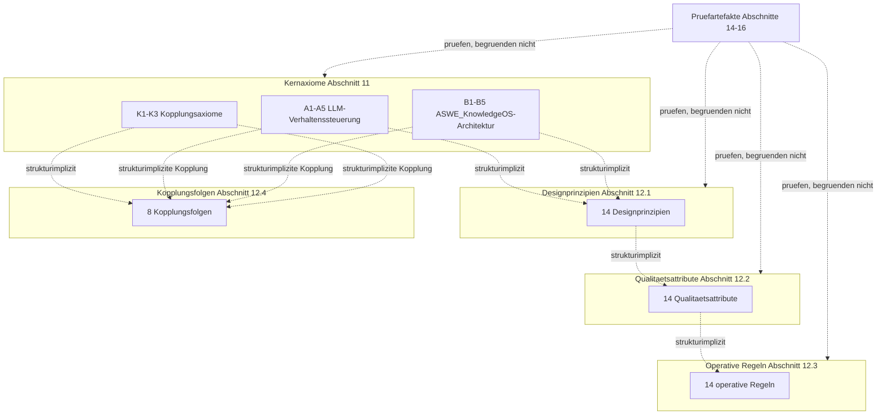

# ASWE_Axiomraum_Schritte_1_bis_4_Pruefung_20260423_V3

## Phase 0 – Voranalyse

### Zielbild
Deterministische Verarbeitung von `ASWE_Axiomraum_Grundlagendokument_20260423_V9.md` entlang der Schritte 1–4: Gesamt-Konsistenzaudit, Ableitungsgraph, Operationalisierung der Qualitaetsattribute und Uebersetzung operativer Regeln in Pruefverfahren.

### Gegenstand
Gegenstand sind ausschliesslich die im V9-Dokument kanonisch gefuehrten Raumelemente aus Abschnitt 11 und 12 sowie die zu ihrer Pruefung definierten Pruefartefakte aus den Abschnitten 8, 9, 14, 15 und 16.

### Geltungsbereich
Diese Datei ist ein Pruefartefakt. Sie erzeugt keine neuen Kernaxiome, keine neuen Folgeebenen und keine neue Dokumentstruktur.

### Nicht-Geltung
Nicht Gegenstand sind Repo-Materialisierung, neue Axiome, neue Folgeelemente, neue Messansprueche fuer Kernaxiome oder Designprinzipien sowie frei erfundene Ableitungskanten.

### Epistemischer Status
- **Beobachtung:** V9 definiert Elementklassen, Pruefartefakte, Wohlgeformtheitsregeln, Zirkularitaetssperren, Diagrammlogik, Pruefstandard, Pruefalgorithmus und Routinen.
- **Aussage:** Die Ebenenstruktur ist objektiv artefaktbelegt; elementgenaue Rueckbindungen der meisten Folgeelemente sind nicht explizit belegt.
- **Hypothese:** Das Dokument ist logisch weiterverarbeitbar, wenn fehlende elementgenaue Rueckbindungen als strukturimplizit statt als explizit markiert werden.
- **Kriterium:** Keine erfundenen Kanten; jede Entscheidung mit Suchspur und Beurteilbarkeitsstatus.
- **Empfehlung:** V9 ist verwendbar; fuer hoehere Objektivierung sollte spaeter eine Element-Rueckbindungsmatrix nachgezogen werden.

Harte Regel:
```text
Definitorische Mindestschicht -> logische Konsistenzschicht -> Pruefstandard -> Pruefalgorithmus -> Pruefroutine -> Pruefurteil
```

## Phase 1 – Gesamt-Konsistenzaudit

### Suchspur
- Suchspur-ID: `SK-1-GESAMT-KONSISTENZAUDIT`
- Quelle: `ASWE_Axiomraum_Grundlagendokument_20260423_V9.md`
- angewendete Abschnitte: 8, 9, 11, 12, 14, 15, 16
- Routine: `16.4 Gesamt-Konsistenzaudit`
- Algorithmus: `15.2 Algorithmus`
- Ergebnisstatus: Pruefartefakt, kein Raumelement

| Element | Primaertyp | Fundstelle | Rueckbindung | Rueckbindungsstatus | Ableitungsrichtung | W-Regel | L-Regel | Zirkularitaetsbefund | Gegenmodell | Beurteilbarkeitsstatus | Entscheidung |
| --- | --- | --- | --- | --- | --- | --- | --- | --- | --- | --- | --- |
| A1 Ziel- und Geltungsbindung | Kernaxiom | 11.1 | basal gesetzt | objektiv artefaktbelegt | keine Ableitung; Ausgangsebene | W1 | L1-L6 | kein Zyklus belegbar | koennte nur bei Handlungs-/Messformulierung kollabieren; hier nicht | objektiv artefaktbelegt | beibehalten |
| A2 Epistemische Trennung | Kernaxiom | 11.1 | basal gesetzt | objektiv artefaktbelegt | keine Ableitung; Ausgangsebene | W1 | L1-L6 | kein Zyklus belegbar | koennte nur bei Handlungs-/Messformulierung kollabieren; hier nicht | objektiv artefaktbelegt | beibehalten |
| A3 Auditierbarkeit und Unsicherheitsmarkierung | Kernaxiom | 11.1 | basal gesetzt | objektiv artefaktbelegt | keine Ableitung; Ausgangsebene | W1 | L1-L6 | kein Zyklus belegbar | koennte nur bei Handlungs-/Messformulierung kollabieren; hier nicht | objektiv artefaktbelegt | beibehalten |
| A4 begrenzt-rueckgabefaehige Schrittlogik unter Aufsicht | Kernaxiom | 11.1 | basal gesetzt | objektiv artefaktbelegt | keine Ableitung; Ausgangsebene | W1 | L1-L6 | kein Zyklus belegbar | koennte nur bei Handlungs-/Messformulierung kollabieren; hier nicht | objektiv artefaktbelegt | beibehalten |
| A5 Verhaltenstestbarkeit | Kernaxiom | 11.1 | basal gesetzt | objektiv artefaktbelegt | keine Ableitung; Ausgangsebene | W1 | L1-L6 | kein Zyklus belegbar | koennte nur bei Handlungs-/Messformulierung kollabieren; hier nicht | objektiv artefaktbelegt | beibehalten |
| B1 Terminologische Primaerordnung | Kernaxiom | 11.2 | basal gesetzt | objektiv artefaktbelegt | keine Ableitung; Ausgangsebene | W1 | L1-L6 | kein Zyklus belegbar | koennte nur bei Handlungs-/Messformulierung kollabieren; hier nicht | objektiv artefaktbelegt | beibehalten |
| B2 Ontologische Trennschaerfe | Kernaxiom | 11.2 | basal gesetzt | objektiv artefaktbelegt | keine Ableitung; Ausgangsebene | W1 | L1-L6 | kein Zyklus belegbar | koennte nur bei Handlungs-/Messformulierung kollabieren; hier nicht | objektiv artefaktbelegt | beibehalten |
| B3 Provenienz und Referenzierbarkeit | Kernaxiom | 11.2 | basal gesetzt | objektiv artefaktbelegt | keine Ableitung; Ausgangsebene | W1 | L1-L6 | kein Zyklus belegbar | koennte nur bei Handlungs-/Messformulierung kollabieren; hier nicht | objektiv artefaktbelegt | beibehalten |
| B4 Pfad- und Schnittstellenexplizitheit | Kernaxiom | 11.2 | basal gesetzt | objektiv artefaktbelegt | keine Ableitung; Ausgangsebene | W1 | L1-L6 | kein Zyklus belegbar | koennte nur bei Handlungs-/Messformulierung kollabieren; hier nicht | objektiv artefaktbelegt | beibehalten |
| B5 Governierte Evolvierbarkeit | Kernaxiom | 11.2 | basal gesetzt | objektiv artefaktbelegt | keine Ableitung; Ausgangsebene | W1 | L1-L6 | kein Zyklus belegbar | koennte nur bei Handlungs-/Messformulierung kollabieren; hier nicht | objektiv artefaktbelegt | beibehalten |
| K1 Beobachtung-Aussage-Beleg | Kernaxiom | 11.3 | basal gesetzt | objektiv artefaktbelegt | keine Ableitung; Ausgangsebene | W1 | L1-L6 | kein Zyklus belegbar | koennte nur bei Handlungs-/Messformulierung kollabieren; hier nicht | objektiv artefaktbelegt | beibehalten |
| K2 Evaluation vor Operationalisierung | Kernaxiom | 11.3 | basal gesetzt | objektiv artefaktbelegt | keine Ableitung; Ausgangsebene | W1 | L1-L6 | kein Zyklus belegbar | koennte nur bei Handlungs-/Messformulierung kollabieren; hier nicht | objektiv artefaktbelegt | beibehalten |
| K3 Spiegel-/Adapter-Asymmetrie | Kernaxiom | 11.3 | basal gesetzt | objektiv artefaktbelegt | keine Ableitung; Ausgangsebene | W1 | L1-L6 | kein Zyklus belegbar | koennte nur bei Handlungs-/Messformulierung kollabieren; hier nicht | objektiv artefaktbelegt | beibehalten |
| Explizitheit kritischer Annahmen | Designprinzip | 12.1 | Abschnitt 12 als Folgeebene aus Abschnitt 11 | strukturimplizit rekonstruierbar | Kernaxiom -> Designprinzip; elementgenaue Kante nicht belegt | W2 | L2-L4,L8,L10 | kein Zyklus belegbar; Rueckbindung nur strukturimplizit | koennte teils Qualitaetsattribut oder operative Regel sein; bei Bedarf gesondert pruefen | strukturimplizit rekonstruierbar | beibehalten; spaeter elementgenau rueckbinden |
| regelgebundene Selbstkritik | Designprinzip | 12.1 | Abschnitt 12 als Folgeebene aus Abschnitt 11 | strukturimplizit rekonstruierbar | Kernaxiom -> Designprinzip; elementgenaue Kante nicht belegt | W2 | L2-L4,L8,L10 | kein Zyklus belegbar; Rueckbindung nur strukturimplizit | koennte teils Qualitaetsattribut oder operative Regel sein; bei Bedarf gesondert pruefen | strukturimplizit rekonstruierbar | beibehalten; spaeter elementgenau rueckbinden |
| adversariale Pruefbarkeit | Designprinzip | 12.1 | Abschnitt 12 als Folgeebene aus Abschnitt 11 | strukturimplizit rekonstruierbar | Kernaxiom -> Designprinzip; elementgenaue Kante nicht belegt | W2 | L2-L4,L8,L10 | kein Zyklus belegbar; Rueckbindung nur strukturimplizit | koennte teils Qualitaetsattribut oder operative Regel sein; bei Bedarf gesondert pruefen | strukturimplizit rekonstruierbar | beibehalten; spaeter elementgenau rueckbinden |
| evaluator-kritische Testdisziplin | Designprinzip | 12.1 | Abschnitt 12 als Folgeebene aus Abschnitt 11 | strukturimplizit rekonstruierbar | Kernaxiom -> Designprinzip; elementgenaue Kante nicht belegt | W2 | L2-L4,L8,L10 | kein Zyklus belegbar; Rueckbindung nur strukturimplizit | koennte teils Qualitaetsattribut oder operative Regel sein; bei Bedarf gesondert pruefen | strukturimplizit rekonstruierbar | beibehalten; spaeter elementgenau rueckbinden |
| definitorische Priorisierung | Designprinzip | 12.1 | Abschnitt 12 als Folgeebene aus Abschnitt 11 | strukturimplizit rekonstruierbar | Kernaxiom -> Designprinzip; elementgenaue Kante nicht belegt | W2 | L2-L4,L8,L10 | kein Zyklus belegbar; Rueckbindung nur strukturimplizit | koennte teils Qualitaetsattribut oder operative Regel sein; bei Bedarf gesondert pruefen | strukturimplizit rekonstruierbar | beibehalten; spaeter elementgenau rueckbinden |
| Rollen- und Relationsreinheit | Designprinzip | 12.1 | Abschnitt 12 als Folgeebene aus Abschnitt 11 | strukturimplizit rekonstruierbar | Kernaxiom -> Designprinzip; elementgenaue Kante nicht belegt | W2 | L2-L4,L8,L10 | kein Zyklus belegbar; Rueckbindung nur strukturimplizit | koennte teils Qualitaetsattribut oder operative Regel sein; bei Bedarf gesondert pruefen | strukturimplizit rekonstruierbar | beibehalten; spaeter elementgenau rueckbinden |
| kontrollierte Kopplung | Designprinzip | 12.1 | Abschnitt 12 als Folgeebene aus Abschnitt 11 | strukturimplizit rekonstruierbar | Kernaxiom -> Designprinzip; elementgenaue Kante nicht belegt | W2 | L2-L4,L8,L10 | kein Zyklus belegbar; Rueckbindung nur strukturimplizit | koennte teils Qualitaetsattribut oder operative Regel sein; bei Bedarf gesondert pruefen | strukturimplizit rekonstruierbar | beibehalten; spaeter elementgenau rueckbinden |
| driftwachsame Revisionsdisziplin | Designprinzip | 12.1 | Abschnitt 12 als Folgeebene aus Abschnitt 11 | strukturimplizit rekonstruierbar | Kernaxiom -> Designprinzip; elementgenaue Kante nicht belegt | W2 | L2-L4,L8,L10 | kein Zyklus belegbar; Rueckbindung nur strukturimplizit | koennte teils Qualitaetsattribut oder operative Regel sein; bei Bedarf gesondert pruefen | strukturimplizit rekonstruierbar | beibehalten; spaeter elementgenau rueckbinden |
| Verifikationsfaehigkeit | Designprinzip | 12.1 | Abschnitt 12 als Folgeebene aus Abschnitt 11 | strukturimplizit rekonstruierbar | Kernaxiom -> Designprinzip; elementgenaue Kante nicht belegt | W2 | L2-L4,L8,L10 | kein Zyklus belegbar; Rueckbindung nur strukturimplizit | koennte teils Qualitaetsattribut oder operative Regel sein; bei Bedarf gesondert pruefen | strukturimplizit rekonstruierbar | beibehalten; spaeter elementgenau rueckbinden |
| epistemische Staffelung | Designprinzip | 12.1 | Abschnitt 12 als Folgeebene aus Abschnitt 11 | strukturimplizit rekonstruierbar | Kernaxiom -> Designprinzip; elementgenaue Kante nicht belegt | W2 | L2-L4,L8,L10 | kein Zyklus belegbar; Rueckbindung nur strukturimplizit | koennte teils Qualitaetsattribut oder operative Regel sein; bei Bedarf gesondert pruefen | strukturimplizit rekonstruierbar | beibehalten; spaeter elementgenau rueckbinden |
| Materialisierungsdisziplin | Designprinzip | 12.1 | Abschnitt 12 als Folgeebene aus Abschnitt 11 | strukturimplizit rekonstruierbar | Kernaxiom -> Designprinzip; elementgenaue Kante nicht belegt | W2 | L2-L4,L8,L10 | kein Zyklus belegbar; Rueckbindung nur strukturimplizit | koennte teils Qualitaetsattribut oder operative Regel sein; bei Bedarf gesondert pruefen | strukturimplizit rekonstruierbar | beibehalten; spaeter elementgenau rueckbinden |
| keine konkurrierende Wahrheitsquelle | Designprinzip | 12.1 | Abschnitt 12 als Folgeebene aus Abschnitt 11 | strukturimplizit rekonstruierbar | Kernaxiom -> Designprinzip; elementgenaue Kante nicht belegt | W2 | L2-L4,L8,L10 | kein Zyklus belegbar; Rueckbindung nur strukturimplizit | koennte teils Qualitaetsattribut oder operative Regel sein; bei Bedarf gesondert pruefen | strukturimplizit rekonstruierbar | beibehalten; spaeter elementgenau rueckbinden |
| Ausnahmebehandlungs-Explizitheit | Designprinzip | 12.1 | Abschnitt 12 als Folgeebene aus Abschnitt 11 | strukturimplizit rekonstruierbar | Kernaxiom -> Designprinzip; elementgenaue Kante nicht belegt | W2 | L2-L4,L8,L10 | kein Zyklus belegbar; Rueckbindung nur strukturimplizit | koennte teils Qualitaetsattribut oder operative Regel sein; bei Bedarf gesondert pruefen | strukturimplizit rekonstruierbar | beibehalten; spaeter elementgenau rueckbinden |
| Nachzugsdisziplin fuer Folgeebenen bei Axiomrevision | Designprinzip | 12.1 | Abschnitt 12 als Folgeebene aus Abschnitt 11 | strukturimplizit rekonstruierbar | Kernaxiom -> Designprinzip; elementgenaue Kante nicht belegt | W2 | L2-L4,L8,L10 | kein Zyklus belegbar; Rueckbindung nur strukturimplizit | koennte teils Qualitaetsattribut oder operative Regel sein; bei Bedarf gesondert pruefen | strukturimplizit rekonstruierbar | beibehalten; spaeter elementgenau rueckbinden |
| Driftresistenz | Qualitaetsattribut | 12.2 | Abschnitt 12.2 als Folgeebene; keine elementgenaue Ableitung | strukturimplizit rekonstruierbar | Kernaxiom/Designprinzip -> Qualitaetsattribut; Kante nicht elementgenau belegt | W3 | L3,L10 | kein Zyklus belegbar; Messbarkeit erst hier | koennte bei Normformulierung zur operativen Regel kippen; hier als Eigenschaft formuliert | strukturimplizit rekonstruierbar | beibehalten; Indikator nur als Pruefartefakt |
| Kontrollierbarkeit in enger Fassung | Qualitaetsattribut | 12.2 | Abschnitt 12.2 als Folgeebene; keine elementgenaue Ableitung | strukturimplizit rekonstruierbar | Kernaxiom/Designprinzip -> Qualitaetsattribut; Kante nicht elementgenau belegt | W3 | L3,L10 | kein Zyklus belegbar; Messbarkeit erst hier | koennte bei Normformulierung zur operativen Regel kippen; hier als Eigenschaft formuliert | strukturimplizit rekonstruierbar | beibehalten; Indikator nur als Pruefartefakt |
| Reproduzierbarkeit | Qualitaetsattribut | 12.2 | Abschnitt 12.2 als Folgeebene; keine elementgenaue Ableitung | strukturimplizit rekonstruierbar | Kernaxiom/Designprinzip -> Qualitaetsattribut; Kante nicht elementgenau belegt | W3 | L3,L10 | kein Zyklus belegbar; Messbarkeit erst hier | koennte bei Normformulierung zur operativen Regel kippen; hier als Eigenschaft formuliert | strukturimplizit rekonstruierbar | beibehalten; Indikator nur als Pruefartefakt |
| argumentative Nachvollziehbarkeit | Qualitaetsattribut | 12.2 | Abschnitt 12.2 als Folgeebene; keine elementgenaue Ableitung | strukturimplizit rekonstruierbar | Kernaxiom/Designprinzip -> Qualitaetsattribut; Kante nicht elementgenau belegt | W3 | L3,L10 | kein Zyklus belegbar; Messbarkeit erst hier | koennte bei Normformulierung zur operativen Regel kippen; hier als Eigenschaft formuliert | strukturimplizit rekonstruierbar | beibehalten; Indikator nur als Pruefartefakt |
| Wiederauffindbarkeit | Qualitaetsattribut | 12.2 | Abschnitt 12.2 als Folgeebene; keine elementgenaue Ableitung | strukturimplizit rekonstruierbar | Kernaxiom/Designprinzip -> Qualitaetsattribut; Kante nicht elementgenau belegt | W3 | L3,L10 | kein Zyklus belegbar; Messbarkeit erst hier | koennte bei Normformulierung zur operativen Regel kippen; hier als Eigenschaft formuliert | strukturimplizit rekonstruierbar | beibehalten; Indikator nur als Pruefartefakt |
| Persistenz in enger Fassung | Qualitaetsattribut | 12.2 | Abschnitt 12.2 als Folgeebene; keine elementgenaue Ableitung | strukturimplizit rekonstruierbar | Kernaxiom/Designprinzip -> Qualitaetsattribut; Kante nicht elementgenau belegt | W3 | L3,L10 | kein Zyklus belegbar; Messbarkeit erst hier | koennte bei Normformulierung zur operativen Regel kippen; hier als Eigenschaft formuliert | strukturimplizit rekonstruierbar | beibehalten; Indikator nur als Pruefartefakt |
| Reparierbarkeit | Qualitaetsattribut | 12.2 | Abschnitt 12.2 als Folgeebene; keine elementgenaue Ableitung | strukturimplizit rekonstruierbar | Kernaxiom/Designprinzip -> Qualitaetsattribut; Kante nicht elementgenau belegt | W3 | L3,L10 | kein Zyklus belegbar; Messbarkeit erst hier | koennte bei Normformulierung zur operativen Regel kippen; hier als Eigenschaft formuliert | strukturimplizit rekonstruierbar | beibehalten; Indikator nur als Pruefartefakt |
| Wartbarkeit | Qualitaetsattribut | 12.2 | Abschnitt 12.2 als Folgeebene; keine elementgenaue Ableitung | strukturimplizit rekonstruierbar | Kernaxiom/Designprinzip -> Qualitaetsattribut; Kante nicht elementgenau belegt | W3 | L3,L10 | kein Zyklus belegbar; Messbarkeit erst hier | koennte bei Normformulierung zur operativen Regel kippen; hier als Eigenschaft formuliert | strukturimplizit rekonstruierbar | beibehalten; Indikator nur als Pruefartefakt |
| duale Lesbarkeit in enger Fassung | Qualitaetsattribut | 12.2 | Abschnitt 12.2 als Folgeebene; keine elementgenaue Ableitung | strukturimplizit rekonstruierbar | Kernaxiom/Designprinzip -> Qualitaetsattribut; Kante nicht elementgenau belegt | W3 | L3,L10 | kein Zyklus belegbar; Messbarkeit erst hier | koennte bei Normformulierung zur operativen Regel kippen; hier als Eigenschaft formuliert | strukturimplizit rekonstruierbar | beibehalten; Indikator nur als Pruefartefakt |
| Wahrheitsquellenstabilitaet in enger Fassung | Qualitaetsattribut | 12.2 | Abschnitt 12.2 als Folgeebene; keine elementgenaue Ableitung | strukturimplizit rekonstruierbar | Kernaxiom/Designprinzip -> Qualitaetsattribut; Kante nicht elementgenau belegt | W3 | L3,L10 | kein Zyklus belegbar; Messbarkeit erst hier | koennte bei Normformulierung zur operativen Regel kippen; hier als Eigenschaft formuliert | strukturimplizit rekonstruierbar | beibehalten; Indikator nur als Pruefartefakt |
| Ableitungsnachvollziehbarkeit | Qualitaetsattribut | 12.2 | Abschnitt 12.2 als Folgeebene; keine elementgenaue Ableitung | strukturimplizit rekonstruierbar | Kernaxiom/Designprinzip -> Qualitaetsattribut; Kante nicht elementgenau belegt | W3 | L3,L10 | kein Zyklus belegbar; Messbarkeit erst hier | koennte bei Normformulierung zur operativen Regel kippen; hier als Eigenschaft formuliert | strukturimplizit rekonstruierbar | beibehalten; Indikator nur als Pruefartefakt |
| Vererbungskonsistenz | Qualitaetsattribut | 12.2 | Abschnitt 12.2 als Folgeebene; keine elementgenaue Ableitung | strukturimplizit rekonstruierbar | Kernaxiom/Designprinzip -> Qualitaetsattribut; Kante nicht elementgenau belegt | W3 | L3,L10 | kein Zyklus belegbar; Messbarkeit erst hier | koennte bei Normformulierung zur operativen Regel kippen; hier als Eigenschaft formuliert | strukturimplizit rekonstruierbar | beibehalten; Indikator nur als Pruefartefakt |
| Rueckrollbarkeit | Qualitaetsattribut | 12.2 | Abschnitt 12.2 als Folgeebene; keine elementgenaue Ableitung | strukturimplizit rekonstruierbar | Kernaxiom/Designprinzip -> Qualitaetsattribut; Kante nicht elementgenau belegt | W3 | L3,L10 | kein Zyklus belegbar; Messbarkeit erst hier | koennte bei Normformulierung zur operativen Regel kippen; hier als Eigenschaft formuliert | strukturimplizit rekonstruierbar | beibehalten; Indikator nur als Pruefartefakt |
| Ausfuehrungseffizienz | Qualitaetsattribut | 12.2 | Abschnitt 12.2 als Folgeebene; keine elementgenaue Ableitung | strukturimplizit rekonstruierbar | Kernaxiom/Designprinzip -> Qualitaetsattribut; Kante nicht elementgenau belegt | W3 | L3,L10 | kein Zyklus belegbar; Messbarkeit erst hier | koennte bei Normformulierung zur operativen Regel kippen; hier als Eigenschaft formuliert | strukturimplizit rekonstruierbar | beibehalten; Indikator nur als Pruefartefakt |
| Zielbild vor Ausfuehrung explizieren | Operative Regel | 12.3 | Abschnitt 12.3 als Folgeebene; keine elementgenaue Ableitung | strukturimplizit rekonstruierbar | Prinzip/Attribut -> operative Regel; Kante nicht elementgenau belegt | W4 | L3,L4,L10 | kein Zyklus belegbar; keine Rueckwaertsbegruendung verwenden | koennte mit Pruefroutine verwechselt werden; als Raumelement-Regel belassen | strukturimplizit rekonstruierbar | beibehalten; Pruefverfahren als Pruefartefakt ableiten |
| Aussagearten trennen | Operative Regel | 12.3 | Abschnitt 12.3 als Folgeebene; keine elementgenaue Ableitung | strukturimplizit rekonstruierbar | Prinzip/Attribut -> operative Regel; Kante nicht elementgenau belegt | W4 | L3,L4,L10 | kein Zyklus belegbar; keine Rueckwaertsbegruendung verwenden | koennte mit Pruefroutine verwechselt werden; als Raumelement-Regel belassen | strukturimplizit rekonstruierbar | beibehalten; Pruefverfahren als Pruefartefakt ableiten |
| Unsicherheiten markieren | Operative Regel | 12.3 | Abschnitt 12.3 als Folgeebene; keine elementgenaue Ableitung | strukturimplizit rekonstruierbar | Prinzip/Attribut -> operative Regel; Kante nicht elementgenau belegt | W4 | L3,L4,L10 | kein Zyklus belegbar; keine Rueckwaertsbegruendung verwenden | koennte mit Pruefroutine verwechselt werden; als Raumelement-Regel belassen | strukturimplizit rekonstruierbar | beibehalten; Pruefverfahren als Pruefartefakt ableiten |
| kleinsten sicheren naechsten Schritt waehlen | Operative Regel | 12.3 | Abschnitt 12.3 als Folgeebene; keine elementgenaue Ableitung | strukturimplizit rekonstruierbar | Prinzip/Attribut -> operative Regel; Kante nicht elementgenau belegt | W4 | L3,L4,L10 | kein Zyklus belegbar; keine Rueckwaertsbegruendung verwenden | koennte mit Pruefroutine verwechselt werden; als Raumelement-Regel belassen | strukturimplizit rekonstruierbar | beibehalten; Pruefverfahren als Pruefartefakt ableiten |
| Gegenbeispiele und Testfaelle anfuehren | Operative Regel | 12.3 | Abschnitt 12.3 als Folgeebene; keine elementgenaue Ableitung | strukturimplizit rekonstruierbar | Prinzip/Attribut -> operative Regel; Kante nicht elementgenau belegt | W4 | L3,L4,L10 | kein Zyklus belegbar; keine Rueckwaertsbegruendung verwenden | koennte mit Pruefroutine verwechselt werden; als Raumelement-Regel belassen | strukturimplizit rekonstruierbar | beibehalten; Pruefverfahren als Pruefartefakt ableiten |
| Begriff vor Benennung, Benennung vor Regelung | Operative Regel | 12.3 | Abschnitt 12.3 als Folgeebene; keine elementgenaue Ableitung | strukturimplizit rekonstruierbar | Prinzip/Attribut -> operative Regel; Kante nicht elementgenau belegt | W4 | L3,L4,L10 | kein Zyklus belegbar; keine Rueckwaertsbegruendung verwenden | koennte mit Pruefroutine verwechselt werden; als Raumelement-Regel belassen | strukturimplizit rekonstruierbar | beibehalten; Pruefverfahren als Pruefartefakt ableiten |
| Herkunft und Referenzen mitfuehren | Operative Regel | 12.3 | Abschnitt 12.3 als Folgeebene; keine elementgenaue Ableitung | strukturimplizit rekonstruierbar | Prinzip/Attribut -> operative Regel; Kante nicht elementgenau belegt | W4 | L3,L4,L10 | kein Zyklus belegbar; keine Rueckwaertsbegruendung verwenden | koennte mit Pruefroutine verwechselt werden; als Raumelement-Regel belassen | strukturimplizit rekonstruierbar | beibehalten; Pruefverfahren als Pruefartefakt ableiten |
| Pfadwechsel nur ueber explizite Schnittstellen | Operative Regel | 12.3 | Abschnitt 12.3 als Folgeebene; keine elementgenaue Ableitung | strukturimplizit rekonstruierbar | Prinzip/Attribut -> operative Regel; Kante nicht elementgenau belegt | W4 | L3,L4,L10 | kein Zyklus belegbar; keine Rueckwaertsbegruendung verwenden | koennte mit Pruefroutine verwechselt werden; als Raumelement-Regel belassen | strukturimplizit rekonstruierbar | beibehalten; Pruefverfahren als Pruefartefakt ableiten |
| Aenderungen gegen Drift und Revisionsfaehigkeit pruefen | Operative Regel | 12.3 | Abschnitt 12.3 als Folgeebene; keine elementgenaue Ableitung | strukturimplizit rekonstruierbar | Prinzip/Attribut -> operative Regel; Kante nicht elementgenau belegt | W4 | L3,L4,L10 | kein Zyklus belegbar; keine Rueckwaertsbegruendung verwenden | koennte mit Pruefroutine verwechselt werden; als Raumelement-Regel belassen | strukturimplizit rekonstruierbar | beibehalten; Pruefverfahren als Pruefartefakt ableiten |
| Bewertung vor Materialisierung | Operative Regel | 12.3 | Abschnitt 12.3 als Folgeebene; keine elementgenaue Ableitung | strukturimplizit rekonstruierbar | Prinzip/Attribut -> operative Regel; Kante nicht elementgenau belegt | W4 | L3,L4,L10 | kein Zyklus belegbar; keine Rueckwaertsbegruendung verwenden | koennte mit Pruefroutine verwechselt werden; als Raumelement-Regel belassen | strukturimplizit rekonstruierbar | beibehalten; Pruefverfahren als Pruefartefakt ableiten |
| Spiegel und Adapter nicht als semantischen Ursprung behandeln | Operative Regel | 12.3 | Abschnitt 12.3 als Folgeebene; keine elementgenaue Ableitung | strukturimplizit rekonstruierbar | Prinzip/Attribut -> operative Regel; Kante nicht elementgenau belegt | W4 | L3,L4,L10 | kein Zyklus belegbar; keine Rueckwaertsbegruendung verwenden | koennte mit Pruefroutine verwechselt werden; als Raumelement-Regel belassen | strukturimplizit rekonstruierbar | beibehalten; Pruefverfahren als Pruefartefakt ableiten |
| Kopplungen explizit markieren und asymmetrische Kopplungen kennzeichnen | Operative Regel | 12.3 | Abschnitt 12.3 als Folgeebene; keine elementgenaue Ableitung | strukturimplizit rekonstruierbar | Prinzip/Attribut -> operative Regel; Kante nicht elementgenau belegt | W4 | L3,L4,L10 | kein Zyklus belegbar; keine Rueckwaertsbegruendung verwenden | koennte mit Pruefroutine verwechselt werden; als Raumelement-Regel belassen | strukturimplizit rekonstruierbar | beibehalten; Pruefverfahren als Pruefartefakt ableiten |
| Deprekation statt stiller Entfernung markieren | Operative Regel | 12.3 | Abschnitt 12.3 als Folgeebene; keine elementgenaue Ableitung | strukturimplizit rekonstruierbar | Prinzip/Attribut -> operative Regel; Kante nicht elementgenau belegt | W4 | L3,L4,L10 | kein Zyklus belegbar; keine Rueckwaertsbegruendung verwenden | koennte mit Pruefroutine verwechselt werden; als Raumelement-Regel belassen | strukturimplizit rekonstruierbar | beibehalten; Pruefverfahren als Pruefartefakt ableiten |
| Prueftiefe an Tragweite und Reversibilitaet ausrichten | Operative Regel | 12.3 | Abschnitt 12.3 als Folgeebene; keine elementgenaue Ableitung | strukturimplizit rekonstruierbar | Prinzip/Attribut -> operative Regel; Kante nicht elementgenau belegt | W4 | L3,L4,L10 | kein Zyklus belegbar; keine Rueckwaertsbegruendung verwenden | koennte mit Pruefroutine verwechselt werden; als Raumelement-Regel belassen | strukturimplizit rekonstruierbar | beibehalten; Pruefverfahren als Pruefartefakt ableiten |
| KF1 Scope-Bindung wirkt bis in Materialisierung und Operationalisierung. | Kopplungsfolge | 12.4 | A1/K2 | strukturimplizit rekonstruierbar | A/B/K -> Kopplungsfolge | W5 | L5,L6 | kein Zyklus belegbar; Kopplung explizit | koennte als Analogie missverstanden werden; als Kopplungsfolge belassen | strukturimplizit rekonstruierbar | beibehalten; Kanten spaeter explizieren |
| KF2 Epistemische Reinheit ist in Verhalten und Architektur gemeinsam basal. | Kopplungsfolge | 12.4 | A2/B2/K1 | strukturimplizit rekonstruierbar | A/B/K -> Kopplungsfolge | W5 | L5,L6 | kein Zyklus belegbar; Kopplung explizit | koennte als Analogie missverstanden werden; als Kopplungsfolge belassen | strukturimplizit rekonstruierbar | beibehalten; Kanten spaeter explizieren |
| KF3 Auditierbarkeit braucht Provenienz und Referenzierbarkeit. | Kopplungsfolge | 12.4 | A3/B3 | strukturimplizit rekonstruierbar | A/B/K -> Kopplungsfolge | W5 | L5,L6 | kein Zyklus belegbar; Kopplung explizit | koennte als Analogie missverstanden werden; als Kopplungsfolge belassen | strukturimplizit rekonstruierbar | beibehalten; Kanten spaeter explizieren |
| KF4 Rueckgabefaehige Schrittlogik braucht explizite Pfad- und Schnittstellenlogik. | Kopplungsfolge | 12.4 | A4/B4 | strukturimplizit rekonstruierbar | A/B/K -> Kopplungsfolge | W5 | L5,L6 | kein Zyklus belegbar; Kopplung explizit | koennte als Analogie missverstanden werden; als Kopplungsfolge belassen | strukturimplizit rekonstruierbar | beibehalten; Kanten spaeter explizieren |
| KF5 Testbarkeit muss vor operative Uebernahme treten. | Kopplungsfolge | 12.4 | A5/K2 | strukturimplizit rekonstruierbar | A/B/K -> Kopplungsfolge | W5 | L5,L6 | kein Zyklus belegbar; Kopplung explizit | koennte als Analogie missverstanden werden; als Kopplungsfolge belassen | strukturimplizit rekonstruierbar | beibehalten; Kanten spaeter explizieren |
| KF6 Ontologische Trennschaerfe stabilisiert Spiegel-/Adapter-Asymmetrie. | Kopplungsfolge | 12.4 | B2/K3 | strukturimplizit rekonstruierbar | A/B/K -> Kopplungsfolge | W5 | L5,L6 | kein Zyklus belegbar; Kopplung explizit | koennte als Analogie missverstanden werden; als Kopplungsfolge belassen | strukturimplizit rekonstruierbar | beibehalten; Kanten spaeter explizieren |
| KF7 Governierte Evolvierbarkeit verlangt begrenzte Ausfuehrungs- und Rueckgabelogik. | Kopplungsfolge | 12.4 | B5/A4 | strukturimplizit rekonstruierbar | A/B/K -> Kopplungsfolge | W5 | L5,L6 | kein Zyklus belegbar; Kopplung explizit | koennte als Analogie missverstanden werden; als Kopplungsfolge belassen | strukturimplizit rekonstruierbar | beibehalten; Kanten spaeter explizieren |
| KF8 Axiomrevision erzwingt Folgeebenen-Nachzug. | Kopplungsfolge | 12.4 | B5 + Nachzugsdisziplin | strukturimplizit rekonstruierbar | A/B/K -> Kopplungsfolge | W5 | L5,L6 | kein Zyklus belegbar; Kopplung explizit | koennte als Analogie missverstanden werden; als Kopplungsfolge belassen | strukturimplizit rekonstruierbar | beibehalten; Kanten spaeter explizieren |


### Befund zu Phase 1
- Keine elementgenauen Ableitungskanten fuer die meisten Designprinzipien, Qualitaetsattribute und operativen Regeln sind im V9-Dokument explizit belegt.
- Die regulare Ebenenfolge ist objektiv artefaktbelegt, weil Abschnitt 8, 9, 12, 14, 15 und 16 sie festlegen.
- Die Rueckbindung einzelner Folgeelemente ist ueberwiegend strukturimplizit rekonstruierbar.
- Daraus folgt kein harter Widerspruch, aber ein minimaler Korrekturrest fuer eine spaetere Element-Rueckbindungsmatrix.

## Phase 2 – Ableitungsgraph

### Suchspur
- Suchspur-ID: `SK-2-ABLEITUNGSGRAPH`
- Quelle: Abschnitt 10 Diagrammtyp 1, Abschnitt 11–12 Gegenstandsraum
- Kantenstatus: ueberwiegend strukturimplizit, nicht elementgenau explizit
- Kantenfehler: kein belegter Kantenfehler
- Einschraenkung: keine elementgenaue Rueckbindung belegbar; nur strukturimplizite Ableitung



Problematische Kanten:
- fehlende Rueckbindung: **elementgenau ja**, strukturell nein
- Rueckwaertsbegruendung: **kein belegter Fall**
- Zyklusverdacht: **kein belegter Fall**
- Scheinkopplung: **kein belegter Fall**, aber Kopplungen bleiben teils strukturimplizit
- Redundanz: **nicht entscheidbar ohne Element-Rueckbindungsmatrix**

## Phase 3 – Qualitaetsattribute operationalisieren

### Suchspur
- Suchspur-ID: `SK-3-QUALITAETSATTRIBUTE`
- Quelle: Abschnitt 12.2
- Regel: Messbarkeit erst ab Qualitaetsattributen
- Status: alle Indikatoren sind Pruefartefakte, keine neuen Raumelemente

| Qualitaetsattribut | Rueckbindung | Rueckbindungsstatus | Bewertungsgegenstand | moeglicher Indikator | Mess-/Bewertungsmodus | Nicht-Geltung | Konfliktlage | Beurteilbarkeitsstatus |
| --- | --- | --- | --- | --- | --- | --- | --- | --- |
| Driftresistenz | Abschnitt 12.2; keine elementgenaue Kante | strukturimplizit rekonstruierbar | Artefakt- oder Bedeutungszustand | Anzahl unbegruendeter Bedeutungs-/Statusverschiebungen pro Revision | Versionsvergleich; Driftfall zaehlen | nicht fuer bewusst dokumentierte Revisionen | Effizienz kann Driftpruefung verkuerzen | heuristisch plausibel |
| Kontrollierbarkeit in enger Fassung | Abschnitt 12.2; keine elementgenaue Kante | strukturimplizit rekonstruierbar | Pruef- oder Aenderungsprozess | Anteil Entscheidungen mit Rueckgabe-/Stopppunkt | Pruefprotokoll auswerten | nicht gleich Autonomiebegrenzung insgesamt | Kontrolle vs. Ausfuehrungseffizienz | heuristisch plausibel |
| Reproduzierbarkeit | Abschnitt 12.2; keine elementgenaue Kante | strukturimplizit rekonstruierbar | Pruefergebnis | Uebereinstimmung zweier unabhaengiger Prueflaeufe | Interrater- oder Wiederholungspruefung | nicht fuer rein explorative Ideation | Strenge vs. Geschwindigkeit | heuristisch plausibel |
| argumentative Nachvollziehbarkeit | Abschnitt 12.2; keine elementgenaue Kante | strukturimplizit rekonstruierbar | Aussage- und Entscheidungsblock | Anteil Urteile mit expliziter Begruendung | Suchspur/Prueftabelle zaehlen | nicht fuer triviale Formatkorrekturen | Kuerze vs. Begruendungstiefe | heuristisch plausibel |
| Wiederauffindbarkeit | Abschnitt 12.2; keine elementgenaue Kante | strukturimplizit rekonstruierbar | Referenz oder Element | Anteil Elemente mit Datei-/Abschnittsanker | Manifest/Suchspur pruefen | nicht fuer nichtmaterialisierte Chatfragmente | Granularitaet vs. Pflegeaufwand | heuristisch plausibel |
| Persistenz in enger Fassung | Abschnitt 12.2; keine elementgenaue Kante | strukturimplizit rekonstruierbar | persistenzpflichtiges Artefakt | Anteil persistenzpflichtiger Entscheidungen mit Dateiablage | Paket-/Repo-Dateien pruefen | nicht fuer temporäre Arbeitshypothesen | Persistenz vs. Ueberdokumentation | heuristisch plausibel |
| Reparierbarkeit | Abschnitt 12.2; keine elementgenaue Kante | strukturimplizit rekonstruierbar | Fehlerzustand | Zeit/Schritte bis minimaler Korrektur | Korrekturlog und Diff pruefen | nicht fuer konzeptionell offene Fragen | Reparatur vs. Neuentwurf | heuristisch plausibel |
| Wartbarkeit | Abschnitt 12.2; keine elementgenaue Kante | strukturimplizit rekonstruierbar | Dokument-/Regelbestand | Anzahl klar lokalisierbarer Aenderungsstellen | Aenderungspfad simulieren | nicht fuer Einmalnotizen | Modularitaet vs. Lesefluss | heuristisch plausibel |
| duale Lesbarkeit in enger Fassung | Abschnitt 12.2; keine elementgenaue Kante | strukturimplizit rekonstruierbar | Mensch-/Maschinenlesbarkeit | Vorhandensein klarer Struktur plus maschinenlesbarer Felder | Markdown/Manifest/Schemas pruefen | nicht fuer rein narrative Abschnitte | Lesbarkeit vs. Formalisierung | heuristisch plausibel |
| Wahrheitsquellenstabilitaet in enger Fassung | Abschnitt 12.2; keine elementgenaue Kante | strukturimplizit rekonstruierbar | Wahrheitsquelle/Referenz | Anzahl konkurrierender Primaerquellen pro Entscheidung | Manifest und Dokumentrollen pruefen | nicht fuer bewusst parallele Belege | Stabilitaet vs. Aktualisierung | heuristisch plausibel |
| Ableitungsnachvollziehbarkeit | Abschnitt 12.2; keine elementgenaue Kante | strukturimplizit rekonstruierbar | Ableitung von Elementen | Anteil Folgeelemente mit expliziter Rueckbindung | Ableitungsgraph/Suchspur pruefen | nicht fuer noch nicht kanonisierte Reservebegriffe | Strenge vs. Flexibilitaet | heuristisch plausibel |
| Vererbungskonsistenz | Abschnitt 12.2; keine elementgenaue Kante | strukturimplizit rekonstruierbar | Nicht-Geltung/Spannung ueber Ebenen | Anteil nachgezogener Grenzen bei Folgeelementen | Axiomrevision simulieren | nicht fuer isolierte Elemente ohne Folgebezug | Nachzugspflicht vs. Aufwand | heuristisch plausibel |
| Rueckrollbarkeit | Abschnitt 12.2; keine elementgenaue Kante | strukturimplizit rekonstruierbar | Aenderung/Materialisierung | Vorhandensein dokumentierter Ruecknahmeoption | Korrekturlog/Versionierung pruefen | nicht fuer rein lesende Pruefung | Rueckrollbarkeit vs. Persistenz | heuristisch plausibel |
| Ausfuehrungseffizienz | Abschnitt 12.2; keine elementgenaue Kante | strukturimplizit rekonstruierbar | Pruef- oder Arbeitsablauf | Pruefaufwand pro belastbar entschiedenem Element | Zeit/Schrittzahl pro Entscheidung | nicht wenn Zielbildschutz beruehrt ist | Effizienz darf Prueftiefe nicht uebersteuern | heuristisch plausibel |


### Befund zu Phase 3
Die Qualitaetsattribute sind prinzipiell operationalisierbar. Ihre Indikatoren sind jedoch ueberwiegend **heuristisch plausibel**, weil V9 keine elementgenauen Rueckbindungen und keine konkreten Schwellenwerte vorgibt. Das verletzt die Ebenenlogik nicht, begrenzt aber die Objektivitaet.

## Phase 4 – Operative Regeln in Pruefverfahren uebersetzen

### Suchspur
- Suchspur-ID: `SK-4-OPERATIVE-REGELN`
- Quelle: Abschnitt 12.3
- Regel: abgeleitete Pruefverfahren sind Pruefartefakte, keine neuen Raumelemente

| Operative Regel | Trigger | Handlung | Pruefschritt | Stopregel | Suchspur-Feld | erwartbares Ergebnis | Rueckbindung | Status |
| --- | --- | --- | --- | --- | --- | --- | --- | --- |
| Zielbild vor Ausfuehrung explizieren | vor jeder Analyse/Aenderung | Zielbild notieren | Pruefe Felder Ziel/Gegenstand/Geltung/Nicht-Geltung | stoppen, wenn Ziel fehlt | Zielbild-Feld | freigegebene Voranalyse | A1 | Pruefartefakt; keine neue Folgeebene |
| Aussagearten trennen | bei jeder Bewertung | Aussagetyp markieren | Beobachtung/Aussage/Hypothese/Kriterium/Empfehlung trennen | stoppen bei Typkollaps | Aussagetyp-Feld | typisierte Aussage | A2/K1 | Pruefartefakt; keine neue Folgeebene |
| Unsicherheiten markieren | bei Annahmen oder Luecken | Unsicherheit ausweisen | Status objektiv/rekonstruierbar/heuristisch/nicht belastbar vergeben | stoppen bei unbegruendet starker Behauptung | Unsicherheits-Feld | begrenzter Geltungsanspruch | A3 | Pruefartefakt; keine neue Folgeebene |
| kleinsten sicheren naechsten Schritt waehlen | bei Handlungsempfehlung | kleinste reversible Aktion waehlen | Reversibilitaet und Scope pruefen | stoppen bei zu grossem Sprung | Naechster-Schritt-Feld | begrenzter Handlungsvorschlag | A4 | Pruefartefakt; keine neue Folgeebene |
| Gegenbeispiele und Testfaelle anfuehren | bei Validierung | Gegenmodell/Testfall formulieren | Pruefe mindestens einen Fehlklassifikationsfall | stoppen wenn kein Testfall moeglich | Gegenmodell-Feld | pruefbare Aussage | A5/L8 | Pruefartefakt; keine neue Folgeebene |
| Begriff vor Benennung, Benennung vor Regelung | bei neuer Begrifflichkeit | Begriff definieren | Pruefe Definition vor Label/Regel | stoppen bei Namensgebung ohne Begriff | Begriffsfeld | definitorisch priorisierte Regel | B1 | Pruefartefakt; keine neue Folgeebene |
| Herkunft und Referenzen mitfuehren | bei Belegen/Entscheidungen | Quelle/Fundstelle notieren | Datei/Abschnitt/Version pruefen | stoppen bei fehlender Fundstelle | Fundstelle-Feld | referenzierbare Aussage | B3 | Pruefartefakt; keine neue Folgeebene |
| Pfadwechsel nur ueber explizite Schnittstellen | bei Wechsel Analyse->Materialisierung | Schnittstelle benennen | Pruefe Pfad-/Rollenwechsel | stoppen bei implizitem Write | Pfadwechsel-Feld | explizite Uebergabe | B4 | Pruefartefakt; keine neue Folgeebene |
| Aenderungen gegen Drift und Revisionsfaehigkeit pruefen | bei Revision | Drift-/Rueckrollpruefung | Vorher/Nachher und Nachzug pruefen | stoppen bei unkontrollierter Drift | Drift-Feld | revisionsfaehige Aenderung | B5 | Pruefartefakt; keine neue Folgeebene |
| Bewertung vor Materialisierung | vor Materialisierung | Bewertung abschliessen | Pruefurteil vor Write pruefen | stoppen ohne Pruefurteil | Pruefurteil-Feld | bewertete Materialisierung | K2 | Pruefartefakt; keine neue Folgeebene |
| Spiegel und Adapter nicht als semantischen Ursprung behandeln | bei Manifest/Adapter/Prompt | Ursprung und Spiegel trennen | Pruefe ob Adapter nur abgeleitet ist | stoppen bei Adapter als Quelle | Ursprung-Feld | asymmetrische Spiegelung | K3 | Pruefartefakt; keine neue Folgeebene |
| Kopplungen explizit markieren und asymmetrische Kopplungen kennzeichnen | bei A/B/K-Bezug | Kopplungskante benennen | Richtung/Asymmetrie pruefen | stoppen bei impliziter Kopplung | Kopplungs-Feld | explizite Kopplungsfolge | K3/L5 | Pruefartefakt; keine neue Folgeebene |
| Deprekation statt stiller Entfernung markieren | bei Entfernung/Verengung | Deprekationsgrund notieren | Pruefe Log/Entscheidung | stoppen bei stiller Loeschung | Deprekations-Feld | nachvollziehbare Entfernung | L7 | Pruefartefakt; keine neue Folgeebene |
| Prueftiefe an Tragweite und Reversibilitaet ausrichten | bei Wahl der Prueftiefe | Tragweite/Reversibilitaet bestimmen | Pruefe angemessene Tiefe | stoppen bei Unterpruefung hoher Tragweite | Prueftiefe-Feld | angemessene Pruefung | L10/A4 | Pruefartefakt; keine neue Folgeebene |


### Befund zu Phase 4
Die operativen Regeln lassen sich in Pruefverfahren uebersetzen. Die erzeugten Pruefverfahren sind Pruefartefakte. Sie duerfen nicht als neue operative Regeln oder Routinen des Grundlagendokuments behandelt werden, solange sie nicht durch die Neuaufnahme- oder Umklassifizierungsroutine geprueft wurden.

## Phase 5 – Selbstpruefung

| Pruefpunkt | Ergebnis |
|---|---|
| keine neuen Kernaxiome erzeugt | erfuellt |
| keine neuen Folgeebenen erzeugt | erfuellt |
| Pruefartefakte nicht als Raumelemente behandelt | erfuellt |
| Messbarkeit erst ab Qualitaetsattributen angewandt | erfuellt |
| operative Regeln nicht mit Pruefroutinen verwechselt | erfuellt |
| Pruefstandard nicht als Definitionsebene verwendet | erfuellt |
| Pruefalgorithmus nicht als Routine behandelt | erfuellt |
| Diagrammtyp 1 nicht als zusaetzliche Axiomquelle verwendet | erfuellt |
| Suchspur fuer jede Entscheidung vorhanden | erfuellt, gruppen- und tabellenbasiert |
| Ergebnis aus V9 reproduzierbar ableitbar | erfuellt mit Einschraenkung: elementgenaue Rueckbindungen fehlen |

## Phase 6 – Endurteil

**Entscheidung:** weiterverarbeitbar mit minimalem Korrekturrest.

### Echte logisch-definitorische Maengel
1. **Elementgenaue Rueckbindungsmatrix fehlt.** Die meisten Folgeelemente sind strukturell, aber nicht elementgenau auf Kernaxiome oder Designprinzipien zurueckgebunden.
2. **Schwellenwerte fuer Qualitaetsattribute fehlen.** Die Operationalisierung kann Indikatoren vorschlagen, aber keine objektiven Schwellen aus V9 ableiten.
3. **Redundanz zwischen Folgeelementen ist ohne Rueckbindungsmatrix nur begrenzt entscheidbar.**

### Kein belegter Mangel
- keine Rueckwaertsbegruendung belegt
- kein Ableitungszyklus belegt
- keine Pruefartefakte als Raumelemente verwendet
- keine Messung von Kernaxiomen oder Designprinzipien erzeugt

### Naechster minimaler Schritt
Eine gesonderte Element-Rueckbindungsmatrix erstellen:
```text
Folgeelement | Primaertyp | Rueckbindung auf Kernaxiom | Rueckbindung auf Designprinzip | Status | Belegstelle | Entscheidung
```
