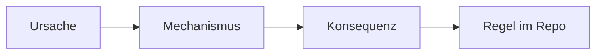

# Template: Explanation

## Ziel-Pfad im Repo

- Intended path: `meta/templates/docs/AgenticSWE_DocsTemplate_Explanation_20260226_V2.md`

## Leitfrage

> **🟦 Ziel:** TODO: Welche „Warum“-Frage beantwortet das?

- In scope: TODO
- Out of scope: TODO

## Frontmatter (Copy/Paste)

```yaml
---
project: AgenticSWE_KnowledgeOS
doc_type: explanation
version: V1
date: 2026-02-26
status: draft
audience:
  - human
  - llm
intent: "TODO: Erkläre warum X so ist und welche Trade-offs gelten."
tags:
  - layer/handbook
  - artifact/explanation
  - topic/diataxis
  - topic/<domain>
---
```

## Mentales Modell (1 Visualisierung)



## Kontext und Annahmen

- TODO: Annahmen.
- TODO: Begrenzungen.

## Trade-offs (entscheidungsfähig)

- Option A
  - Pros: TODO
  - Cons: TODO
- Option B
  - Pros: TODO
  - Cons: TODO

## Failure Modes (warum es schiefgeht)

- TODO: Failure Mode → Symptom → Ursache.

## Konsequenzen für Governance (Gates/Policy)

- TODO: Welche Regeln folgen daraus?
- TODO: Welche Checks sind betroffen?

## Glossar und Taxonomie

- Canonical terms (Glossar): TODO
- Tags geprüft (Taxonomie): 1× layer, 1× artifact.

## See also

- Tutorial (learning-by-doing): TODO
- How-to (task recipe): TODO
- Reference (facts & API): TODO

## DoD (Quick)

- Keine Schrittfolgen / Rezepte.
- Trade-offs klar.
- markdownlint clean.
- cSpell: keine Tippfehler.
