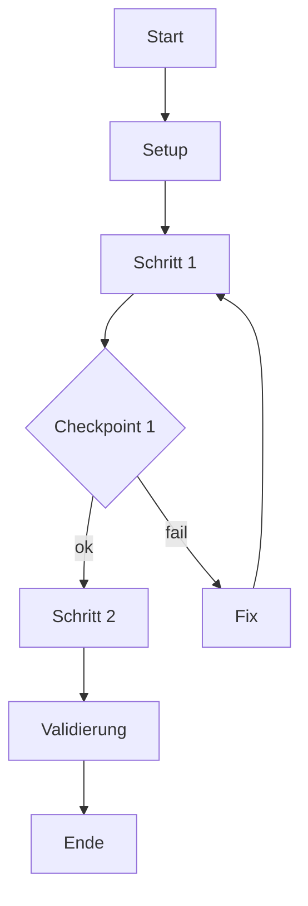

# Template: Tutorial

## Ziel-Pfad im Repo

- Intended path: `meta/templates/docs/AgenticSWE_DocsTemplate_Tutorial_20260226_V3.md`

## Reader Contract

> **🟦 Ziel:** TODO: Nach diesem Tutorial kannst du X und siehst Ergebnis Y.

- Zielgruppe: TODO (z. B. Einsteiger:in, Solo-Dev).
- Dauer: TODO (realistisch, grob).
- Startzustand: TODO (was muss vorhanden sein?).
- Endzustand: TODO (welche Dateien/Outputs sind da?).

## Frontmatter (Copy/Paste)

```yaml
---
project: AgenticSWE_KnowledgeOS
doc_type: tutorial
version: V1
date: 2026-02-26
status: draft
audience:
  - human
  - llm
intent: "TODO: Ein Satz, was am Ende funktioniert."
tags:
  - layer/handbook
  - artifact/tutorial
  - topic/diataxis
  - topic/<domain>
---
```

## Überblick (1 Visualisierung)

> **🟩 Check:** Leser:in versteht den Ablauf in 15 Sekunden.



## Voraussetzungen

- Tools: TODO
- Dateien/Pfade: TODO
- Vorwissen (nicht erklären): TODO

## Schrittfolge (learning-by-doing)

1. **Setup**
   - TODO: konkrete Aktion.
   - **🟩 Check:** TODO: sichtbares Ergebnis.

1. **Erster Erfolg (minimal)**
   - TODO: kleinster Schritt, der „etwas zeigt“.
   - **🟩 Check:** TODO

1. **Ausbau in 2–4 Schritten**
   - TODO
   - TODO
   - **🟩 Check:** TODO

1. **Validierung (Preflight)**
   - TODO: markdownlint + cSpell + Frontmatter/Tags (nur geänderte Dateien).
   - **🟩 Check:** Problems Panel ohne Blocker.

## Lern-Checkpoints (verständlichkeitsfördernd)

- Checkpoint 1: TODO (was muss jetzt klar/da sein?)
- Checkpoint 2: TODO
- Mini-Übung (optional): TODO (kleine Variation, 1–2 Minuten)

## Troubleshooting (Top 3)

- **Symptom:** TODO
  - **Ursache:** TODO
  - **Fix:** TODO

## Glossar und Taxonomie

- Canonical terms (Glossar): TODO
- Tags geprüft (Taxonomie): 1× layer, 1× artifact, topic tags allowlisted.

## Evidence (für PR-Report)

- TODO: 2–4 Bulletpoints, was du geprüft hast und was clean ist.

## Visualisierung (max. 1)

- Default: Mermaid Flowchart (inline) für Schrittfolge + Checkpoints.
- Upgrade: D2 (rendered SVG) für „polished“ Überblick.

- Toolbox (Instrumente + Matrix): `AgenticSWE_Docs_Instrumente_Toolbox_20260226_V3.md`
- Explanation (Tool-Trade-offs): `AgenticSWE_Diagramme_Varianten_Explanation_20260226_V1.md`

## See also

- How-to (task recipe): TODO
- Reference (facts & API): TODO
- Explanation (why): TODO

## DoD (Quick)

- Sichtbares Ergebnis erreicht.
- Checkpoints enthalten.
- markdownlint clean.
- cSpell: keine Tippfehler.
- Kein Konzeptkapitel „Warum“ (das ist Explanation).
