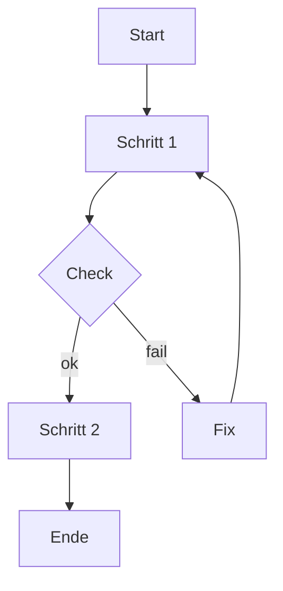
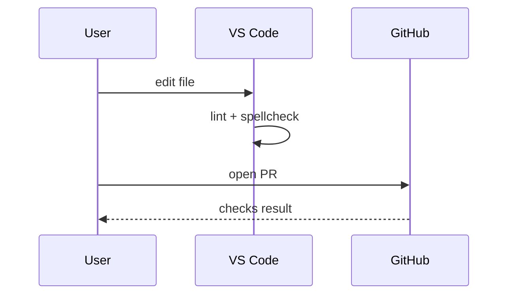
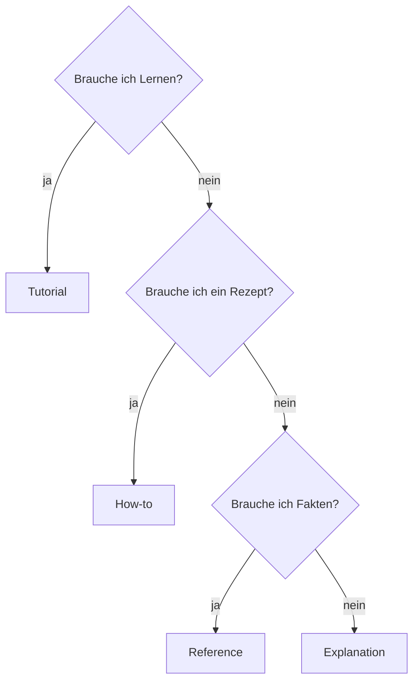
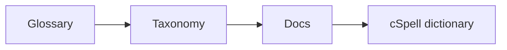

# Doku-Instrumente Toolbox

## Ziel-Pfad im Repo

- Intended path: `handbook/reference/AgenticSWE_Docs_Instrumente_Toolbox_20260226_V1.md`

## Wie du das nutzt

1. Wähle pro Dokument 3–6 Instrumente.
1. Nutze nur, was den primären Dokumententyp unterstützt.
1. Vermeide Overkill: Instrumente sind Hilfen, keine Pflicht.

> **🟦 Ziel:** Mehr Verständnis ohne Typ-Mix.
>
> **🟧 Achtung:** Nicht jede Visualisierung passt überall.

---

## Fokus-Blöcke (portable)

> **🟦 Ziel:** Ergebnis/Outcome.
>
> **🟧 Achtung:** Risiko/Stolperstein/Side-Effect.
>
> **🟩 Check:** Verifikation/Success-Kriterium.
>
> **🟥 Stop:** Abbruch/Stop-&-Ask (kurz, klar).

---

## Tabellen-Patterns

### Input/Output Tabelle

| Feld | Beschreibung |
| --- | --- |
| Inputs | TODO |
| Outputs | TODO |
| Constraints | TODO |
| Evidence | TODO |

### „Was ändert sich?“ Tabelle

| Artefakt | Änderung | Warum |
| --- | --- | --- |
| TODO | TODO | TODO |

### Parameter-Table (Reference)

| Key | Typ | Pflicht | Default | Beispiel | Bedeutung |
| --- | --- | --- | --- | --- | --- |
| TODO | TODO | TODO | TODO | TODO | TODO |

---

## Visualisierungen (Mermaid-first)

### 1) Ablauf (flowchart; Mermaid)

Wann nutzen:

- Tutorial: Überblick über Lernpfad.
- How-to: Rezept-Flow + Checks.
- Runbook: Incident/Operations-Flow.

### 2) Sequence (sequence diagram; Mermaid)

Wann nutzen:

- Wenn Interaktion zwischen Tools wichtig ist (VS Code, CI, CMS).

### 3) Entscheidung (decision tree; Mermaid)

Wann nutzen:

- In Policy/Guides, um Typen abzugrenzen.

### 4) Artefakt-Map (artifact map)

Nutze eine einfache Liste oder Mermaid-Graph:

Wann nutzen:

- Wenn Governance/SSOT wichtig ist.

---

## Leitfragen nach Dokumententyp

### Tutorial (learning-by-doing)

- Was ist das sichtbare Ergebnis?
- Welche minimalen Voraussetzungen reichen?
- Welche Schritte sind unvermeidbar (und in welcher Reihenfolge)?
- Welche 2–3 Checkpoints zeigen Fortschritt?
- Welche 3 typischen Fehler passieren Anfänger:innen?

### How-to (task recipe)

- Für welche Ausgangslage gilt das Rezept (Scope)?
- Welche Inputs/Outputs sind relevant?
- Welche Risiken/Side-Effects gibt es?
- Wie verifiziere ich Erfolg?
- Wie rolle ich zurück?

### Reference (facts & API)

- Was ist normativ (muss), was ist informativ (kann)?
- Welche Keys/Felder sind erlaubt?
- Welche Default-Werte gelten?
- Welche Beispiele decken typische Fälle ab?
- Welche Fehler/Edge-Cases gibt es (knapp)?

### Explanation (why & mental model)

- Welche Frage beantwortet das (und welche nicht)?
- Welche Annahmen sind zentral?
- Welche Trade-offs gelten und warum?
- Welche Failure Modes erklärt das Modell?
- Welche Alternativen gibt es (und warum gewählt/abgelehnt)?

---

## Checklisten (Definition of Done, DoD)

### Minimal-DoD für alle Docs

- Frontmatter valide.
- Tags: 1× layer, 1× artifact.
- markdownlint clean (mindestens MD022, MD032, MD029).
- cSpell: keine echten Tippfehler; Jargon bewusst gepflegt.
- See also: Link auf mindestens 1 passenden anderen Diátaxis-Typ.

### „No Overkill“ Check

- Jede Sektion dient dem primären Dokumenttyp.
- Keine „Warum“-Kapitel in How-to.
- Keine Schrittfolgen in Reference.
