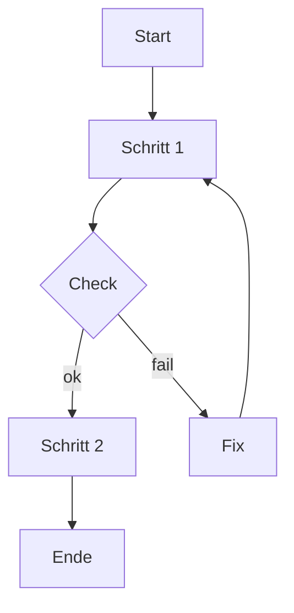
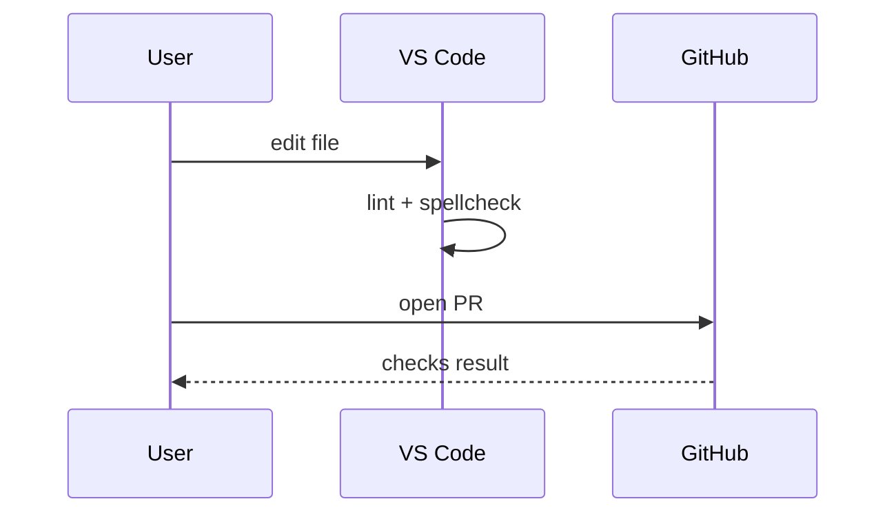
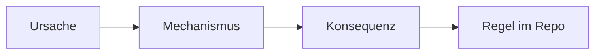

# Doku-Instrumente Toolbox

## Ziel-Pfad im Repo

- Intended path: `handbook/reference/AgenticSWE_Docs_Instrumente_Toolbox_20260226_V3.md`

## Nutzung

1. Wähle pro Dokument 3–6 Instrumente.
1. Halte den Dokumenttyp sauber (kein Typ-Mix).
1. Nutze maximal 1–2 Visualisierungen pro Dokument.
1. Jede Sektion muss dem Hauptzweck dienen.
1. Wenn unsicher: kürzen und verlinken.

> **🟦 Ziel:** Mehr Verständnis, weniger Noise.
>
> **🟧 Achtung:** Instrumente sind Hilfen, keine Pflicht.

---

# Diagramm-Toolwahl bis CMS-Portal

Diese Toolbox beschreibt *Instrumente*. Für die *Tool-Varianten* (Mermaid, D2, draw.io, Excalidraw) gilt:

- **Default:** Mermaid (inline) für kleine Flows.
- **Upgrade:** D2 (render to SVG) für „polished“ System-/Architektur-Übersichten.
- **Sonderfälle:** draw.io (WYSIWYG) und Excalidraw (Whiteboard) nur gezielt.

> **🟩 Check:** Wenn du unsicher bist: Mermaid zuerst, D2 nur bei Mehrwert.

Weiterführend (SSOT für Trade-offs + Workflow):

- Explanation: `AgenticSWE_Diagramme_Varianten_Explanation_20260226_V1.md`
- How-to (Codex + Extensions + Autonomie): `AgenticSWE_Diagramme_Codex_HowTo_20260226_V2.md`
- Tutorial (End-to-end Diagramm-Flow): `AgenticSWE_Diagramme_Tutorial_20260226_V3.md`

## Repo-Layout und Render-Gate

Empfehlung bis Portal:

- `diagrams/src/` (SSOT der Quellen)
- `diagrams/rendered/` (SVG-Assets, wenn gerendert)

Render-Gate (minimal):

- Wenn D2-Source geändert wurde, muss die entsprechende SVG aktualisiert werden.

---

# Default-Instrumente pro Dokumenttyp

## Tutorial (learning-by-doing)

1. Reader Contract.
1. Flowchart (flowchart; Mermaid oder D2).
1. Checkpoints (progress checks).
1. Worked Example + Mini-Übung.
1. Troubleshooting (Top 3).

## How-to (task recipe)

1. Scope + Success Criteria.
1. Inputs/Outputs Tabelle.
1. Schrittfolge (mit Entscheidungsstellen).
1. Verifikation.
1. Rollback.
1. Failure Modes (Top 1–3).

## Reference (facts)

1. Parameter-/Key-Tabelle.
1. Normativ vs informativ markieren.
1. Minimal-/Vollbeispiel.
1. Fehlerbilder (kurz).

## Explanation (why)

1. Leitfrage + Kurzfassung.
1. Mentales Modell (causal flow; Mermaid oder D2).
1. Trade-off-Matrix.
1. Failure Modes.
1. Konsequenzen für Governance.

---

# Auswahlmatrix (Instrument → Dokumenttyp)

Legende:

- ✅ empfohlen
- 🟡 optional
- ❌ vermeiden

| Instrument | Tutorial | How-to | Reference | Explanation |
| --- | --- | --- | --- | --- |
| Reader Contract | ✅ | 🟡 | ❌ | 🟡 |
| Scope + Success Criteria | 🟡 | ✅ | ✅ (Scope) | ✅ (Scope) |
| Inputs/Outputs Tabelle | 🟡 | ✅ | ✅ | 🟡 |
| Schrittfolge (numbered) | ✅ | ✅ | ❌ | ❌ |
| Verifikation | ✅ | ✅ | 🟡 | 🟡 |
| Rollback | 🟡 | ✅ | ❌ | ❌ |
| Parameter-/Key-Tabelle | ❌ | 🟡 | ✅ | ❌ |
| Minimal-/Vollbeispiel | ✅ | ✅ | ✅ | 🟡 |
| Trade-off-Matrix | ❌ | 🟡 | ❌ | ✅ |
| Failure Modes | ✅ | ✅ | ✅ (kurz) | ✅ |
| Flowchart | ✅ | ✅ | 🟡 | 🟡 |
| Sequence Diagram | 🟡 | ✅ | 🟡 | 🟡 |
| Causal Diagram | ❌ | ❌ | ❌ | ✅ |
| Fokus-Blöcke (Ziel/Check/Stop) | ✅ | ✅ | 🟡 | ✅ |

---

# Fokus-Blöcke (portable)

> **🟦 Ziel:** Ergebnis/Outcome.
>
> **🟧 Achtung:** Risiko/Stolperstein/Side-Effect.
>
> **🟩 Check:** Verifikation/Success-Kriterium.
>
> **🟥 Stop:** Abbruch/Stop-&-Ask.

---

# Tabellen-Patterns

## Inputs/Outputs Tabelle

| Feld | Beschreibung |
| --- | --- |
| Inputs | TODO |
| Outputs | TODO |
| Constraints | TODO |
| Evidence | TODO |

## „Was ändert sich?“ Tabelle

| Artefakt | Änderung | Warum |
| --- | --- | --- |
| TODO | TODO | TODO |

## Parameter-Table (Reference)

| Key | Typ | Pflicht | Default | Beispiel | Bedeutung |
| --- | --- | --- | --- | --- | --- |
| TODO | TODO | TODO | TODO | TODO | TODO |

## Trade-off Matrix (Explanation)

| Option | Pros | Cons | Wann wählen |
| --- | --- | --- | --- |
| A | TODO | TODO | TODO |
| B | TODO | TODO | TODO |

---

# Visualisierungen (Mermaid-first)

## 1) Ablauf (flowchart; Mermaid)

Wann nutzen:

- Tutorial: Überblick über Lernpfad + Checkpoints.
- How-to: Rezept-Flow + Verifikation.
- Reference: nur wenn Struktur/Abhängigkeiten sonst unklar bleiben.

## 2) Sequence (sequence diagram; Mermaid)

Wann nutzen:

- Tool-Interaktionen (VS Code, CI, CMS).

## 3) Mentales Modell (causal flow; Mermaid)

Wann nutzen:

- Explanation: Ursachen, Gründe, Trade-offs.

---

# Leitfragen (prompts) pro Dokumenttyp

## Tutorial (learning-by-doing)

- Was ist das sichtbare Ergebnis?
- Welche minimalen Voraussetzungen reichen?
- Welche Schritte sind unvermeidbar (und in welcher Reihenfolge)?
- Welche 2–3 Checkpoints zeigen Fortschritt?
- Welche 3 typischen Fehler passieren Anfänger:innen?

Self-Explanation Prompts (optional):

- „Warum war dieser Schritt nötig?“
- „Welche Annahme steckt dahinter?“
- „Was wäre ein Gegenbeispiel?“

## How-to (task recipe)

- Für welche Ausgangslage gilt das Rezept (Scope)?
- Welche Inputs/Outputs sind relevant?
- Welche Risiken/Side-Effects gibt es?
- Wie verifiziere ich Erfolg?
- Wie rolle ich zurück?

## Reference (facts)

- Was ist normativ (muss), was ist informativ (kann)?
- Welche Keys/Felder sind erlaubt?
- Welche Default-Werte gelten?
- Welche Beispiele decken typische Fälle ab?
- Welche Fehler/Edge-Cases gibt es (knapp)?

## Explanation (why)

- Welche „Warum“-Frage beantwortet das (und welche nicht)?
- Welche Annahmen sind zentral?
- Welche Trade-offs gelten und warum?
- Welche Failure Modes erklärt das Modell?
- Welche Alternativen gibt es (und warum gewählt/abgelehnt)?

---

# Anti-Patterns (häufige Fehler)

- Tutorial wird zu Explanation: zu viel Hintergrund, zu wenig Checks.
- How-to wird zu Reference: zu viele Optionen statt Rezept.
- Reference wird zu How-to: Schrittfolgen statt Fakten.
- Explanation wird zu Runbook: konkrete Anweisung statt Modell.

---

# Minimal-DoD (alle Dokumente)

- Frontmatter valide.
- Tags: 1× layer, 1× artifact.
- markdownlint clean (mindestens MD022, MD032, MD029).
- cSpell: keine echten Tippfehler; Jargon bewusst gepflegt.
- See also: Link auf mindestens 1 passenden anderen Diátaxis-Typ.
